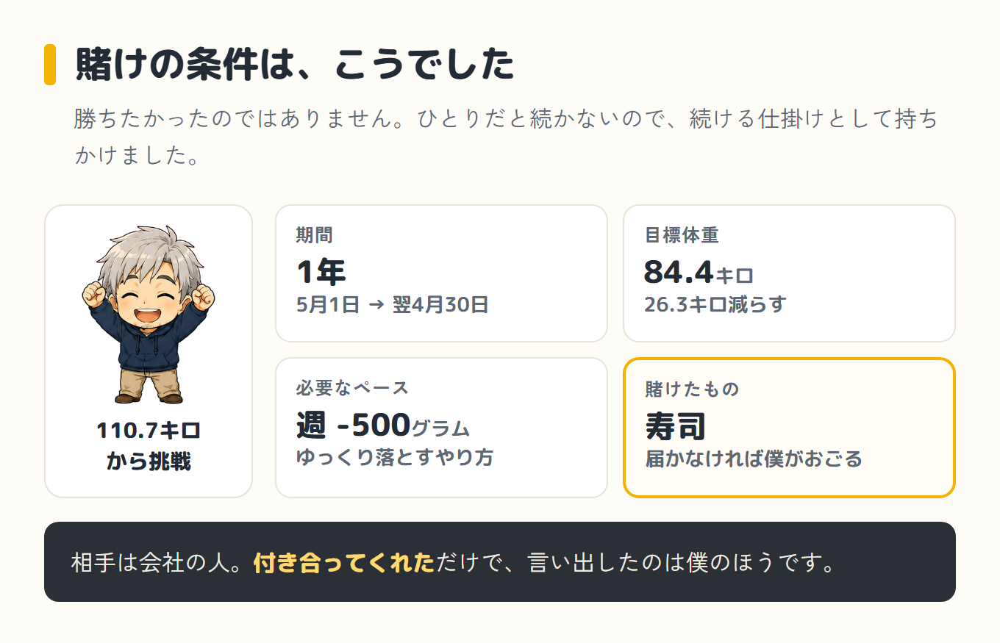
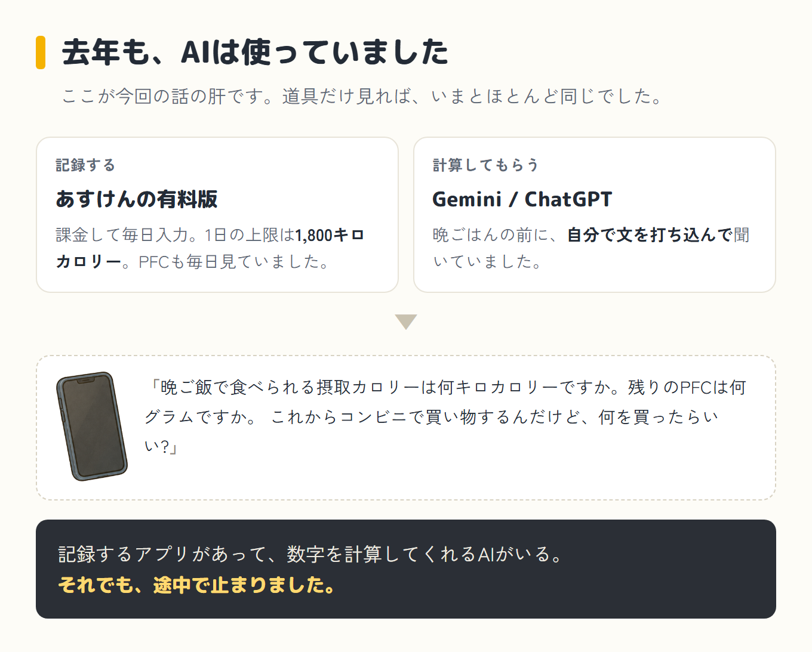
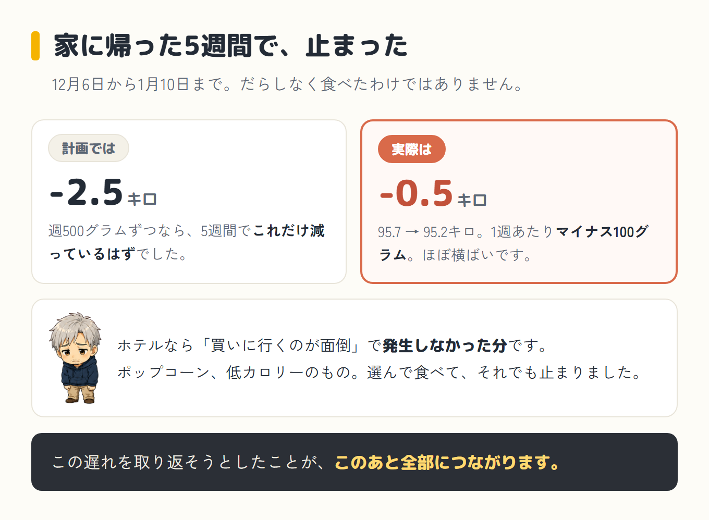
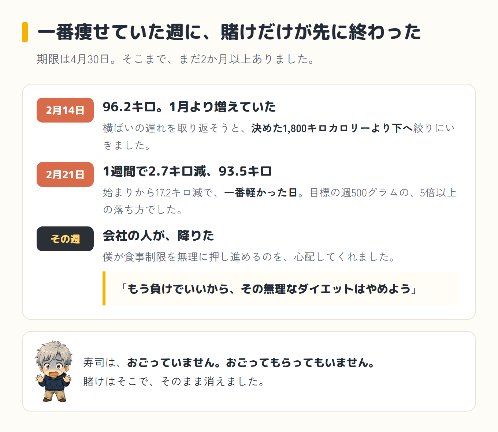
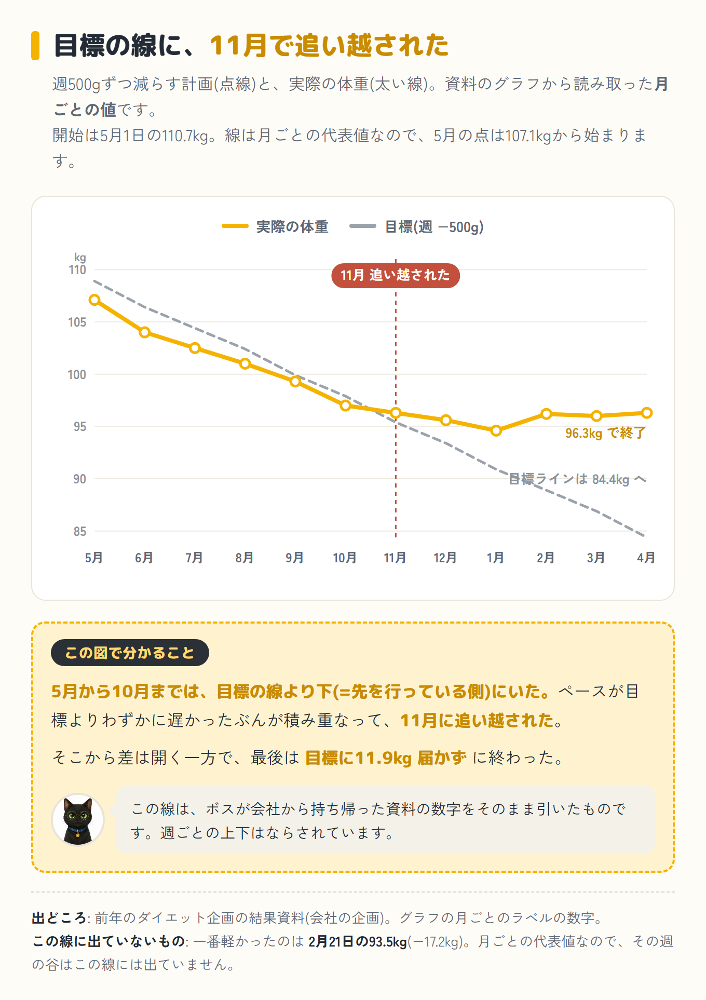
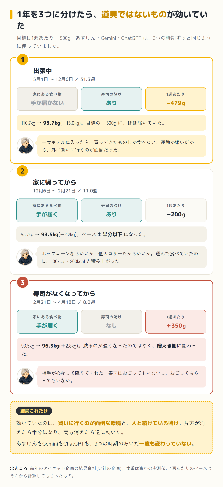
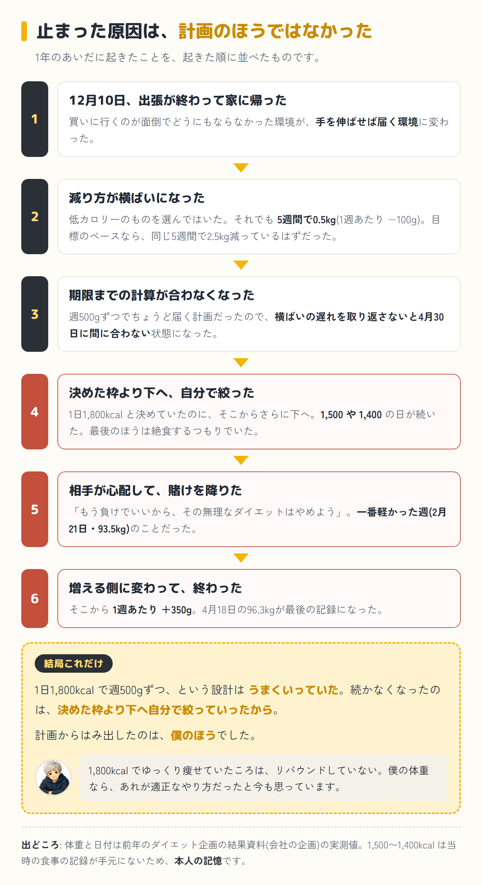
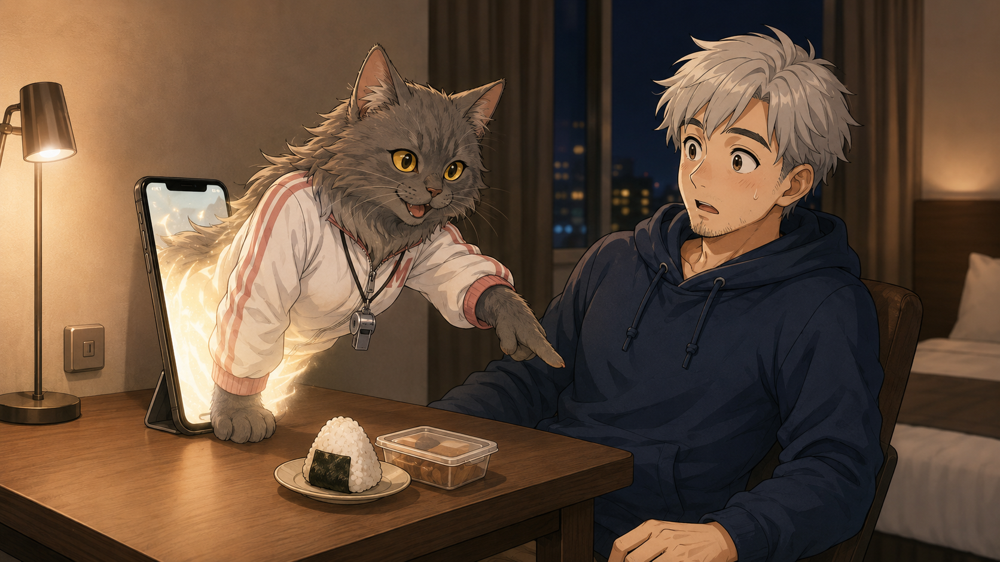
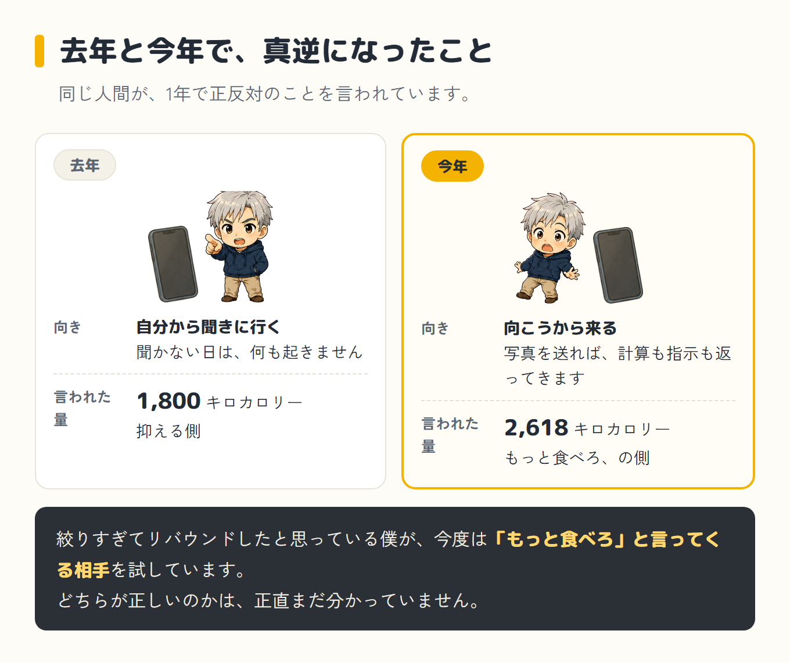

去年、僕の体重は110.7キロありました。運動はしていません。今もしていません。

その状態から、15キロ痩せました。ただ、先に言っておくと、これは成功談ではありません。目標には届かず、いまは98キロ台です。

「AIで痩せた話」でもありません。AIは去年から使っていました。それでも途中で止まりました。何が効いていて、何が効いていなかったのか。当時の結果を引っ張り出して、見返しながら書きます。

## 賭けは、僕から持ちかけた

始まりは、会社の人との賭けでした。期間は5月1日から翌年の4月30日までの1年。目標体重は84.4キロで、110.7キロからなので26.3キロ減らすことになります。ペースにすると、週に500グラムずつです。

届かなかったら、僕が寿司をおごる。届いたら、おごってもらう。そういう約束です。

勝ちたかったわけではありません。ひとりだと絶対に続かないので、続けるための仕掛けとして、僕のほうから賭けに乗ってもらいました。会社の人は、それに付き合ってくれました。

## やり方は、あすけんの有料版とAI

記録には、あすけんの有料版を使いました。課金して、毎日食べたものを入れる。そこで出た1日の上限が、1,800キロカロリーでした。

PFC(タンパク質・脂質・炭水化物の配分)も毎日見ていました。とくに脂質は数字が超えないように、食べるものを選んでいました。

そして、ここが今回の話の肝なのですが、去年の時点でAIを使っていました。聞く相手は主にGeminiで、ChatGPTにも聞いていました。晩ごはんの前に、こういう文を自分で打ち込みます。

> 「晩ご飯で食べられる摂取カロリーは何キロカロリーですか。残りのPFCは何グラムと何グラムと何グラムですか。これからコンビニで買い物するんだけど、何を買ったらいい? この中に収まりますか?」

記録するアプリがあって、数字を計算してくれるAIがいる。道具だけ見れば、いまとほとんど同じです。

## 出張中は、目標のペースにほぼ乗っていた

賭けを始めた12日後、5月13日から出張に入りました。そこからはホテル泊の毎日です。数えてもらったら、賭けの始まりから12月6日までの219日のうち、207日が出張でした。

ホテル暮らしには、はっきりした特徴がありました。一度部屋に入ってしまえば、買ってきたものしか食べません。夜に何か食べたくなっても、わざわざ外まで買いに行かない。なんせ運動が嫌いなので、その一歩が面倒なんです。だから空腹でも我慢できました。

我慢できたのは、意志が強かったからではありません。買いに行くのが面倒だったからです。運動が嫌いという性格が、ここでだけは痩せる方向に働きました。

体重は落ちました。見返したら、12月6日に95.7キロ。始まりから15.0キロ減です。この間のペースを計算してもらったら、1週あたりマイナス479グラムでした。目標の500グラムに、ほぼ届いていました。

## 12月10日、家に帰った

出張が終わったのは12月10日でした。15キロ減に届いた、4日後です。

家に帰ってからも、気をつけてはいたんです。何か食べたくなったら、ポップコーンならいいか、低カロリーのものならいいか、と、なるべくカロリーの低いものを選んで食べていました。

ただ、その積み重ねが100キロカロリー、200キロカロリーになっていきました。ホテルなら「買いに行くのが面倒」で発生しなかった分です。順調にちょっとずつ減っていた体重が、横ばいになりました。

見返したら、12月6日の95.7キロから、1月10日の95.2キロまで、5週間で0.5キロしか減っていませんでした。計算してもらったら、1週あたりマイナス100グラム。目標のペースなら、同じ5週間で2.5キロ減っているはずでした。

だらしなく食べて戻したのではありません。選んで食べて、それでも止まりました。

## 2月、賭けの相手のほうから降りた

横ばいのぶん、計算が合わなくなっていました。もともと、週500グラムずつでちょうど届く計画です。横ばいだった5週間の遅れを、どこかで取り返さないと、期限の4月30日までに84.4キロには届きません。

だから、強引に食べるものを減らしにいきました。決めていた1,800キロカロリーを守るのではなく、そこからさらに下へ。最後のほうは、絶食するつもりくらいでやろうとしていました。

見返したら、2月14日は96.2キロで、横ばいどころか1月10日より増えていました。そこから2月21日までの1週間で、2.7キロ減って93.5キロ。始まりから17.2キロ減で、一番軽かった日です。計算してもらったら、目標の週500グラムの5倍以上の落ち方でした。

その週に、会社の人が降りました。僕が食事制限を無理に押し進めるのを心配して、「もう負けでいいから、その無理なダイエットはやめよう」と言ってくれました。

寿司は、おごっていません。おごってもらってもいません。賭けはそこで、そのまま消えました。期限よりずっと手前、一番痩せていた週に、賭けだけが先に終わった形です。

## 寿司がなくなってから、増える側に変わった

そこからの数字は、はっきりしていました。計算してもらったら、2月21日から後は1週あたりプラス350グラム。減るのが遅くなったのではなく、増える側に変わっていました。

なぜ増えたのか。僕は、リバウンドだったと思っています。

ただ、原因は1,800キロカロリーという枠のほうではありません。1日1,800キロカロリーで週500グラムずつ、というのはゆっくり落とすやり方で、実際にうまくいっていました。僕の体重なら、これは適正なやり方だったと今も思っています。

リバウンドしたと思う時期は、その枠よりさらに下まで、自分で絞り込んでいました。1,500とか1,400とか、そのくらいまで落ちていた日が続いていたんだと思います。当時の食事の記録は手元にないので、はっきりした数字は分かりません。体の仕組みの話も、当時も今も分かっていません。あくまで、僕の場合はそうだったという見方です。

そう考えると、会社の人が賭けを降りたことと、体重が増えたことは、同じところにつながっています。心配されたのは、その絞りすぎでした。止めてくれたのは、正しかったんだと思います。

見返したら、記録の最終日は4月18日で96.3キロ。14.4キロ減で、目標の84.4キロには11.9キロ届いていませんでした。

ただ、この時期が全部だめだったわけでもありません。3月に受けた人間ドックでは、保健師さんにめちゃくちゃ褒められて、すごく気持ちよくなった記憶があります。目標には届いていなくても、始めたころとはだいぶ違う体ではあったので。26.3キロというすごい目標に対しての結果でしたが、振り返ってみたら、15キロは結構頑張ったほうじゃないかなと今は思っています。

## 3つの時期を並べたら、答えが出ていた

今回、当時の結果を見返して、期間を3つに分けて計算してもらいました。

| 時期 | 家の環境 | 賭け | 体重 | 1週あたり |
|---|---|---|---|---|
| (1) 出張中(31.3週) | 無い | あり | 110.7 → 95.7キロ | -479g |
| (2) 家に帰ってから(11.0週) | ある | あり | 95.7 → 93.5キロ | -200g |
| (3) 賭けが終わってから(8.0週) | ある | 無い | 93.5 → 96.3キロ | +350g |

環境が消えたら、ペースが半分以下になりました。寿司もなくなったら、増える側に変わりました。

そして、あすけんもGeminiもChatGPTも、3つの時期のあいだずっと同じように使っていました。道具は一度も変わっていません。だから僕の場合、15キロ痩せられたのはAIのおかげではなかった、と言えます。

効いていたのは、買いに行くのが面倒なホテルという環境と、人と続けている賭け。どちらか片方ではなく、両方要ったんです。片方が消えたら半分になり、両方消えたら逆に動いたので。

ただ、数字を見返して、もうひとつ思ったことがあります。止まった原因は、計画のほうではなかった、ということです。1,800キロカロリーで週500グラムという設計は、僕の場合はうまくいっていました。続かなくなったのは、横ばいで計算が合わなくなって、決めた枠より下へ自分で絞っていったからです。計画からはみ出したのは、僕のほうでした。

そして、その横ばいは、家に帰って環境が変わってから始まっています。環境が変わって、横ばいになって、計算が合わなくなって、無理をして、止められて、増えて終わった。去年の1年は、全部この順番でつながっていました。

## だから今年は、向こうから来る相手にした

今年もダイエットをしています。相手はGeminiでもChatGPTでもなく、ミルさん。パソコンとスマホのAIに、昔飼っていた猫の名前をつけたコーチです。

去年は、残りのカロリーとPFCを自分で打ち込んで、自分から聞きに行っていました。聞きに行かない日は、何も起きません。今年は、食事の写真を送れば、計算も指示も向こうから返ってきます。

言われている数字も真逆です。去年は1日1,800キロカロリーに抑えていました。今年、始めたころにミルさんから出た目標は1日2,618キロカロリーで、同じ人間が、1年で正反対のことを言われています。

ただ、どちらも「その時の僕に出た数字」です。去年の1,800は、当時の僕の体重で、あすけんが出したものでした。

今年の目標も、固定ではありません。連載の記録を見返したら、2,618だった数字が2,647になり、2,654になっていました。

なぜ変わるのか。ここは珍しく分かります。この計算のしかたは、僕が自分でダイエットアプリに入れたものだからです。参考にしているダイエットトレーナーの人が出しているやり方で、体重から計算するので、体重が変われば数字も変わります。

パソコンのことは分かっていない僕ですが、これだけは分かっています。

体重や条件が変われば、必要な量も変わっていくはずです。だから、誰にでも当てはまる数字ではないと思っています。

絞りすぎてリバウンドしたと思っている僕が、今度は「もっと食べろ」と言ってくる相手を試している。去年の失敗が、そのまま今年のやり方を選んだ理由です。どちらが正しいのかは、正直まだ分かっていません。

## 今年の出張も、12月10日で終わる

いま、僕はまた出張中です。ホテル泊の毎日で、去年ペースが出ていたのと同じ環境です。

この出張は、12月10日で終わります。去年、家に帰ったのと同じ日付です。

去年はそこからペースが半分以下になり、寿司がなくなって、増える側に変わりました。今年は賭けの代わりに、毎日向こうから来るミルさんがいます。同じ日付から先がどうなるかは、僕にも分かりません。

その記録は、連載として書いています。ミルさんがどういうコーチなのかは、第1話から読めます。

[【ダイエット】第1話: ダイエットアプリを作ってたら、いつのまにかAIが専属トレーナーになっていた話](/blog/diet/mil-tanjou/)
