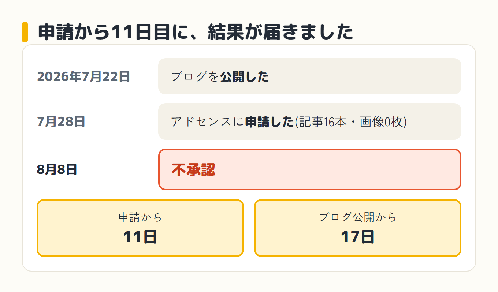
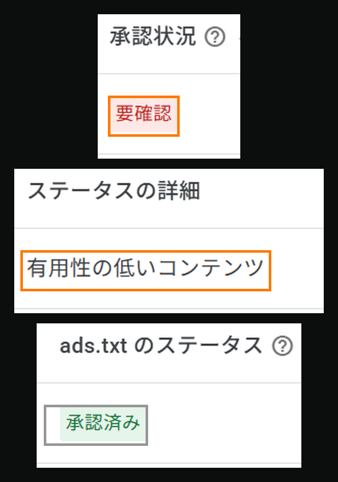
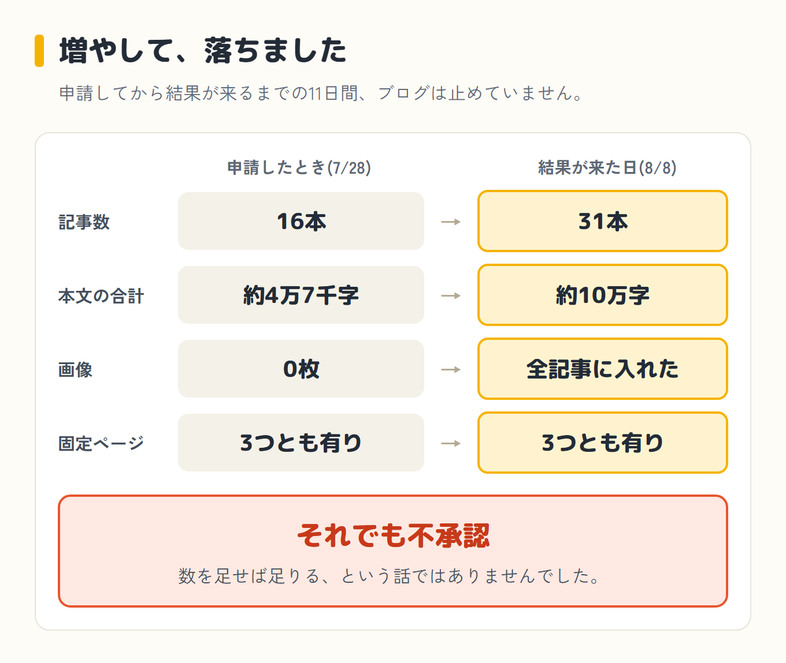
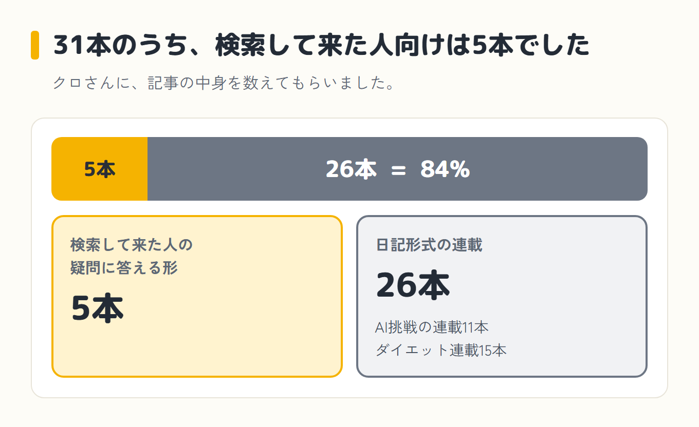
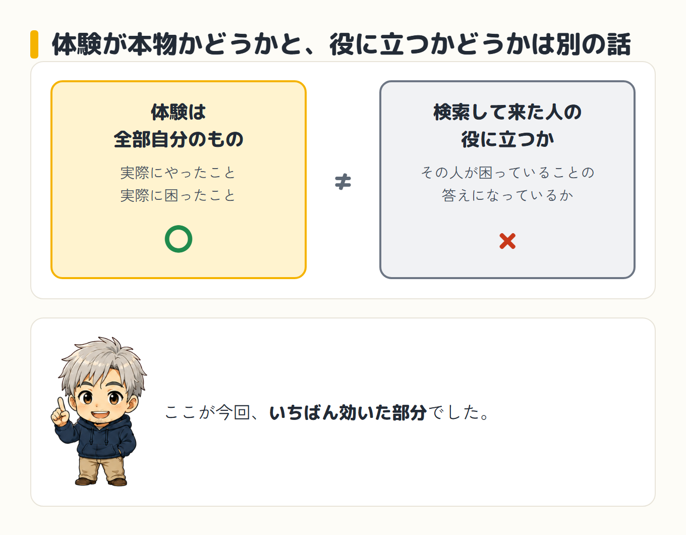
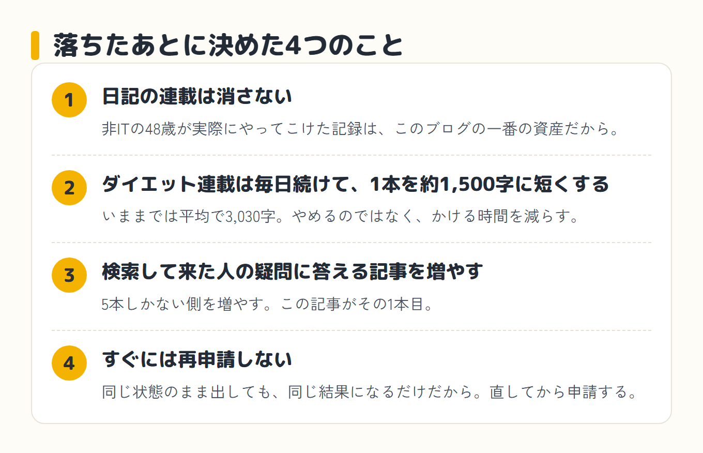

2026年8月8日、Googleアドセンス(サイトに広告を出してお金をもらうためのGoogleの仕組み)の審査結果が届きました。

不承認でした。

申請したのが7月28日なので、11日かかったことになります。ブログを公開したのが7月22日なので、開設から17日です。

理由として画面に出ていたのは、「有用性の低いコンテンツ」という一文だけでした。

AIと一緒にブログを書いていて審査に落ちた方、これからAIでブログを始めようとしていて審査が不安な方に向けて、何が届いて、どこに理由が書いてあって、これから何を直すことにしたのかを、そのまま出します。

申請したときのブログがどんな状態だったかは、[前の記事](/blog/ai-blog-adsense-shinsa/)に全部書きました。記事16本、合計約4万7千字、画像0枚、検索から来たのは2。その記事に「結果が分かったら、この記事に追記します」と書いたので、これがその続きです。

## 届いたメールに、理由は書いていませんでした

メールは定型文でした。

「サイトの内容を見直して、更新されることをおすすめします」

「問題が解決しましたら、再審査を申請していただけます」

書いてあったのは、だいたいこの2つです。

何が問題だったのかは、一言も書いてありません。

落ちたことだけは分かって、直す場所が分からない状態でした。

![実際に届いたメールの画面。見出しは「お客様のサイト(ai-yokubari.com)を AdSense で審査いたしました。」。本文は「審査の結果、残念ながら、お客様のサイトは広告を掲載する準備がまだ整っていないようです。サイトに広告を掲載できるようにするには、いくつかの問題を解決していただく必要がございます」。その下にオレンジの枠で囲まれた「詳細については、アカウントの[サイト]ページでご確認ください」の一文。いちばん下は「サイトの内容を見直して、更新されることをおすすめします。問題が解決しましたら、サイトの再審査を申請していただけます」](../../assets/blog/ai-blog-adsense-ochita/01-mail.png)

## 理由は管理画面の「サイト」ページにありました

メールではなく、アドセンスの管理画面のほうに書いてありました。

「サイト」というページを開くと、承認状況が「**要確認**」になっていて、その下のステータスの詳細に「**有用性の低いコンテンツ**」と出ていました。

同じ画面で、もう1つ分かったことがあります。

<strong>ads.txt は「承認済み」</strong>になっていました。

ads.txt は、広告を出すための設定ファイルです。「このサイトの広告枠を扱っていいのはここです」と宣言しておくもので、これが無かったり間違っていたりすると、そこで引っかかります。

そこは通っていました。

つまり、ファイルの置き方や設定の不備で落ちたのではなく、**中身の判定で落ちた**ということになります。

直す場所がサイトの中身だ、というところまでは、これで分かりました。

## 申請したときより、中身は増えていました

落ちたのが「中身」だと分かって、まず引っかかったのがここです。

申請してから結果が来るまでの11日間、ブログは止めていません。

記事はほぼ倍になりました。前の記事で「気になります」と書いた画像0枚も、全部の記事に入れ終えました。

増やして、落ちました。

数を足せば足りるという話ではなかった、ということになります。

## 31本のうち、検索して来た人向けの記事は5本でした

何がまずいのかが自分では分からなかったので、クロさん(AIの相棒。パソコンの中で実際に手を動かしてくれるAIです)に、記事の中身を数えてもらいました。

数えてもらったら、こうでした。

- 検索して来た人の疑問に答える形の記事 … **5本**
- 日記形式の連載 … **26本**(AI挑戦の連載11本+ダイエット連載15本)

日記が<strong>84%</strong>でした。

クロさんの見立ては、こうです。「有用性の低いコンテンツ」というのは、「検索して来た人が探している答えが、このサイトに見当たらない」という判定だと教えてもらいました。日記が84%という形は、まさにそこに引っかかりやすい、とも言われました。

言われてみると、そのとおりです。

うちのブログを検索で見つけた人が最初に開くページは、たいてい誰かの日記です。日記は、書いた本人の話であって、その人が困っていることの答えではありません。

ただし、**Googleは「どの記事がダメだった」とは教えてくれません**。

なので、これはクロさんの見立てであって、確定した理由ではありません。ここは断定できません。

## 記事数は足りていたはずでした

記事数はどうなのかも、クロさんに調べてもらいました。

検索の上位に出てくる2023年の記事には、審査に落ちるブログは記事数が30以下の作りたてのものが多い、と書いてありました。

独自性が強くクオリティの高いブログなら、5記事でも合格することがある、とも書いてありました。

うちは31本あります。数だけなら、この目安は超えています。

ただ、**開設17日**です。作りたてであることは、どうやっても変わりません。

サイトが若いことも効いていそうだと思いました。ここも、確かめる方法はありません。

## 「AIが書いたから落ちた」とは考えていません

前の記事を書いたとき、「AIに書かせた記事はアドセンスの審査に通らない」という話をあちこちで見て、不安になっていました。

落ちた今、そこを疑うこともできます。

でも、そうは考えていません。

クロさんに調べてもらったところ、Googleは「AI や自動化は、適切に使用している限りは Google のガイドラインの違反になりません」と公式に説明しているそうです(出どころ: [AI 生成コンテンツに関する Google 検索のガイダンス](https://developers.google.com/search/blog/2023/02/google-search-and-ai-content?hl=ja)・2023年2月8日)。評価されるのは作り方ではなく、品質・独自性・読む人の役に立つかどうかだ、とも書いてあったそうです。

それに、落ちた理由として実際に出ていたのは「AIが作ったコンテンツ」ではなく、「有用性の低いコンテンツ」でした。

書いたのが人かAIかではなく、中身が誰かの役に立つかどうかを見られている、と読みました。

うちの記事の体験は、全部自分のものです。実際にやったこと、実際に困ったこと。そこは1つも作っていません。前の記事にも同じことを書きました。

それでも「有用性が低い」と判定されました。

**体験が本物かどうかと、検索して来た人の役に立つかどうかは、別の話**だということになります。ここが今回いちばん効いた部分です。

## 落ちたあとに決めた4つのこと

結果を見て、こう決めました。

**1. 日記の連載は消しません。**

「有用性が低い」と言われたのは日記の割合だろう、という見立ては受け止めます。それでも消しません。非ITの48歳が実際にやってこけた記録は、このブログの一番の資産だと思っているからです。削る方向には行きません。

**2. ダイエット連載は毎日続けますが、1本を約1,500字に短くします。**

いままでは1本あたり平均で3,030字ありました(15本の実測)。ここを半分にします。やめるのではなく、かける時間を減らして、浮いた分を次に回します。

**3. 検索して来た人の疑問に答える記事を増やします。**

5本しかない側を増やします。この記事が、その1本目です。

**4. すぐには再申請しません。**

同じ状態のまま出しても、同じ結果になるだけだと思っています。直してから、再審査を申請します。

## 結果を見たときに思ったこと

結果を見た第一声は、「アドセンス通らなかったよ～」でした。

そのあとに思ったのが、こういうことです。

やっぱり有益な、読者が困ったことを解決できるものが必要だ、というのは、トップブロガーの人が話していることでした。今まで書いたものは消さないし、これからも続けます。ただ、もっと何か違う方法も考えていかないと、収益を上げるということに対しては足りないんじゃないか。

前の記事の最後に、「落ちたらどうしよう、とは思っています」と書きました。

その「落ちたら」が来ました。

## 申請したときの状態を見たい方へ

落ちたブログが、申請の時点でどんな状態だったのか。記事数、文字数、アクセス数、直前にやった作業まで、全部この記事に出しています。

同じくらいの規模で申請しようとしている方は、こちらを先に見てもらうほうが早いと思います。

→ [AIエージェントと書いたブログはアドセンス審査に通るのか|開設6日・16記事で申請してみた](/blog/ai-blog-adsense-shinsa/)
