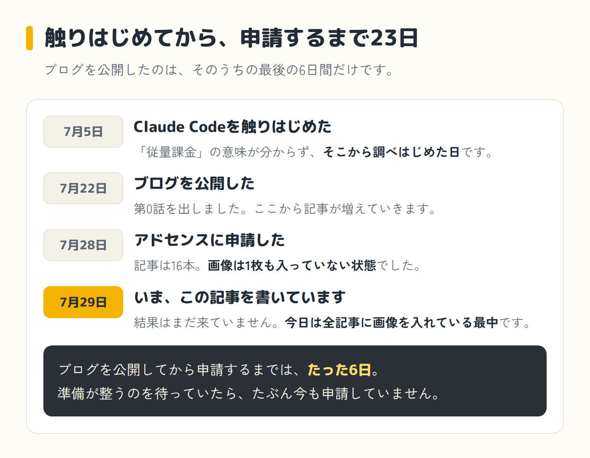
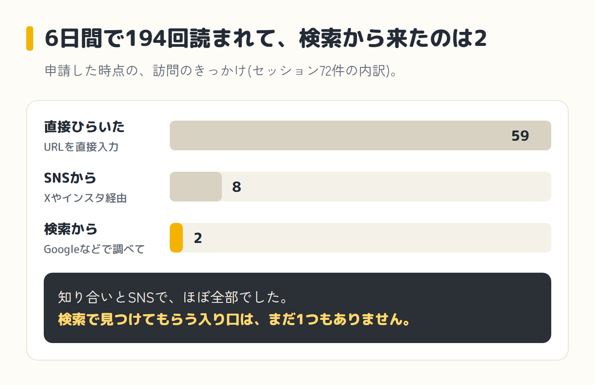
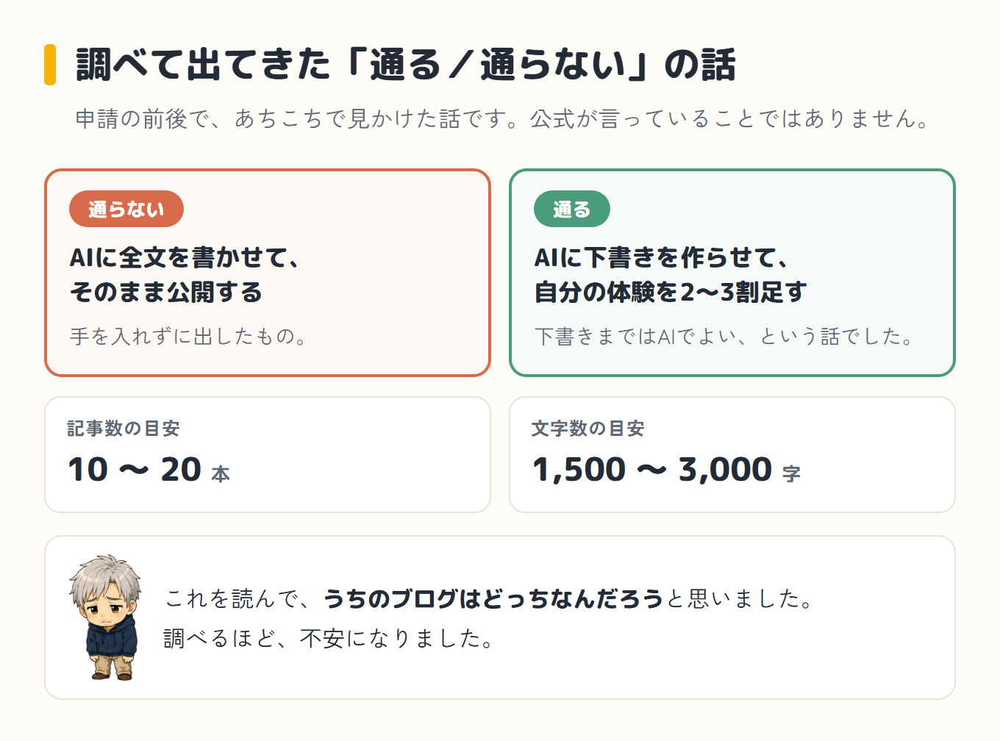
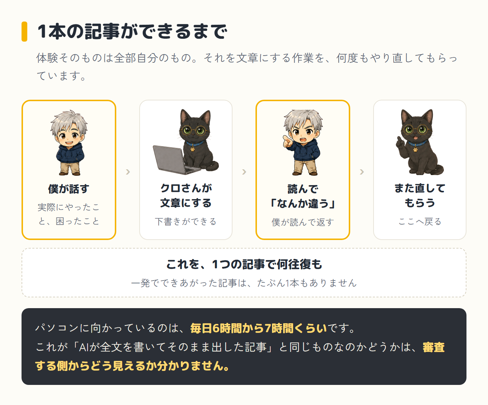
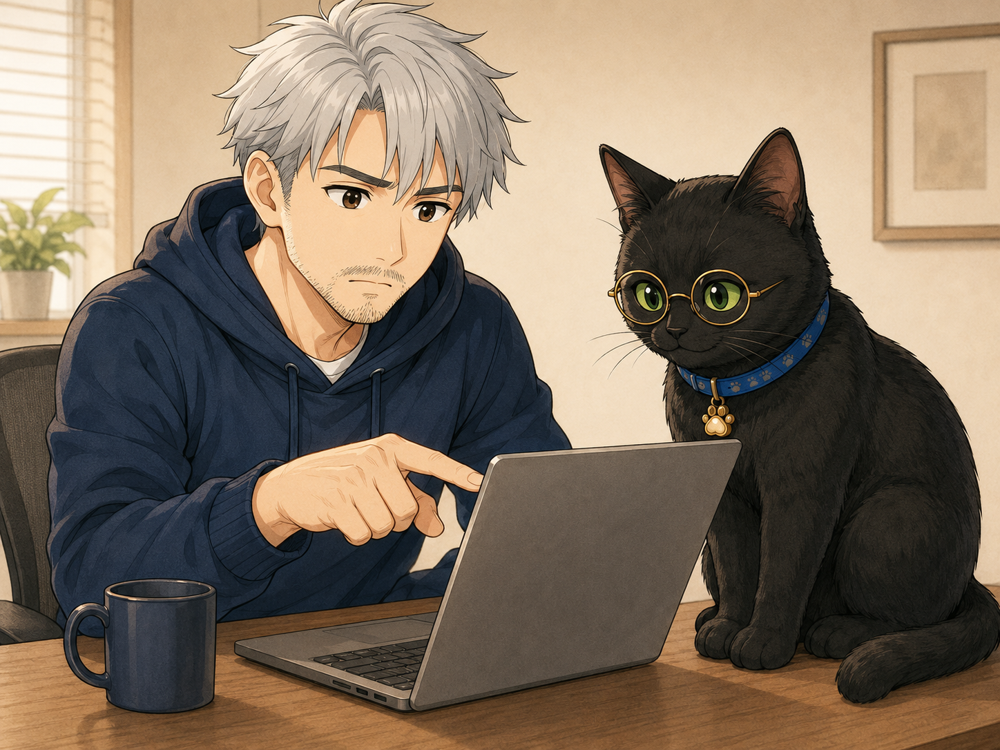
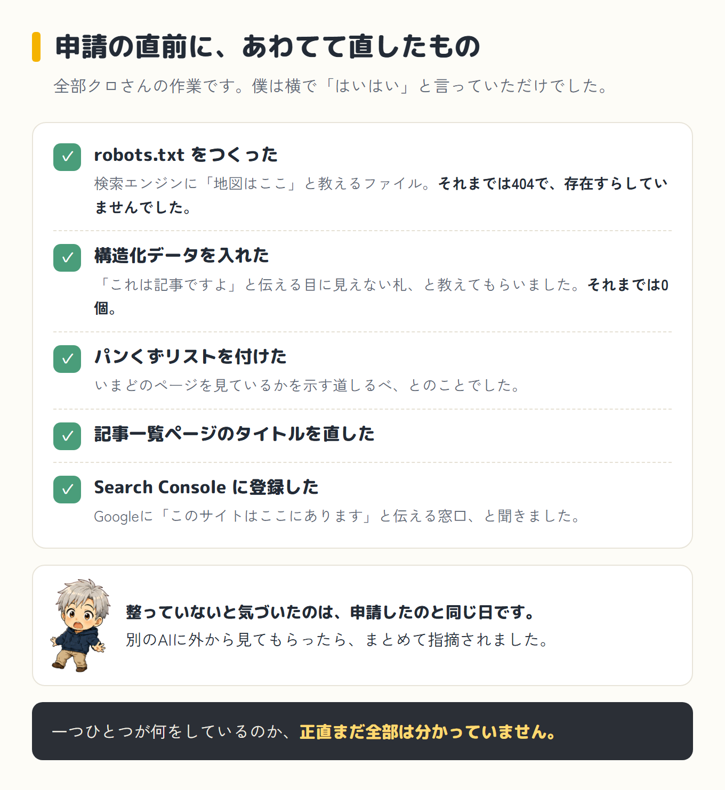
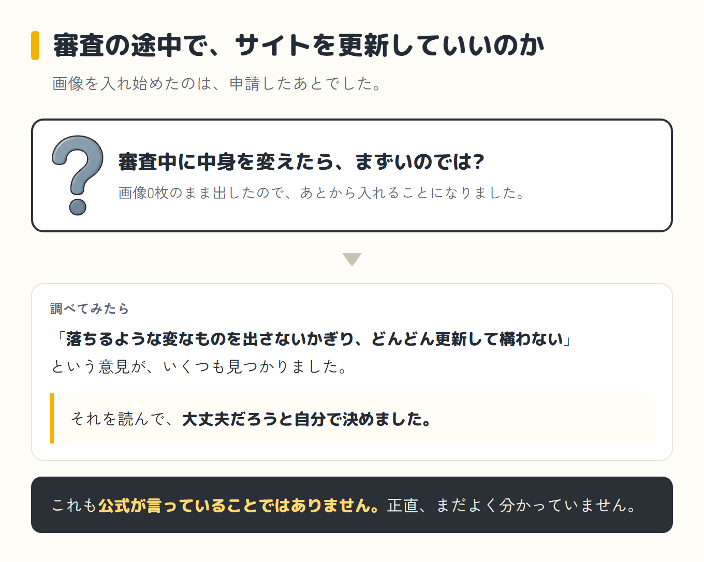
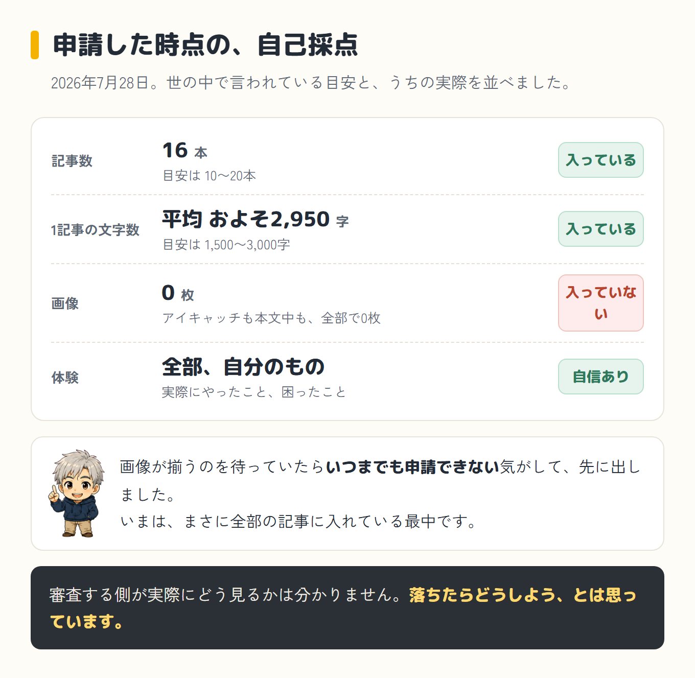

Claude Codeを触り始めたのが2026年7月5日でした。

ブログを公開したのが2026年7月22日です。

そこから6日後の2026年7月28日に、Googleアドセンス(サイトに広告を出してお金をもらうためのGoogleの仕組み)へ申請しました。

申請した時点で、記事は16本、合計で約4万7千字。画像は1枚も入っていませんでした。

## 先に言っておきます(結果はまだ出ていません)

この記事に、審査の結果はまだ書いていません。

書いている今日の時点で、結果がまだ来ていないからです。

「アドセンス 審査 通った」を探してこのページに来た方には申し訳ないのですが、今ここで言えるのは結果ではありません。

申請したときにブログがどんな状態だったか、という中身だけです。

その中身を、この記事にぜんぶ出します。

結果が分かったら、この記事に追記します。

## 申請したときのブログの中身

申請した2026年7月28日の時点で、ブログはこういう状態でした。

| 項目 | 内容 |
|---|---|
| 記事数 | 16本(AI挑戦の連載11本+ダイエット記録5本) |
| 文字数 | 合計約4万7千字。1記事あたり平均およそ2,950字 |
| カテゴリ | 3つ(AIの始め方/AIで作ってみた/運動しないダイエット) |
| 固定ページ | プライバシーポリシー・お問い合わせ・プロフィールの3つ |
| 画像 | 0枚(アイキャッチも0枚) |
| アクセス数(公開〜申請の6日間) | ページビュー194・セッション72・検索経由2 |

公開してから申請するまでの6日間で、ページビュー(ページが表示された回数)は194でした。

アクセスした人は52人、セッション(訪問のひとまとまり)は72でした。

どこから来たかを見ると、直接アドレスを打って来た人が59、SNS経由が8でした。

<strong class="red">検索から来たのは2でした。</strong>

読んでもらう入り口が、まだ1つもできていない状態で申請したことになります。

国別で見ると、1位はアメリカで22、2位が日本で10でした。

日本語で書いているブログなのに、なぜアメリカが1位なのかは、いまだに分かっていません。

ロボットのような機械的なアクセスが混ざっているのかもしれない、と教えてもらいました。

それと、この数字には、自分で確認のために開いた分も入っているそうです。確認用に開いたページのアクセスも記録に残っていた、と言われました。

このとき、Search Console(検索でどう見られているかを見る道具)とGA4(アクセス解析)は、まだつないでいませんでした。

どんな言葉で検索されて来ているのかを見る準備すら、できていなかったということになります。

その状態のまま申請しました。

## 「AIが書いた記事は通らない」を調べて、不安になりました

申請の前後で、「AIに書かせた記事はアドセンスの審査に通らない」という話をあちこちで見ました。

調べるほど不安になりました。

よく出てきたのは、こういう話でした。

AIに全文を書かせてそのまま公開するのはダメ。

AIに下書きを作らせるところまではよくて、そこに自分の体験や感想を2〜3割足せば通る、というものでした。

記事数の目安は10本から20本。

文字数の目安は1記事1500字から3000字、とも書いてありました。

これを読んで、うちのブログはどっちなんだろうと思いました。

## ただ、うちの記事は「AIが全部書いた」ものではありません

うちのブログの記事は、AIの相棒・クロさん(パソコンの中で実際に手を動かしてくれるAIです)と一緒に作っています。

体験そのものは全部自分のものです。

実際にやったこと、実際に困ったこと、実際に妻に話したこと。

そこは1つも作っていません。

どんなことを書いているのかは、[第0話](/blog/episode-0/)から並んでいます。

ただ、それを文章にする作業は、クロさんに何度もやり直してもらっています。

僕が話したことをクロさんが文章にして、それを読んで「なんか違う」と言って、また直してもらいます。

これを1つの記事で何往復もします。

一発でできあがった記事は、たぶん1本もありません。

それと、ブログのやり方そのものは、YouTubeでずいぶん勉強しました。今も見ています。

パソコンに向かっているのは、毎日6時間から7時間くらいです。

これが、世の中で言われている「AIが全文を書いてそのまま出した記事」と同じものなのか、違うものなのか。

書いている自分としては違う気がしていますが、審査する側からそう見えるかどうかは分かりません。

ここは別の記事でもう少し詳しく書くつもりなので、今回はここまでにしておきます。

## 申請の直前にクロさんがやったこと

申請する直前に、いくつか作業をしました。

ただし、ここに書くことは全部クロさんがやった作業です。

僕が自分の手を動かしたわけではありません。

僕は横で「はいはい」と言っていただけです。

- **robots.txt**をつくってもらいました。検索エンジンに「このサイトの地図はここにあります」と教えるファイルらしいです。それまではアクセスすると404(そのページが存在しないという意味のエラー)になっていて、そもそも存在していなかったと、このとき初めて知りました
- **構造化データ**(JSON-LD)を入れてもらいました。検索エンジンに「これは記事ですよ」と伝えるための、目に見えない札のようなものだと教えてもらいました。それまでは0個でした
- **パンくずリスト**を付けてもらいました。今どのページを見ているかを示す道しるべのようなもの、とのことでした
- 記事一覧ページのタイトルを直してもらいました
- **Search Console**に登録しました。Googleに対して「このサイトはここにあります」と伝える窓口のようなもの、と聞きました
- アクセス解析の**GA4**は、これより前からすでに入っていました

一つひとつが何をしているのか、正直まだ全部は分かっていません。

ただ、申請する前の時点でこれだけのことが整っていなかった、というのは事実として書いておきます。

ちなみに、整っていないと気づいたのは、申請したのと同じ日です。

別のAIにブログを外から見てもらったら、まとめて指摘されました。

そこから慌てて直して、その日のうちに申請しています。その話は[第5話](/blog/episode-5/)に書きました。

## 画像はまだ入っていませんでした(でも今日、入れています)

申請した2026年7月28日の時点で、画像は1枚も入っていませんでした。

<strong class="red">アイキャッチも本文中の画像も、全部で0枚でした。</strong>

ただ、このまま放っておくつもりはありません。

画像が全部揃うのを待っていたら、いつまで経っても申請できない気がして、先に申請を出しました。

画像は、この記事を書いている今日(7月29日)、まさに全部の記事に入れている最中です。

今日中には全部終わらせるつもりでいます。

審査の途中でサイトを更新して大丈夫なのかは、正直よく分かっていません。

調べてみたら、「落ちるような変なものを出さないかぎり、どんどん更新して構わない」という意見がいくつも見つかりました。

それを読んで、大丈夫だろうと自分で決めました。

## いま思っていること

文字数は、目安の中に入っているそうです。

数えてもらったら、1記事あたり平均およそ2,950字でした。

目安は1500〜3000字と言われているので、ちょうどその中です。

画像が0枚だったのは、やっぱり気になります。

記事数は10本から20本という目安に、いちおう入っています。

体験は全部自分のものです。

そこだけは自信があります。

審査する側が実際にどう見るかは分かりません。

落ちたらどうしよう、とは思っています。

それが今の正直な気持ちです。

## この記事、あとで追記します

結果が分かったら、この記事に追記します。

通っても、落ちても、ここに書きます。

その日まで、この記事はこのままにしておきます。

気になった方は、このページを覚えておいてもらえるとうれしいです。
