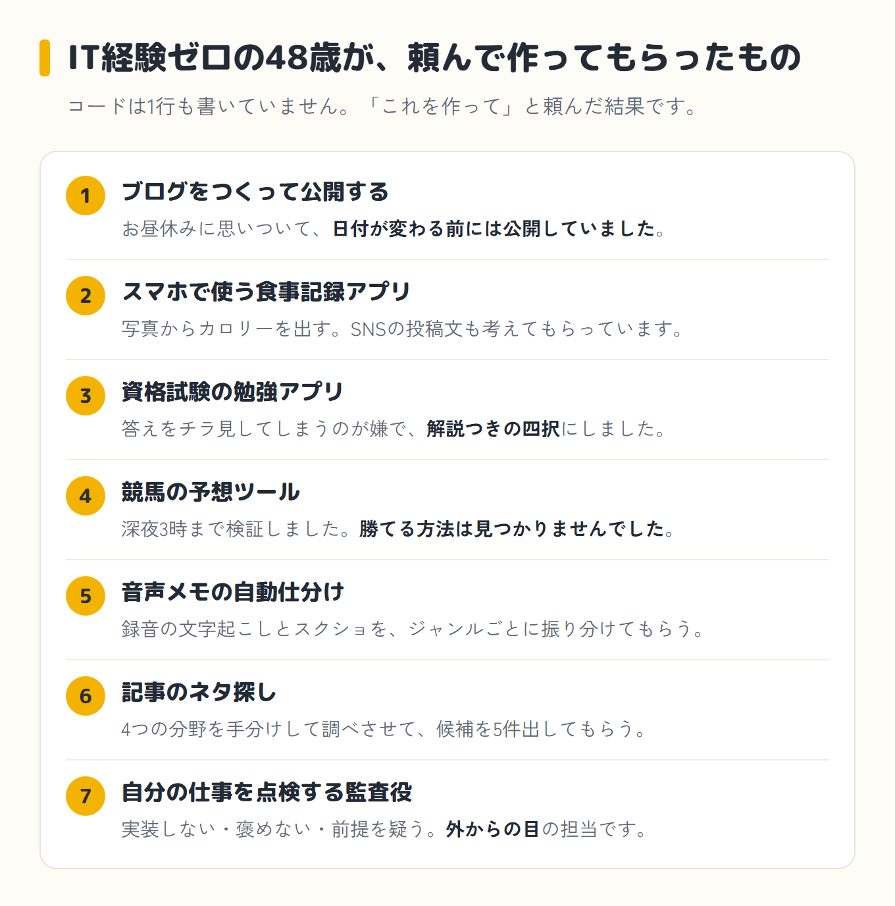
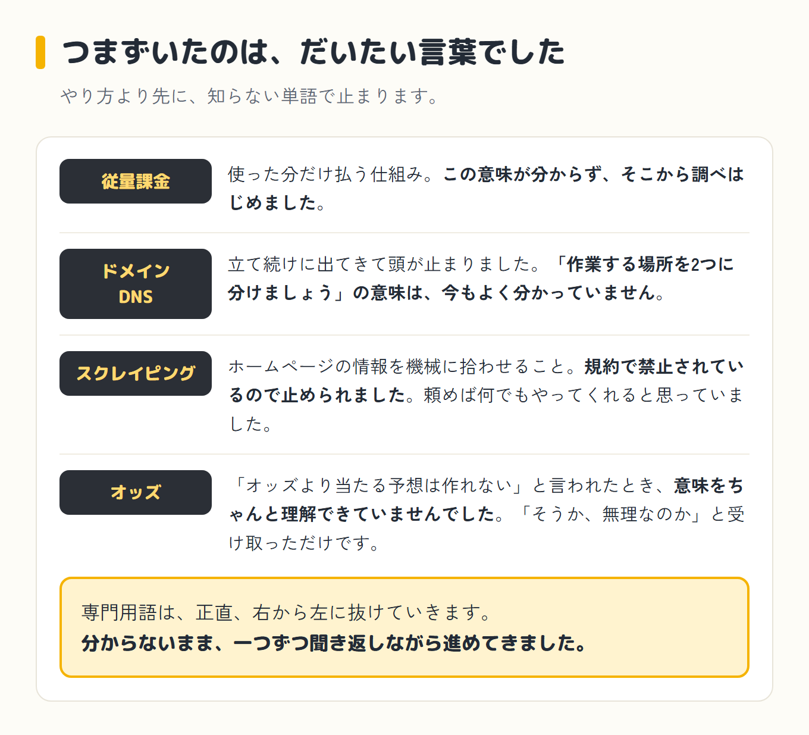

Claude Codeは、パソコンの中で実際に手を動かしてプログラムを書いてくれるAI(AIの相棒・クロさん)です。頼んだ作業を最後までやってくれます。

書いている本人は48歳・土木一筋30年、IT・プログラミング経験はゼロでした。それでもClaude Codeでブログや食事記録アプリなどを実際に形にしてきました。

**この記事でわかること**

- 非エンジニアが実際にClaude Codeで作ったもの7つ
- 作る途中でつまずいた場所
- Claude Codeを使うのに必要なもの

## まず結論:IT経験ゼロの48歳がここまで作った

2026年7月5日にClaude Codeを触り始めて、今日で24日経ちました。

結論から書きます。IT経験ゼロの48歳が、Claude Codeを使って、ブログ、食事記録アプリ、資格試験アプリ、競馬の予想ツール、音声メモの自動仕分け、記事ネタ探し、監査役まで形にしてきました。

コードは自分で書いていません。「これを作って」と頼んで動いてもらってできたものです。

## Claude Codeでできること7つ(非エンジニアが実際に作ったもの)

### 1. ブログを作って公開する

「ブログでもやってみるか」とお昼休みに思いついて、日付が変わる前には独自ドメインを取得してサイトを公開していました。「ドメイン」「DNS」「レジストラ」という言葉は、そのとき初めて聞きました。難しい専門知識がないまま、画面を一つずつAIに確認しながら進めた結果です。今は記事が16本になっています。経緯は[こちらの記事](/blog/episode-2/)に書いています。

### 2. スマホで使える食事記録アプリを作る

ダイエットのために、食べたものの写真をAIに解析させてカロリーを入れるアプリを作りました。タンパク質・脂質・炭水化物のPFCも記録できます。もう一つの機能が、その日の食事からSNSの投稿文をAIに考えてもらうことで、こちらがメインの使い方になっています。完成品ではなく、使いにくいところを毎日少しずつ直しながら、スマホで実際に使い続けています。詳しくは[こちらの記事](/blog/diet/mil-tanjou/)。

### 3. 資格試験の勉強アプリを作る

仕事で使う資格試験の勉強アプリも作りました。きっかけは、市販の過去問本を使っていると答えをうっかりチラ見してしまうことと、解説が付いていないことへの不満でした。それなら自分で作ればいいと思い、四択問題をクリックするとその場で正解か不正解かが出て、そのあとに解説も出る形にしました。単純な作りですが、意外とちゃんと動いています。

### 4. 競馬の予想ツールを作る

競馬でも、過去のレースデータを取り込んで、高配当を狙う買い目を自動で組んでくれる道具を作りました。深夜3時まで検証を続けた日もあります。結果として、オッズより当たる予想は最後まで作れず、勝てる方法は見つかりませんでした。それでも道具そのものは形になり、この経験がそのままブログのネタにもなっています。経緯は[こちらの記事](/blog/episode-4/)に書いています。

### 5. 音声メモを自動で仕分けさせる

思いついたことは、ボイスレコーダーに録音したり、スマホに書いたりしてためています。その録音の文字起こしと、思いついたことを書いたページのスクリーンショットを、ジャンルごとのフォルダに自動で振り分けてもらっています。同じものを二重に取り込まないように、取り込み済みかどうかを記録する仕組みも入っています。「取り込んで」と声をかけるだけで、あとはAIが仕分けてくれます。

### 6. 記事のネタを探させる

ブログの記事ネタを探す作業も、AIに手分けして調べてもらう仕組みにしました。「AI全般」「同じ立場の発信者」「土木×AI」「自分のプロジェクト」という4つの分野を同時に調べさせて、候補を5件出してもらう形です。自分の体験とつなげられそうな切り口だけを選んで残す、というやり方で、ネタ切れの不安を減らしています。

### 7. 自分の仕事を点検する担当を作る(監査役)

できあがったブログを、褒めずに問題点だけ指摘する担当も作りました。ルールは3つだけです。実装はしない、褒めない、指示書に書いてあることでも前提を疑う。これまでの会話を一切引き継がない状態で立ち上げるので、内輪の思い込みに引きずられない「外からの目」になります。月1回のペースで呼ぶことにしましたが、まだ1回しかやっていません。経緯は[こちらの記事](/blog/episode-5-kouhen/)に書いています。

## 非エンジニアがClaude Codeでつまずいたこと

ここが、この記事でいちばん書きたいところです。

一番最初につまずいたのは料金の仕組みでした。

そのころ、すごいモデルが出たぞ、という話が流れてきました。Fable 5というAIです。期間限定で使える状態になっていました。無料では使えず、有料プランに入っている人だけです。

何がどうすごいのかは、分かっていませんでした。競馬の分析くらい簡単にやってくれるんだろう、くらいに思っていました。

ありがたく使っていたのですが、ふと「この期間が終わったら、どうなるんだろう」と思って調べました。

そこに「従量課金」と書いてありました。

その言葉の意味が分かりませんでした。使った分だけ払う仕組みのことだと知ったのは、そのあとです。

ちなみに、その「期間限定」は延びに延びて、今は上のプランに入っていれば月額の中で使えるようになりました。あのとき慌てて調べたのは何だったんだ、という感じです。

そのFable 5が実際どのくらいすごいのかは、3週間ほど使った今も、正直よく分かっていません。なんかすごいんだな、というイメージのままです。

ブログを作ったときは、「ドメイン」「DNS」「レジストラ」という言葉が立て続けに出て、頭が一瞬フリーズしました。「作業する場所を2つに分けましょう」と言われましたが、その意味は今でもよく分かっていません。それでも言われるまま進めました。

ゲームのデータを集めようとしたときは、「自動で集めてきてほしい」と軽く頼んだら、「規約で禁止されているので、やめておきましょう」と止められました。頼めば何でもやってくれると思っていたので、意外でした。

このとき「スクレイピング」という言葉を初めて知りました。ホームページに出ている情報を、人が手で写すのではなく、機械にまとめて拾わせることだそうです。便利な代わりに、サイトによっては規約で禁止されている、と教えてもらいました。

競馬のデータを検証してもらったときも、「オッズより当たる予想は作れない」という説明を、そのときはちゃんと理解できていませんでした。「そうか、無理なのか」と受け取っただけでした。

専門用語は、正直、右から左に抜けていきます。分からないまま、一つずつ聞き返しながら進めてきました。

## 非エンジニアがClaude Codeを使うのに必要なもの

必要なものは、パソコンと、有料プランです。

安いプランから始めることができて、使う量が増えていくと、上のプランに移ることになります。自分が今いくら払っているかは、また別の記事で正直に書くつもりです。パソコンは普段使っているものでした。特別なスペックを揃えたわけではありません。

プログラミングの知識は要りません。分からない言葉が出てきたら、そのつど聞き返しながら進めれば大丈夫でした。

## まとめ

IT経験ゼロの48歳でも、Claude Codeに頼んで動いてもらえば、ここまで形にできました。つまずいた場所も含めて、実際にやった記録です。

なぜこの48歳がAIに手を出すことになったのか、始まりは[第0話](/blog/episode-0/)に書いています。まずはそちらから読んでみてください。
