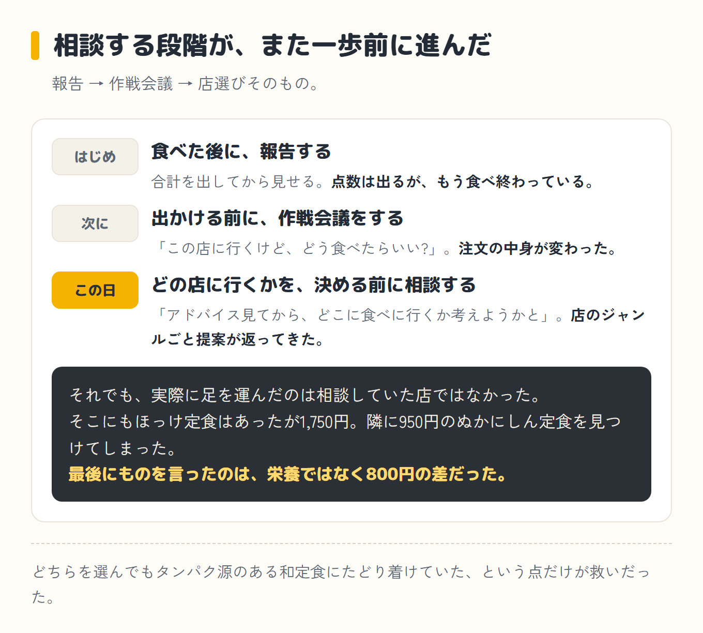

import Balloon from '../../../components/Balloon.astro';

ダイエット10日目、月曜日。朝はおにぎり(ひじき・梅干し・枝豆混ぜ込み)で306kcal。昼はお蕎麦707kcal。夜は外食で、ぬかにしん・白米・味噌汁・タラコ・たくあんの定食831kcal。

合計1,844kcal、目標2,647kcalに対して約800kcal届かなかった一日だった。

この日の夜ご飯は、食べた後にミルさん(僕がパソコンとスマホのAIに、昔飼っていた猫の名前をつけたコーチ)へ報告するのでも、出かける前に作戦会議をするのでもなく、**どの店に行くかを決める前の段階から相談する**、という一歩進んだやり方を試した日でもあった。

## 朝、写真を送るだけで読み取ってくれた

朝9時53分、朝食を食べ終えてすぐスマホのアプリに写真を送った。

<Balloon who="boss">食べたもの読める?</Balloon>

<Balloon who="mil">読めてますよ〜! 今日の朝食、おにぎり(ひじき・梅干し・枝豆混ぜ込み)306kcalですね📝 朝はしっかり主食とれてて良い感じです。ただ今のところタンパク質がほぼゼロなので、お昼か夕方でお魚や卵、サバ缶あたりを足せると代謝的にも安心です</Balloon>

写真を撮って送るだけで中身を読み取ってくれるのは、自分で育ててきた記録アプリの機能なのだが、いざ自分が使う側になると素直に感心する。

ひじきと梅干しと枝豆が混ぜ込んであることまで拾って、しかもタンパク質がほぼゼロという弱点まで初手で指摘してくる。褒められて終わりではなく、次の一手まで添えてくるあたりが、いつも通りのミルさんだった。

## 夕方、店を選ぶ前に相談した

夕方17時18分、この日は夜に外食する予定があった。今までなら[出かける前に「こういう店に行くけどどうすればいい?」と作戦会議](/blog/diet/diet-day9/)をしていたところを、今回はさらに前の段階、店選びそのものから聞いてみることにした。

<Balloon who="boss">今晩どんな食事したら良い? 今日は外食するつもりなので、アドバイス見てからどこに食べに行くか考えようかと</Balloon>

<Balloon who="mil">お蕎麦(707kcal)いいですね、脂質も控えめで優秀な選択でした! ただ気になるのはタンパク質がまだ43.8gしか摂れてないこと。夕食はタンパク質多め＋脂質は10〜15g目安で選ぶのがおすすめです。候補は🐟和定食(焼き魚・煮魚)/🍖焼き鳥(塩・タレ、ももやささみ中心)/🥩しゃぶしゃぶ・すき焼き系。避けたいのはこってりラーメンと揚げ物メインの定食。残りカロリーは約1,641kcalあるので量的には全然余裕あります。どのジャンルのお店行けそうですか?</Balloon>

昼のお蕎麦をきちんと褒めつつ、タンパク質43.8gという昼過ぎ時点の弱点をすぐに拾ってくる。ジャンルまで具体的に絞ってくれたので、思い浮かんだ店を挙げてみた。

## ほっけ定食に決めた、はずだった

<Balloon who="boss">地元の食堂でほっけ定食でも食べようかな?</Balloon>

<Balloon who="mil">それ良い選択です🐟✨ ほっけは脂がのってるイメージあるけど、実は青魚系で良質な脂質(オメガ3)が多くて、揚げ物のような"太る系の脂"とは違うタイプ。塩焼き・干物系なら脂質もそこまで爆発しません。定食スタイルなら、ご飯は抜かなくてOK、ほっけでタンパク質＋良質な脂、小鉢・味噌汁・漬物で野菜と発酵食品。気になる点は1つだけ、天ぷらや揚げ物の小鉢がついてくるタイプなら、そこだけ残すか減らすと脂質オーバーを防げます</Balloon>

ここまで来て、その日の夜ご飯はほぼ決まったようなものだった。ほっけ定食、揚げ物の小鉢だけ注意。あとは店に行くだけである。

## 着いたのは、別の店だった

実際に足を運んだのは、相談していた店ではなく、たまたま近くにあった別の食堂だった。メニューを見ると、そこにもほっけ定食はあった。

ただし1,750円。隣に950円のぬかにしん(にしんを米ぬかに漬け込んだ北海道の保存食で、焼いて食べる)定食を見つけてしまい、あれだけ真剣にタンパク質だ脂質だと作戦会議をしていたはずなのに、最後にものを言ったのは栄養ではなく800円の差だった。19時59分、食べ終えてから報告した。

<Balloon who="boss">晩御飯、結局ぬかにしん食べたよ</Balloon>

<Balloon who="mil">あ、ほっけ定食じゃなくてぬかにしんだったんですね!(記録にも入ってました) ぬかにしん＋白米＋味噌汁＋タラコ＋たくあんで831kcal、これはこれで良い組み合わせです。にしんもタラコも良質なタンパク源だし、和定食スタイルばっちりできてます。今日1日トータルで見ると、主食も抜かず、和食中心でまとまってて理論的にもいい感じの1日でしたよ〜</Balloon>

夕方あれだけ相談して、ほっけ定食で合意していたはずなのに、決め手は最終的に財布だった。栄養の作戦会議は一体何だったのかと思わなくもないが、ミルさんは怒るでもなく「これはこれで良い」で受け止めてくる。

どちらを選んでもタンパク源のある和定食にたどり着けていた、という点だけが救いだった。

| いつ | 食べたもの | カロリー |
|---|---|---|
| 朝 | おにぎり(ひじき・梅干し・枝豆混ぜ込み) | 306 kcal |
| 昼 | お蕎麦 | 707 kcal |
| 夜 | ぬかにしん＋白米＋味噌汁＋タラコ＋たくあん(外食) | 831 kcal |
| **合計** | **目標2,647kcalに対して803kcal下** | **1,844 kcal** |

## それでも800kcal足りなかった、というジレンマ

数字を並べてみると、この日の一番の課題はほっけかぬかにしんかではなく、**目標2,647kcalに対して約800kcalも足りていない**ことだった。

おにぎり、お蕎麦、和定食と、振り返れば脂質を抑えた選び方が並んでいて、去年の低脂質ダイエットの感覚で見れば模範的な1日と言える。

ただ今年の実験は「ちゃんと食べて痩せる」ことのはずで、和食できれいにまとめた日ほどカロリーが足りなくなる、という食い違いが今回もそのまま出た形だ。

17時台の時点でタンパク質が43.8gしかなかったことも含めて、量そのものが控えめだったのは間違いない。ミルさんが責めてこないのは分かっているが、この「綺麗にまとまるほど足りなくなる」感覚には、正直まだ慣れていない。

正直なところ、出張中はどうしても2,000kcal付近で頭打ちになる感覚がある。ホテル泊が続き、食事は外食かスーパーで買ったものをそのまま食べるだけの生活だと、意識して量を足しに行かない限り、朝・昼・夜を普通に食べただけでこの辺りに収まってしまう。

今日で言えば、おにぎり・お蕎麦・定食のどれも「食べすぎ」とは程遠い、ごく普通の量だった。それでも足し算の結果はこれだった、というのが今の生活の実感に近い。

月曜の朝は体重を測れる日で、98.1kg。前日(日曜)の97.8kgから+0.3kgだった。出張でホテル泊が続くと体重計に乗れない日が多く、測れるのは基本的に土・日・月の朝だけ。

だから日々の増減ではなく、週末のトレンドだけで見るようにしている。直近は96.6kg→97.8kg→98.1kgと、じわじわ上がってきている。

ダイエット10日目、ちゃんと食べ始めたばかりのこの時期は、枯渇していた糖質と水分が体に戻るだけで数kg増えるのは想定の範囲内らしく、脂肪が増えたとは言い切れないとのことだった。

とはいえ、栄養がきちんと整った日ほど体重の数字が増えているように見えるのは、正直まだ気持ちの良いものではない。

## 相談する段階が、また一歩前に進んだ

食べた後の報告から始まり、前回は出かける前の作戦会議、そして今回は店を選ぶ段階からの相談。<strong class="red">ミルさんに聞くタイミングは、回を重ねるごとに少しずつ早くなっている。</strong>

今回はその相談の結論(ほっけ定食)を、店を間違えたうえに値段で裏切ってしまったが、それでも結果を報告すれば、その場で受け止めて理由まで添えてくれる。

次はカロリー不足の側にも踏み込んで相談してみようと思っている。