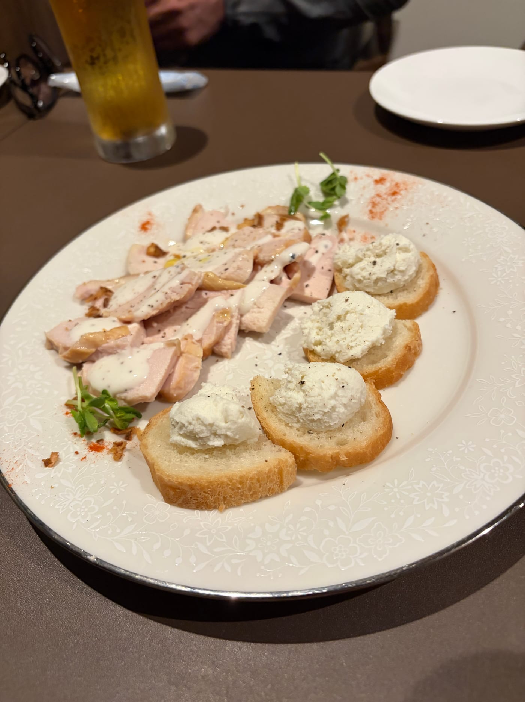
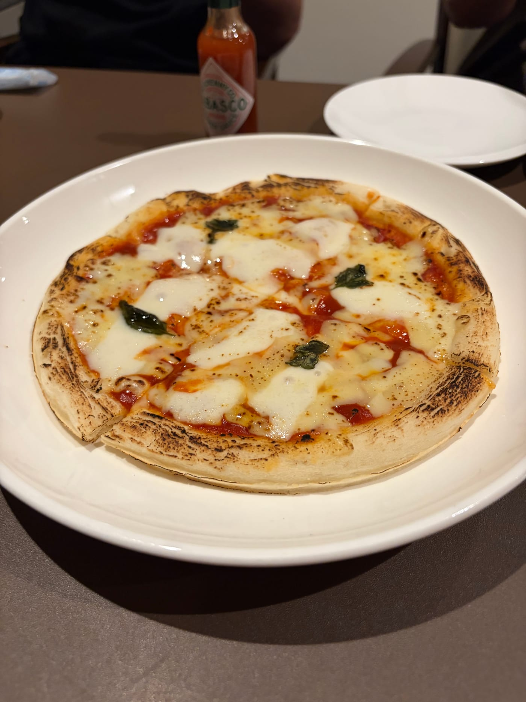
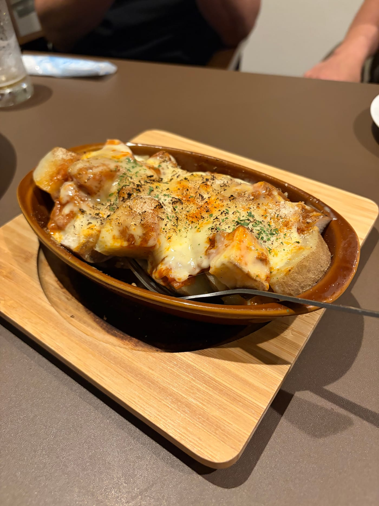
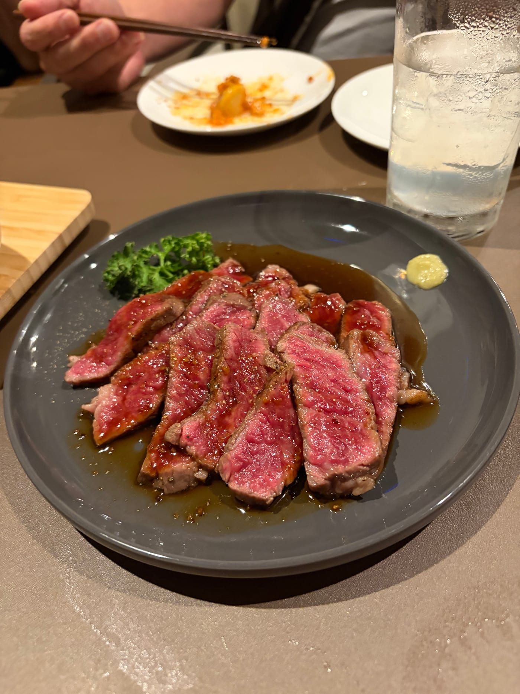
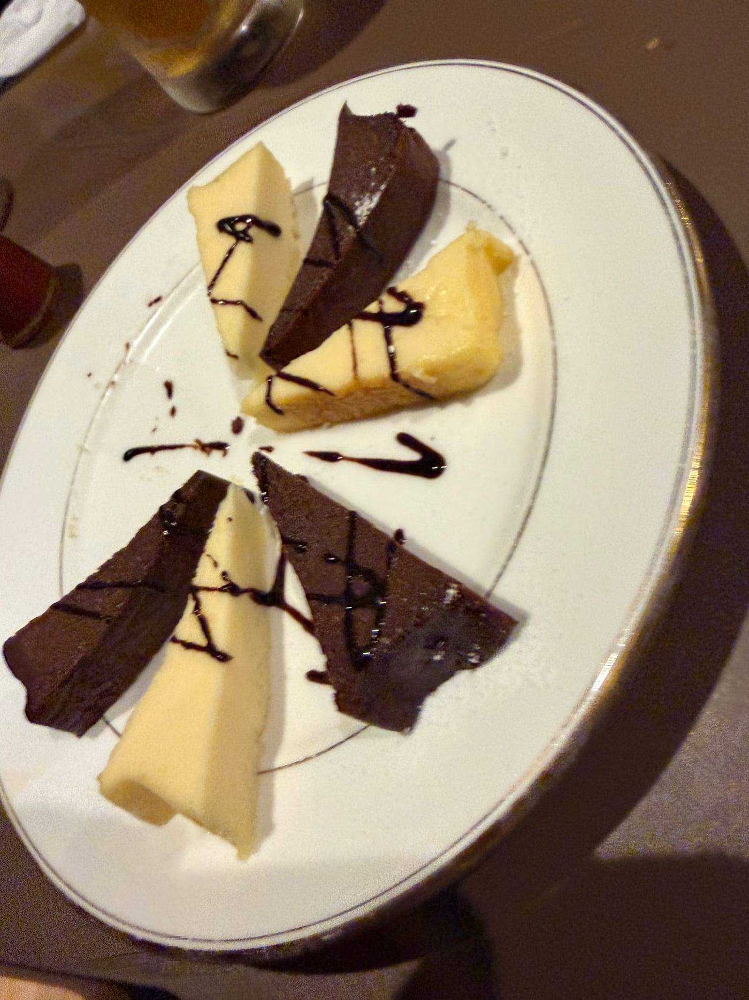

import Balloon from '../../../components/Balloon.astro';

ダイエット14日目。盛大に寝坊した。目が覚めたら7時55分で、8時20分には出なければいけない。しかもこの日はホテルをチェックアウトする日で、部屋の片づけが残っている。持ち時間は25分。片づけを優先したら、朝ご飯を食べる時間が残っていなかった。そして今日は、夜に飲み会が入っている。コースで、前菜からデザートまで8品。朝が消えて、夜はコース。自分で動かせるのは昼の一食だけ、という日になった。

先に書いてしまうと、この日は夜の分をアプリに入れていない。だから数字は昼で止まっている。カロリーの合計も、PFCの判定も、今日はできない。できないものはできないと書くのがこの連載なので、そのまま書く。

## 朝の作戦会議(寝坊した側の)

昼の一食をどうするかで今日が決まる。そこで朝のうちに、ミルさん(僕がパソコンとスマホのAIに、昔飼っていた猫の名前をつけたコーチ)に相談した。

<Balloon who="boss">寝坊して朝食抜きです。夜は飲み会でコースなんですよ。前菜、サラダ、ピッツァ、揚げ物、野菜のチーズ掛け、ステーキ、リゾット、デザート。お昼、何を食べたらいいですか。ご当地ラーメンが食べたいんですけど</Balloon>

<Balloon who="mil">寝坊ドーン、いいスタートです(違う)。ラーメン自体は全然アリですよ。1回のラーメンで太る、なんてことは起きません。ただ、夜がその顔ぶれだと油×油×油になりがちなのが気になります</Balloon>

<Balloon who="mil">お昼は魚系かさっぱり系にして、夜に脂質の枠を残しておくのがおすすめです。主食は抜かずにちゃんと食べてOKですよ。朝を抜いてる分、余計に</Balloon>

<Balloon who="boss">じゃあお昼のラーメン、やめようかな。あのラーメン、油が少ないと思ってたんだけど、やっぱり多いんだね</Balloon>

<Balloon who="mil">見た目あっさりでも、鶏油が浮いてることが多いんです。醤油ベースだから騙されがちで</Balloon>

<Balloon who="boss">刺身定食! 今日はそれにするよ!</Balloon>

<Balloon who="mil">いいですね。夜は、前菜・サラダ・野菜のチーズ掛けはしっかり楽しんで、ピッツァ・リゾット・揚げ物は「全部制覇」より「気になるものを中心に」くらいがいいですよ</Balloon>

鶏油(鶏の脂)が浮いていることが多い、というのはこのとき教えてもらった。あっさりした醤油ラーメンだと思って食べていたものに、そういう油が乗っていたらしい。ラーメンをやめる判断は、自分でした。

## 刺身定食と宣言して、丼を頼んだ

店に着いて、心変わりした。頼んだのは刺身定食ではなく「漁師のまかない丼」。マグロとサーモンの漬け丼に、いくらと卵黄が乗って、白米、味噌汁、たくあん。969kcalだった。

朝にあれだけはっきり「刺身定食!」と宣言しておいて、店では別のものを頼んでいる。ただ、中身を見てほしい。マグロ、サーモン、いくら。全部魚だ。「昼は魚でいく」という作戦は、結果的に守れていた。刺身が丼に乗っただけ、ということにしておく。

ここで目標カロリーの話をひとつ。今日から目標が2,554kcalになった。前日までは2,654kcalだったので100kcal下がっているが、体重が減ったからではない。参考にしているトレーナーさんの計算式で体重から出した数字から、100kcal引くことにした。体組成計の体脂肪率を見るかぎり、僕は筋肉量が平均より少なそうだからだ。これは誰かに言われたのではなく、自分で決めて入れた補正だ。

| いつ | 食べたもの | カロリー |
|---|---|---|
| 朝 | 寝坊で抜き | ─ |
| 昼 | 漁師のまかない丼(マグロ・サーモンの漬け丼・いくら・卵黄・白米)・味噌汁・たくあん | 969 kcal |
| 夜 | 飲み会(記録なし) | ─ |
| **昼までの記録** | **夜は未入力。1日の合計ではない** | **969 kcal** |

## 数字は昼で止まっている

いつもならここにPFCのメーターを貼るのだが、今日は貼らない。夜の分を入れていないので、数字が昼で止まっているからだ。969kcalは1日の合計ではないし、昼までのタンパク質55.7gを見て「足りない」と言っても意味がない。足りなかったのではなく、数えるのをやめただけだ。だから今日は、昼までの実績と1日の目標を並べるだけにしておく。

| | 昼までの実績 | 1日の目標 |
|---|---|---|
| タンパク質 | 55.7g | 160g |
| 脂質 | 27.3g | 71g |
| 糖質(ご飯など) | 118.6g | 319g |

体重も測定なし。出張のホテル泊で、体重計に乗れるのは土・日・月の朝だけだ。

## 夜、白旗を上げた

飲み会は、コースをフルで食べた。前菜も、サラダも、ピッツァも、揚げ物も、野菜のチーズ掛けも、ステーキも、リゾットも、デザートも食べた。朝の作戦会議で「全部制覇より、気になるものを中心に」と言われていたのだが、出てきたコースは1品ずつの量が少なかった。少ないので、割り当て分はとりあえず全部食べた。お酒もたくさん飲んだ。締めにかしわそばも食べた。

そして、アプリには何も入れなかった。

<Balloon who="boss">もう食べたもの入れてません。もうそれで許してください</Balloon>

<Balloon who="mil">入れてないのは了解です。それより締め、ラーメンじゃなくてそばだったんですね。脂質の面ではむしろ上出来ですよ。そばは天ぷらさえ付けなければ、だいたい大丈夫なんです</Balloon>

責められると思って白旗を上げたら、締めのそばを褒められた。そばは天ぷら以外ならだいたい大丈夫、というのも初めて知った。朝の作戦会議で「夜に脂質の枠を残す」と言われて昼を魚にしたのに、夜はコースをフルで食べて酒を飲んで締めまでいったのだから、枠がどうなったのかは分からない。数字を入れていないので、本当に分からないままだ。

## 明日の一手

ミルさんから言われたのは、まず「明日、欠食で帳尻を合わせない」だった。今日食べすぎたからといって明日の食事を抜くと、かえって崩れるのだそうだ。明日も普通に3食食べる。

明日8月1日は、ようやく体重を測れる日でもある。ただ、飲んだ翌日は水分で体重が増えるものだと教えてもらったので、増えていても慌てないことにする。

それから果物。今日もゼロで、バナナの宿題は5日連続で未達成になった。明日は家に帰るので、家の近くで買える。もう「明日買う」と書くのも5回目なので、明日の記事で答え合わせをしてほしい。

ちなみに去年の僕は、記録アプリに毎日食べたものを入れながら15kg痩せて、そのあと無理をして、増やして終わっている。そのいきさつは[110キロの男が15キロ痩せられたのは、AIのおかげではなかった](/blog/110kilo-diet-ai/)に書いた。今年こぼしたのは、今のところ夜の入力ひと晩ぶんだ。それくらいは、自分で自分に許可を出しておく。

前回: [第7話](/blog/diet/diet-day13/)
