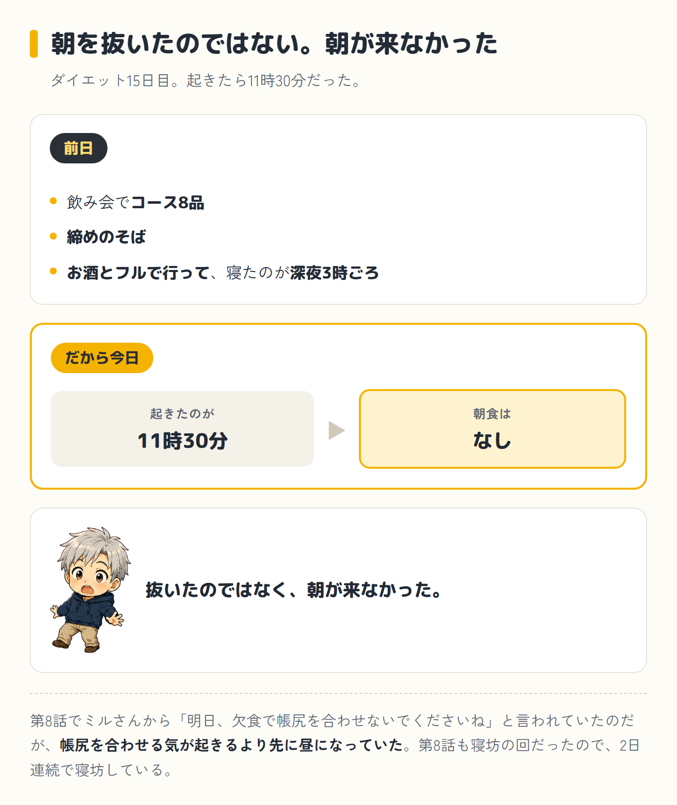
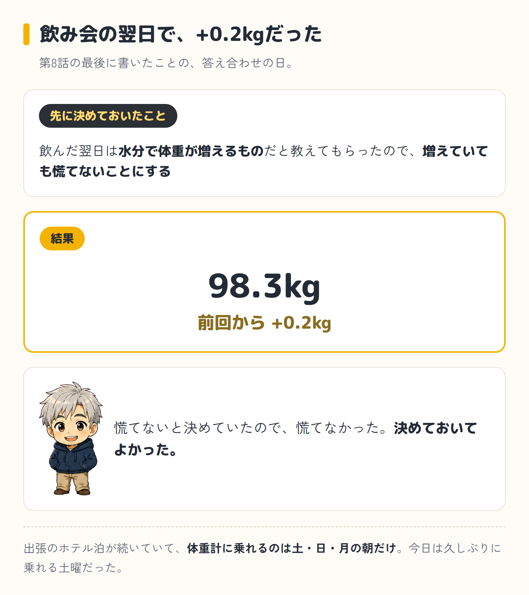
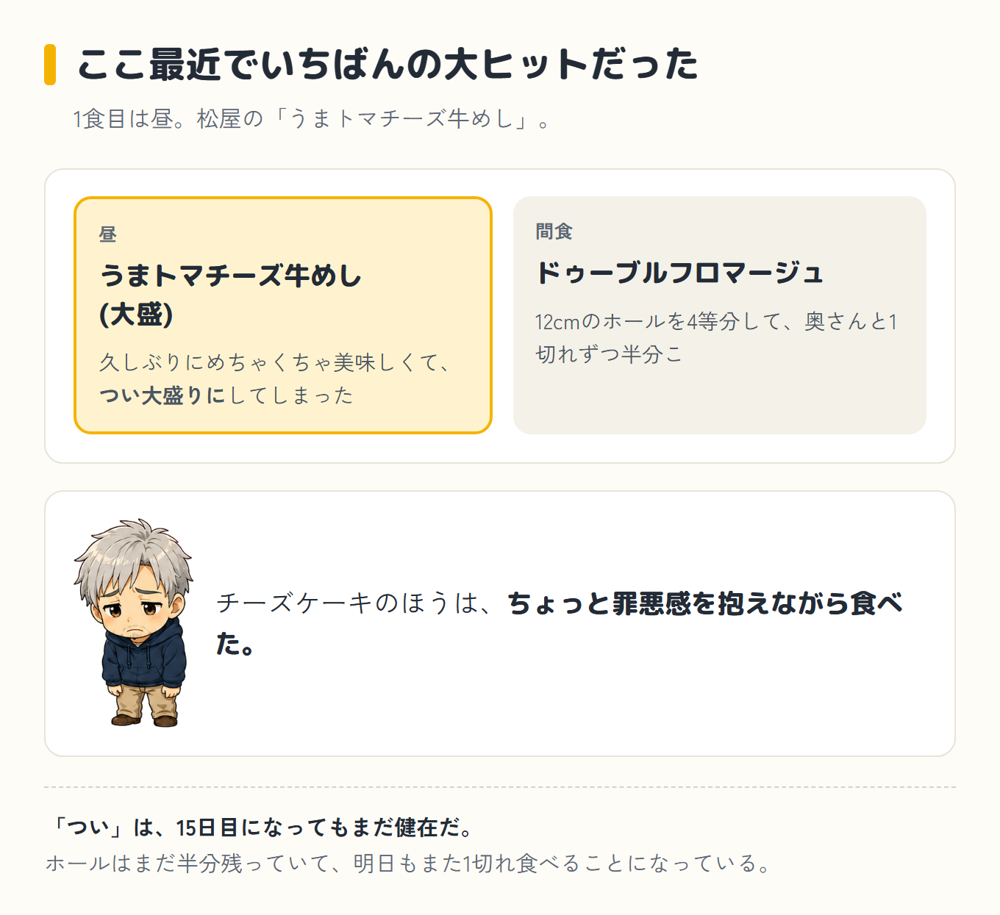
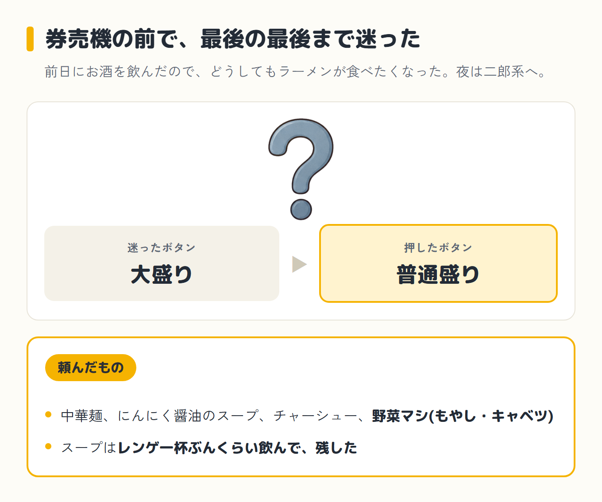
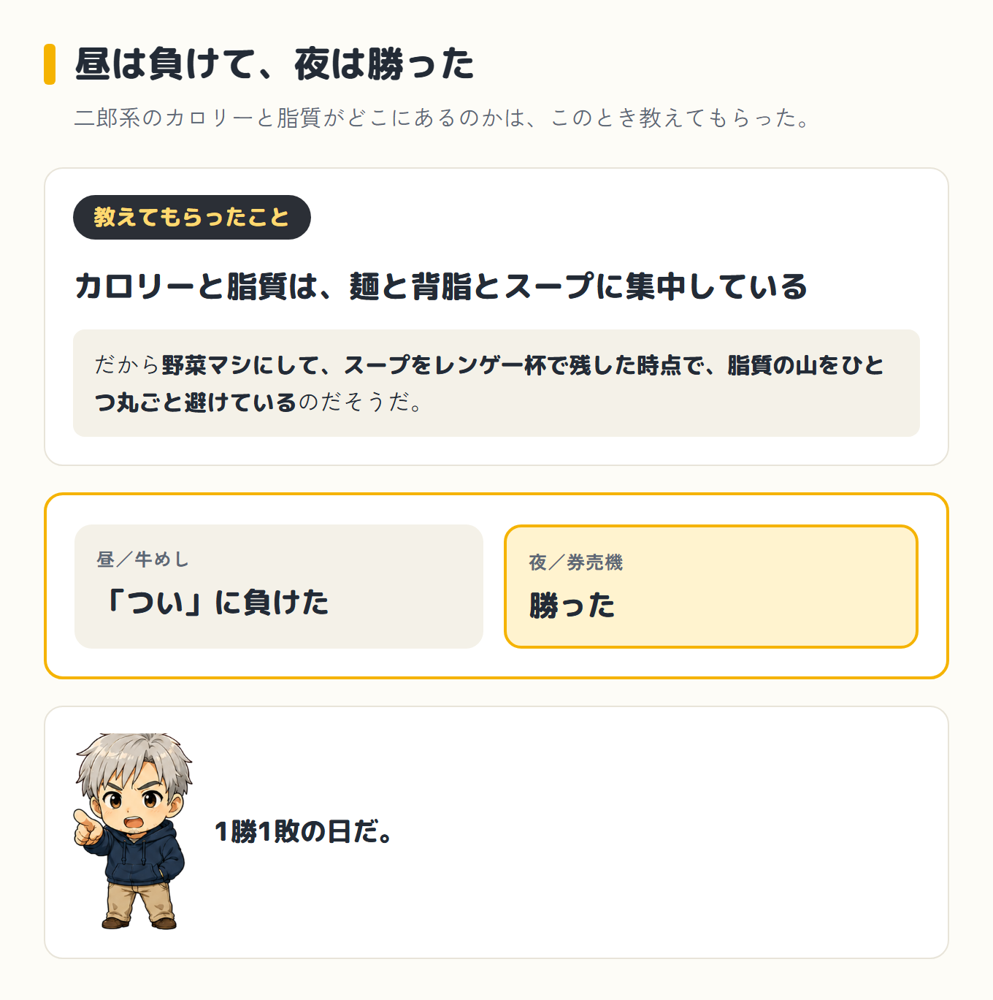
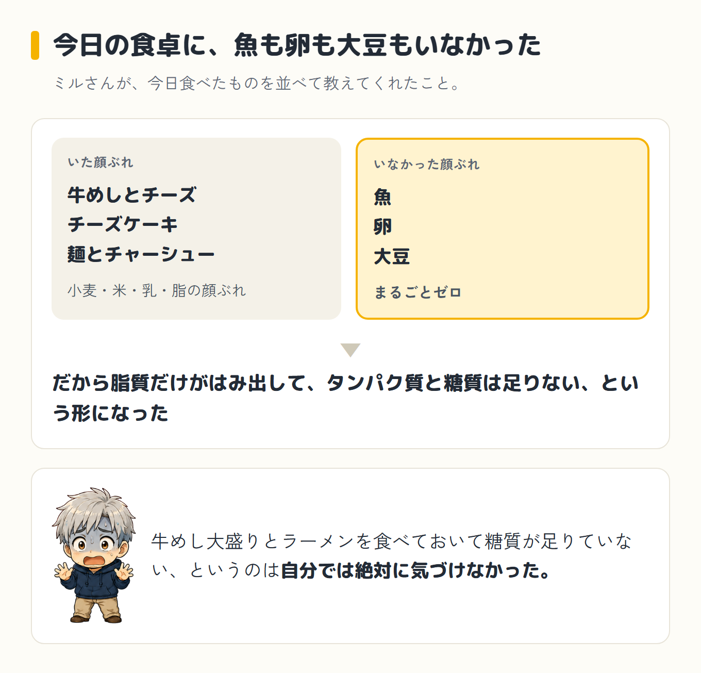
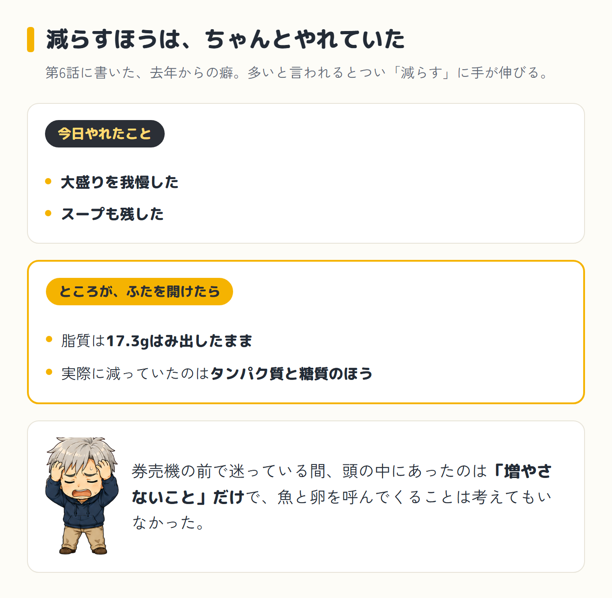

import Balloon from '../../../components/Balloon.astro';

ダイエット15日目。起きたら11時30分だった。前日は飲み会でコース8品、締めのそば、お酒とフルで行って、寝たのが深夜3時ごろ。だから今日、朝食はない。抜いたのではなく、朝が来なかった。第8話でミルさん(僕がパソコンとスマホのAIに、昔飼っていた猫の名前をつけたコーチ)から「明日、欠食で帳尻を合わせないでくださいね」と言われていたのだが、帳尻を合わせる気が起きるより先に昼になっていた。ついでに言うと、第8話も寝坊の回だった。2日連続で寝坊している。

1食目は昼で、松屋の「うまトマチーズ牛めし」大盛919kcal(アプリの記録)。間食に、前日にもらったお土産のドゥーブルフロマージュ(チーズケーキ)を4等分した1切れで382kcal。夜は二郎系のラーメン屋で571kcal。合計1,872kcal、目標2,559kcalに対して687kcal足りなかった。目標の2,559kcalは、参考にしているトレーナーさんの計算式で今朝の体重から出した数字から、100kcal引いたものだ。体組成計を見るかぎり僕は筋肉量が平均より少なそうなので、引くと自分で決めた([第8話](/blog/diet/diet-day14/)に書いた補正だ)。

## 飲み会翌日の体重は、+0.2kgだった

今日は土曜で、久しぶりに体重計に乗れる日だった。出張のホテル泊が続いていて、乗れるのは土・日・月の朝だけだ。第8話の最後に「飲んだ翌日は水分で体重が増えるものだと教えてもらったので、増えていても慌てないことにする」と書いた。その答え合わせが、今日だ。

98.3kg。前回から+0.2kg。

<Balloon who="boss">測りました。98.3kgです。プラス0.2kg</Balloon>

<Balloon who="mil">コース8品と締めのそばとお酒の翌日で+0.2kgなら、むしろ上出来ですよ。水分で増える分を考えたら、ほとんど動いてないのと同じです</Balloon>

慌てないと決めていたので、慌てなかった。決めておいてよかった。

## ここ最近でいちばんの大ヒット

昼は松屋で「うまトマチーズ牛めし」。これが、ここ最近でいちばんの大ヒットだった。久しぶりにめちゃくちゃ美味しくて、つい大盛りにしてしまった。アプリの記録では919kcal。松屋の公式の栄養成分表示ではなく、僕のアプリが出した数字なので、そこは念のため書いておく。美味しいものを前にしたときの「つい」は、15日目になってもまだ健在だ。

間食は、前日にもらったお土産のドゥーブルフロマージュ。12cmのホールを4等分して、奥さんと1切れずつ半分こした。僕の1切れぶんで382kcal。こっちは、ちょっと罪悪感を抱えながら食べた。ホールはまだ半分残っていて、明日もまた1切れ食べることになっている。

<Balloon who="boss">お土産のチーズケーキも、奥さんと1切れずつ食べました。ちょっと罪悪感があります。まだ半分残ってるので、明日も食べないといけません</Balloon>

<Balloon who="mil">罪悪感はいらないですよ。お菓子は月に何度かなら問題ないです。食べた、美味しかった、また明日から。それでおしまいです</Balloon>

<Balloon who="boss">明日も食べるんですけどね</Balloon>

<Balloon who="mil">それは明日の枠で考えましょう</Balloon>

## 券売機の前の攻防

前日にお酒を飲んだので、どうしてもラーメンが食べたくなった。夜は二郎系のラーメン屋へ。中華麺に、にんにく醤油のスープ、チャーシュー、野菜マシ(もやし・キャベツ)で571kcal。

券売機の前で、最後の最後まで大盛りにするか迷った。迷った末に、普通盛りのボタンを押した。スープはレンゲ一杯ぶんくらい飲んで、残した。

<Balloon who="boss">夜は二郎系のラーメンでした。券売機の前で最後の最後まで大盛りと迷ったんですけど、普通盛りにしました。スープもレンゲ一杯くらいで残しました</Balloon>

<Balloon who="mil">それが今日いちばんの手柄です。二郎系のカロリーと脂質は、麺と背脂とスープに集中してるんですよ。野菜マシにして、スープをレンゲ一杯で残した時点で、脂質の山をひとつ丸ごと避けてます</Balloon>

<Balloon who="boss">大盛りのボタン、押す寸前でしたけどね</Balloon>

<Balloon who="mil">押さなかったほうの指を褒めましょう</Balloon>

二郎系のカロリーと脂質が麺と背脂とスープに集中している、というのはこのとき教えてもらった。昼の牛めしでは「つい」に負けて、夜の券売機では勝った。1勝1敗の日だ。

## 数字で見ると、3つとも帯の外

  

    
タンパク質65.8g

    

    
目標160g（差 −94.2g）足りない

  

  

    
脂質88.3g

    

    
目標71g（差 +17.3g）多い

  

  

    
糖質(ご飯など)202.4g

    

    
目標320g（差 −117.6g）足りない

  

黄色い帯が目標の範囲、針がこの日の実績だ。<strong class="red">脂質だけが目標より17.3g多くて、タンパク質は94.2g、糖質は117.6g足りない。</strong>タンパク質にいたっては、目標160gの半分以下だ。

| いつ | 食べたもの | カロリー |
|---|---|---|
| 朝 | 起きたのが11時半で無し | ─ |
| 昼 | うまトマチーズ牛めし(大盛)(松屋) | 919 kcal |
| 間食 | ドゥーブルフロマージュ(12cmを4等分した1切れ・お土産) | 382 kcal |
| 夜 | 二郎系ラーメン(中華麺・にんにく醤油スープ・チャーシュー・野菜マシ) | 571 kcal |
| **合計** | **目標2,559kcalに対して687kcal下** | **1,872 kcal** |

## 魚も卵も大豆も、どこにもいなかった

<Balloon who="mil">気になる点は1つだけです。タンパク質が65.8gで、目標160gの半分以下なんです</Balloon>

<Balloon who="boss">半分以下……</Balloon>

<Balloon who="mil">今日食べたもの、並べてみますね。牛めしとチーズ、チーズケーキ、麺とチャーシュー。小麦・米・乳・脂の顔ぶれで、魚・卵・大豆がまるごとゼロなんです。だから脂質だけがはみ出して、タンパク質と糖質は足りない、という形になりました</Balloon>

<Balloon who="boss">牛めし大盛りとラーメンを食べた日に、糖質が足りないんですか</Balloon>

<Balloon who="mil">意外ですよね。チーズケーキのカロリーが、糖質より脂質側に乗ってるのが効いてます。あと、1食目が11時半だと、そこから寝るまでに2,000kcal弱を詰め込む形になるんです。回数が減ると1回あたりが重くなって、脂質が集中しやすいんですよ</Balloon>

言われて思い返したら、たしかに今日の食卓に、魚も卵も大豆もいなかった。牛めし大盛りとラーメンを食べておいて糖質が117.6gも足りていない、というのは自分では絶対に気づけなかった。

[第6話](/blog/diet/diet-day12/)で、多いと言われるとつい「減らす」に手が伸びる、という去年からの癖のことを書いた。今日は、その減らすほうはちゃんとやれたのだ。大盛りを我慢して、スープも残した。それなのにふたを開けたら、脂質は17.3gはみ出したままで、実際に減っていたのはタンパク質と糖質のほうだった。券売機の前で迷っている間、頭の中にあったのは「増やさないこと」だけで、魚と卵を呼んでくることは考えてもいなかった。

## 明日の一手

ミルさんから出た明日の案はこの3つだった。今回は「減らす」がひとつも入っていない。

- 朝に、ご飯・納豆・卵・味噌汁。これでタンパク質20〜25g摂れるそうだ。朝をちゃんと食べれば、残ったチーズケーキが入ってくる場所もできるらしい
- サバ缶をひとつ。今日まるごとゼロだった魚だ。魚の脂はむしろ摂ってほしい種類だと、第6話でも言われている
- バナナ

バナナについては、第8話で「明日の記事で答え合わせをしてほしい」と書いた。答え合わせの結果、今日も果物はゼロだった。宿題は6日連続になった。昨日は、家に帰ってきてそのまま飲み会に出かけたので、買えなかった。今日は、結局買っていない。

明日は、魚と卵を足す日だ。チーズケーキも待っている。

前回: [第8話](/blog/diet/diet-day14/)
