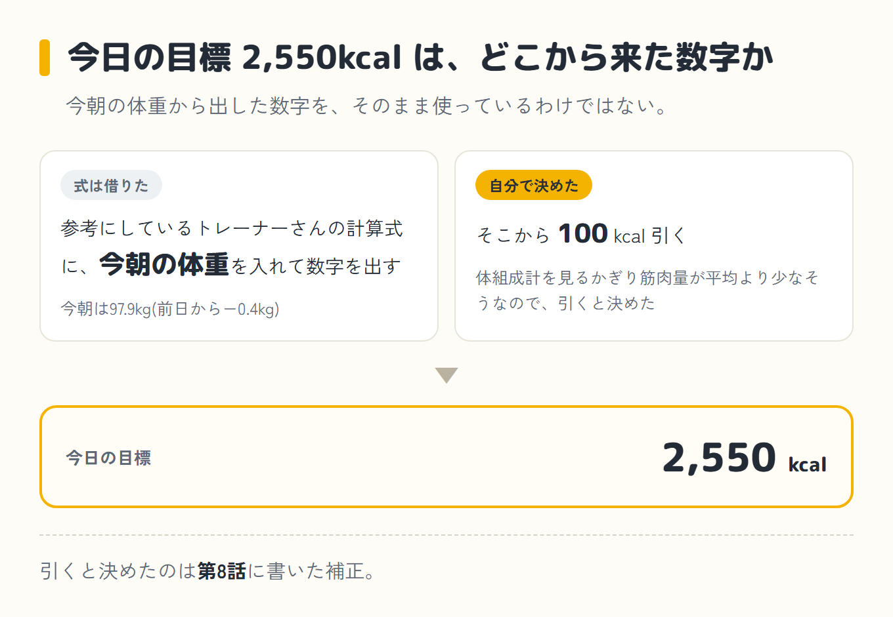
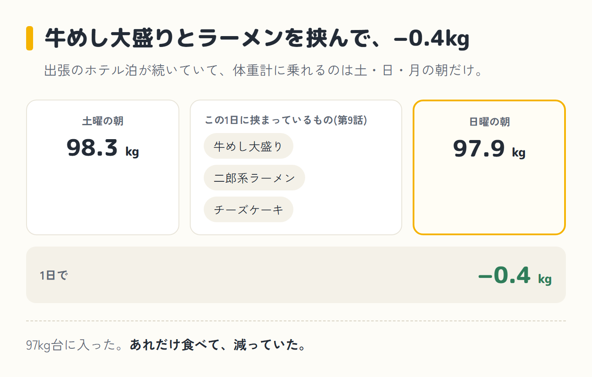
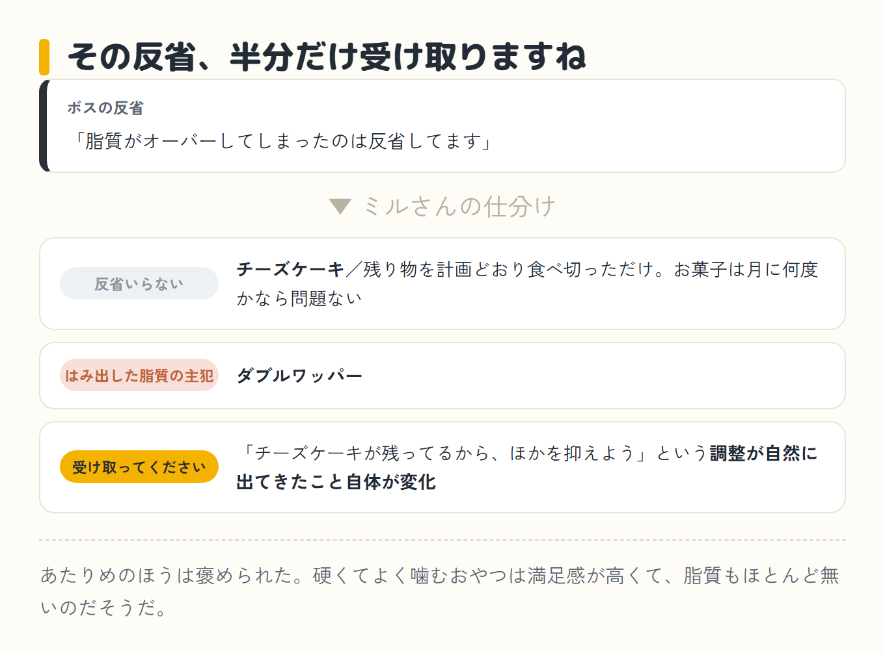
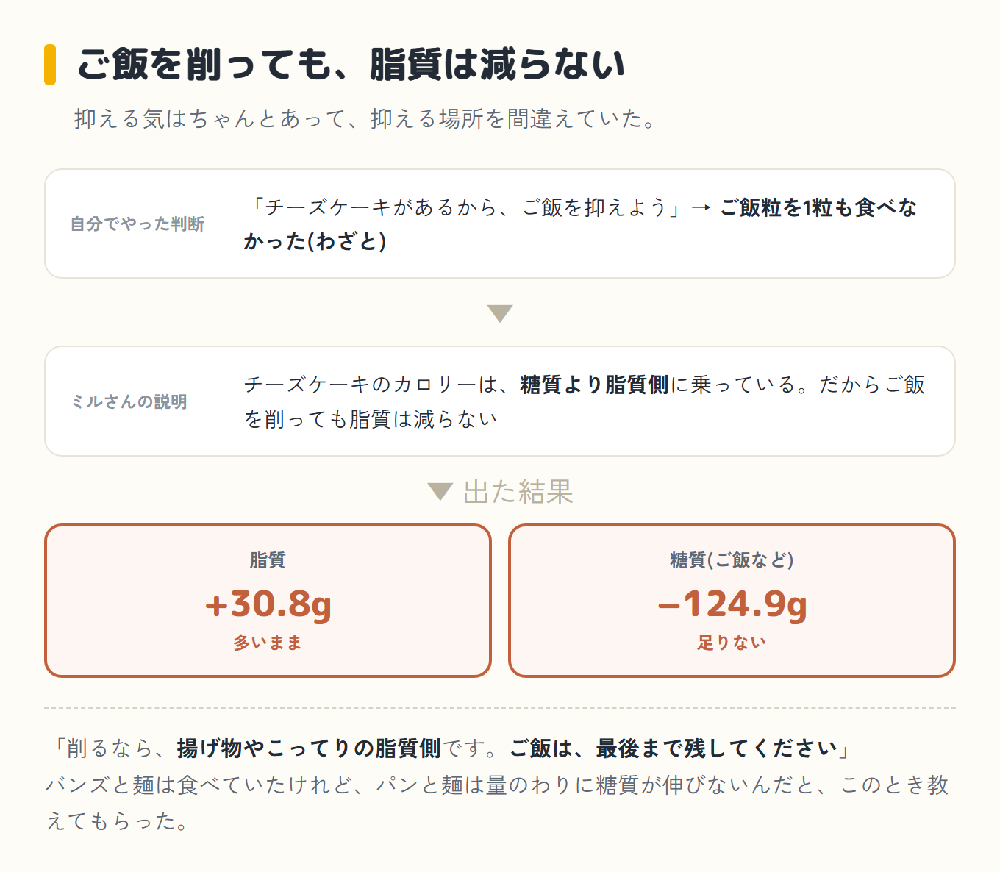
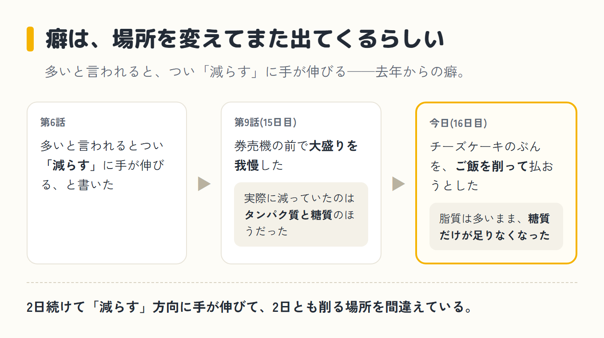
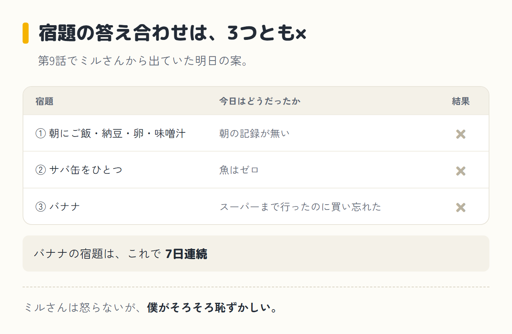

import Balloon from '../../../components/Balloon.astro';

ダイエット16日目、日曜。朝、体重計に乗ったら97.9kgだった。昨日の朝が98.3kgだったので、1日で−0.4kg、97kg台に入った。この1日に挟まっているのは、第9話の牛めし大盛りと二郎系ラーメンとチーズケーキ。あれだけ食べて、減っていた。

この日の記録に、朝ごはんはない。1食目は昼で、バーガーキングのダブルワッパー818kcal。肉が食べたい気分だった。夜は冷やし中華に餃子をつけて816kcal。間食は、前日の残りのドゥーブルフロマージュ(チーズケーキ)とあたりめで409kcal。合計2,043kcal、目標2,550kcalに対して507kcal足りなかった。目標の2,550kcalは、参考にしているトレーナーさんの計算式で今朝の体重から出した数字から、100kcal引いたものだ。体組成計を見るかぎり僕は筋肉量が平均より少なそうなので、引くと自分で決めた([第8話](/blog/diet/diet-day14/)に書いた補正だ)。

## 牛めし大盛りとラーメンを挟んで、−0.4kg

出張のホテル泊が続いていて、体重計に乗れるのは土・日・月の朝だけだ。だから毎日の数字は追わず、週末の測定だけを見る運用になっている。ミルさん(僕がパソコンとスマホのAIに、昔飼っていた猫の名前をつけたコーチ)に報告した。

<Balloon who="boss">測りました。97.9kgです。マイナス0.4kgで、97kg台に入りました</Balloon>

<Balloon who="mil">飲み会もラーメンもあった1週間で−0.4kgなら、上出来ですよ。日々の上げ下げで一喜一憂しないで、週末の測定だけをトレンドで見る。その見方が効いています</Balloon>

上出来、はありがたく受け取っておいた。この−0.4kgは、冒頭に書いたとおり昨日の朝からの1日ぶんの動き。あれだけ食べて減ったのだから、文句のつけようがなかった。

## 予告どおりのチーズケーキと、謎のあたりめ

[第9話](/blog/diet/diet-day15/)の最後に「ホールはまだ半分残っていて、明日もまた1切れ食べることになっている」と書いた。予告どおり食べて、12cmのドゥーブルフロマージュはこれでおしまいになった。そしてこの日は、おやつにあたりめもかじっている。チーズケーキとあたりめを同じ日に食べる人、僕以外にいるんだろうか。

<Balloon who="boss">チーズケーキが残っていたので、なるべくカロリーは抑えたつもりなんですけど、脂質がオーバーしてしまったのは反省してます</Balloon>

<Balloon who="mil">その反省、半分だけ受け取りますね。チーズケーキのほうは反省いらないです。残り物を計画どおり食べ切っただけですし、お菓子は月に何度かなら問題ないです。はみ出した脂質の主犯は、チーズケーキよりダブルワッパーのほうですよ</Balloon>

<Balloon who="boss">主犯、昼ごはんのほうでしたか</Balloon>

<Balloon who="mil">ただ、「チーズケーキが残ってるから、ほかを抑えよう」という調整が自然に出てきたこと自体が変化です。そこは受け取ってください</Balloon>

あたりめのほうは褒められた。硬くてよく噛むおやつは満足感が高くて、脂質もほとんど無いのだそうだ。渋いのは否定しません、とも言われた。

ちなみに、僕が「なるべく抑えたつもり」と言ったその中身については、もう少しあとで。

## 数字で見ると、今日も3つとも帯の外

  

    
タンパク質91.8g

    

    
目標159g（差 −67.2g）足りない

  

  

    
脂質101.8g

    

    
目標71g（差 +30.8g）多い

  

  

    
糖質(ご飯など)194.1g

    

    
目標319g（差 −124.9g）足りない

  

黄色い帯が目標の範囲、針がこの日の実績だ。<strong class="red">脂質は目標より30.8g多くて、タンパク質は67.2g、糖質は124.9g足りない。</strong>前日と同じ、「脂質だけはみ出して、タンパク質と糖質が足りない」形になった。

| いつ | 食べたもの | カロリー |
|---|---|---|
| 朝 | 記録なし | ─ |
| 昼 | ダブルワッパー(バーガーキング) | 818 kcal |
| 夜 | 冷やし中華(麺・ハム・卵・きゅうり・トマト・醤油ベースのタレ)＋餃子 | 816 kcal |
| 間食 | ドゥーブルフロマージュ(前日の残り)＋あたりめ | 409 kcal |
| **合計** | **目標2,550kcalに対して507kcal下** | **2,043 kcal** |

## ご飯粒ゼロは、わざとだった

<Balloon who="mil">気になる点は1つだけです。今日、ご飯粒を1粒も食べていません</Balloon>

<Balloon who="boss">それ、わざとなんです。ドゥーブルフロマージュが残っていたので、ご飯はあえて食べませんでした</Balloon>

<Balloon who="mil">調整しようとしたこと自体は、前進ですよ。残り物が入ってくるぶん、どこかを抑えよう、と考えられるようになったんですから。ただ、削る先にご飯を選んだのが逆向きでした</Balloon>

<Balloon who="boss">逆向き、ですか</Balloon>

<Balloon who="mil">今年の実験は「食べて痩せる」で、糖質は減らさないのが柱です。それに、チーズケーキのカロリーは糖質より脂質側に乗っています。だから、ご飯を削っても脂質は減らないんです。結果、脂質は30.8g多いまま、糖質だけが124.9g足りなくなりました。削るなら、揚げ物やこってりの脂質側です。ご飯は、最後まで残してください</Balloon>

「チーズケーキがあるから、ご飯を抑えよう」。この判断は、僕が自分でやった。抑える気はちゃんとあって、抑える場所を間違えていた。バンズと麺は食べていたけれど、パンと麺は量のわりに糖質が伸びないんだと、このとき教えてもらった。ついでに言うと、魚と大豆も今日もゼロだった。

[第6話](/blog/diet/diet-day12/)に、多いと言われるとつい「減らす」に手が伸びる、という去年からの癖のことを書いた。第9話では、券売機の前で大盛りを我慢したのに、実際に減っていたのはタンパク質と糖質のほうだった。そして今日は、チーズケーキのぶんを、ご飯を削って払おうとした。2日続けて「減らす」方向に手が伸びて、2日とも削る場所を間違えている。癖は、場所を変えてまた出てくるらしい。

## 宿題の答え合わせは、3つとも×

第9話でミルさんから出ていた明日の案は、①朝にご飯・納豆・卵・味噌汁 ②サバ缶をひとつ ③バナナ、の3つだった。答え合わせをすると、朝の記録は無く、魚はゼロで、バナナも無い。3つとも、できていない。

バナナにいたっては、今日はスーパーまで行ったのに、買い忘れた。宿題は7日連続になった。ミルさんは怒らないが、僕がそろそろ恥ずかしい。

## 明日の一手

ミルさんから出た明日の案は、この3つだった。

- おにぎり2個(鮭と、枝豆昆布)。まず、ご飯粒に戻る
- サバ缶か、パックの焼き魚。魚ゼロの連続をここで切る
- バナナ。対策も出た。「店に入ったら、かごの1個目にバナナを入れてから、他の売り場を見てください」だそうだ

明日は、ご飯粒と魚に戻る日だ。そして次に体重計に乗る朝が、ダブルワッパーの答え合わせだ。

前回: [第9話](/blog/diet/diet-day15/)
