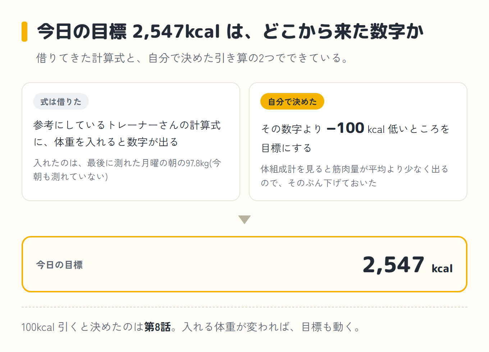
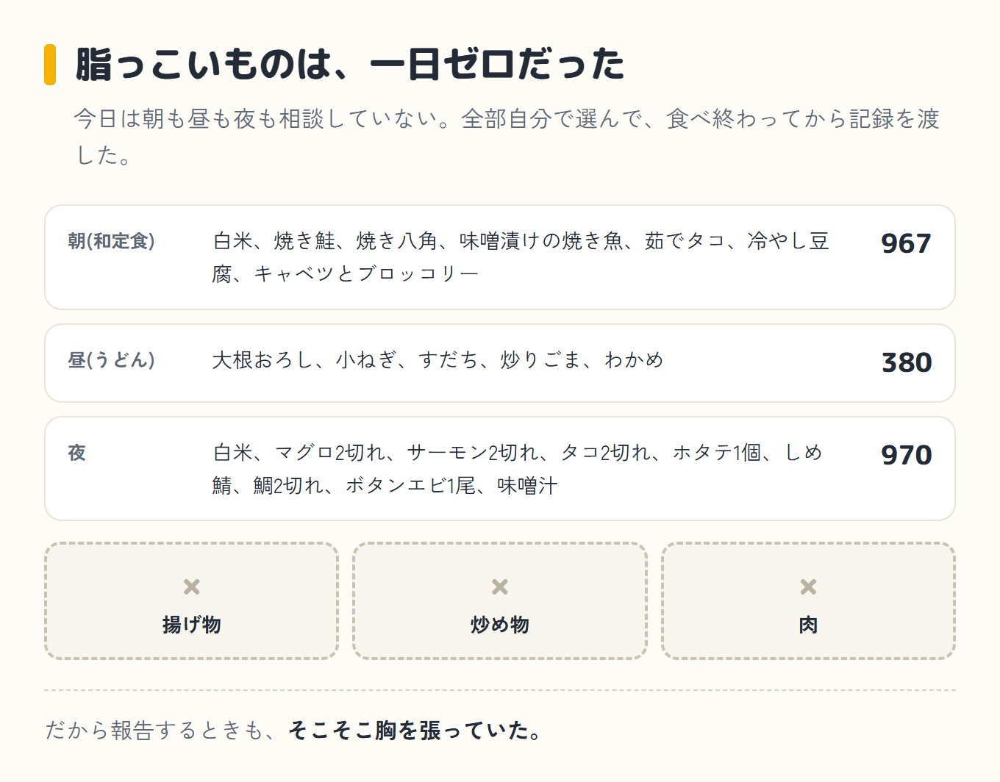
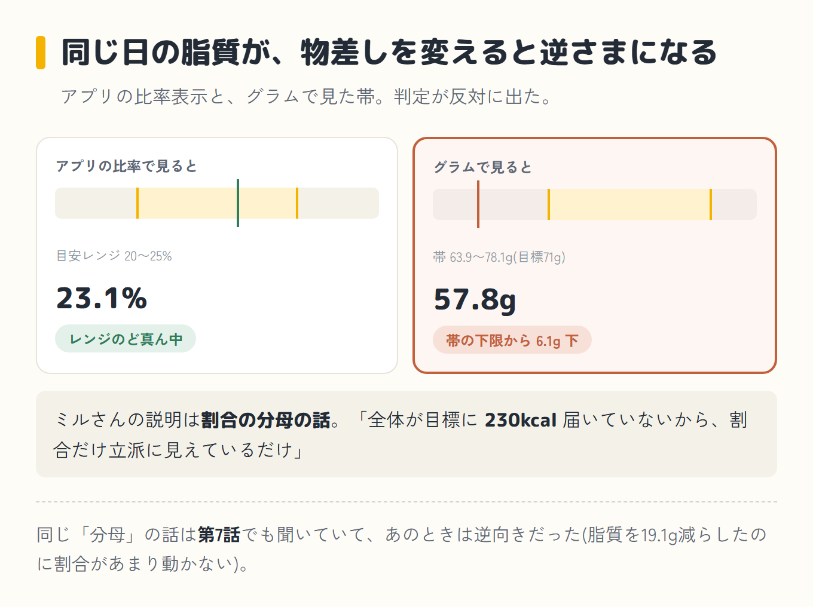
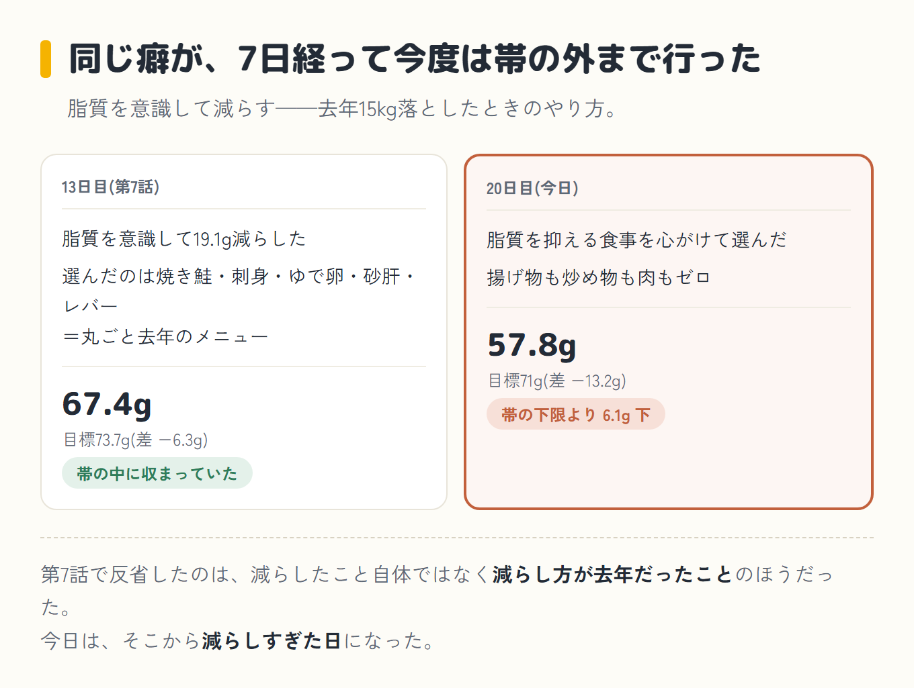
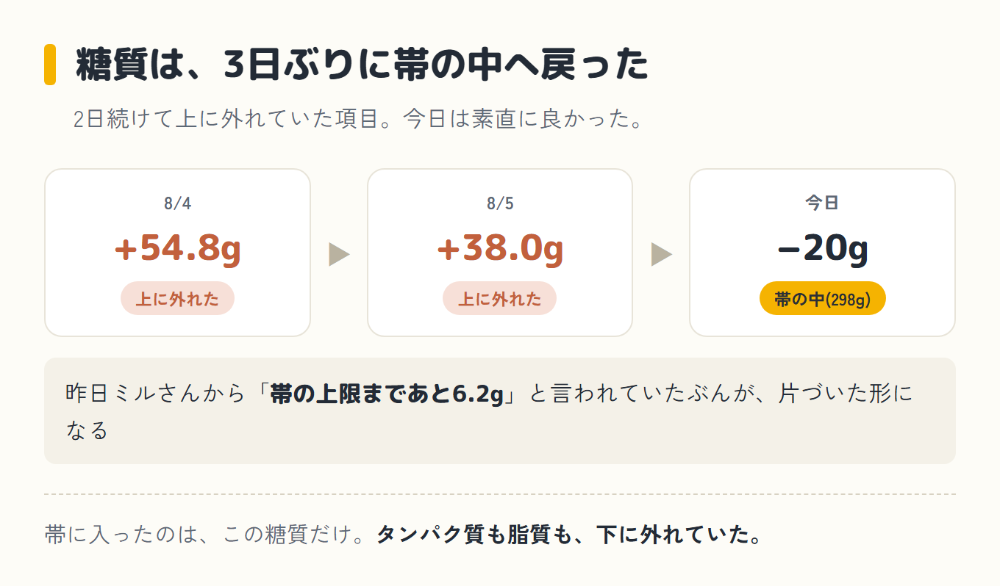
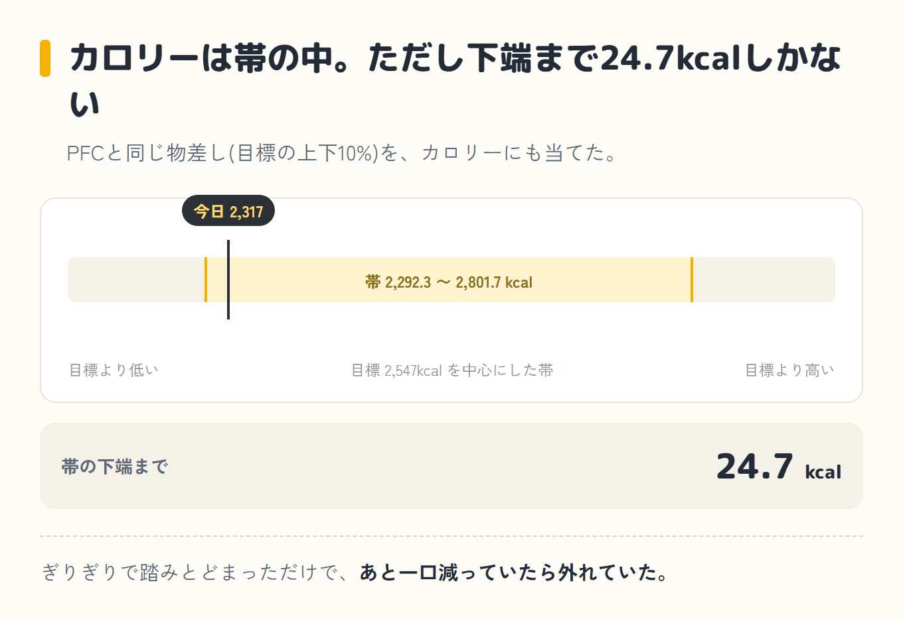
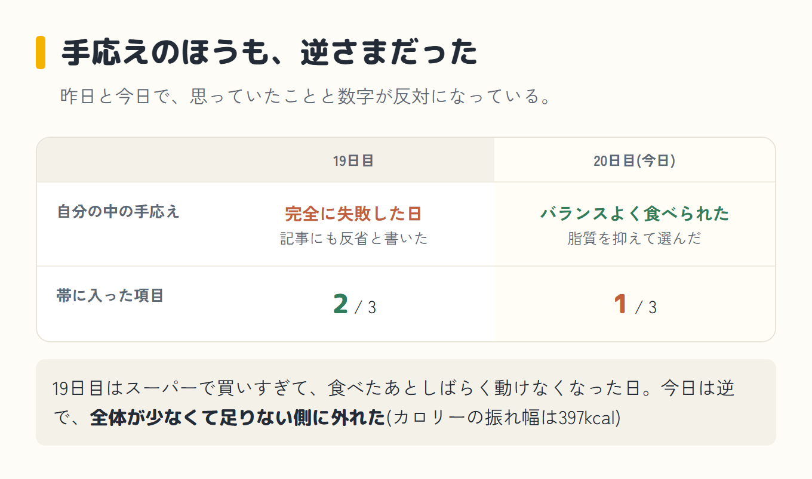

import Balloon from '../../../components/Balloon.astro';

ダイエット20日目、木曜。出張のホテル泊が続いていて、今朝も体重は測っていない。合計は2,317kcal、目標2,547kcalに対して−230で、アプリには「達成」と出た。今日はわりとバランスよく食べられた、という手応えがあった。脂質を抑える食事を心がけて選んだからだ。

朝は和定食で967kcal。昼はうどんで380kcal。夜は白米と刺身と味噌汁で970kcal。間食はなし。今日の目標は2,547kcalだった。もとになっているのは、参考にしているトレーナーさんの計算式で、そこに体重を入れると数字が出る。ただし僕は、その数字より100kcal低いところを目標にしている。100kcal引くと決めたのは僕だ。体組成計を見ると筋肉量が平均より少なく出るので、そのぶん下げておいた([第8話](/blog/diet/diet-day14/)で入れた補正)。入れる体重が変われば目標も動くのだけど、最後に測れたのが月曜の朝の97.8kgなので、今日もそこから出した数字になっている。

## 今日は、一度も相談していない

夕方にミルさん(僕がパソコンとスマホのAIに、昔飼っていた猫の名前をつけたコーチ)へ相談してから晩ごはんを決める日が続いていた。今日は、朝も昼も夜も聞いていない。全部自分で選んで、食べ終わってから記録を渡した。

朝は出張先の和定食で、白米、焼き鮭、焼き八角、味噌漬けの焼き魚、茹でタコ、冷やし豆腐、キャベツとブロッコリー。昼はうどんで、大根おろしと小ねぎとすだちと炒りごまとわかめ。夜は白米に、マグロ2切れ、サーモン2切れ、タコ2切れ、ホタテ1個、しめ鯖、鯛2切れ、ボタンエビ1尾と味噌汁。

並べてみると、揚げ物も炒め物も肉も入っていない。脂っこいものは一日ゼロだった。だから報告するときも、そこそこ胸を張っていた。

<Balloon who="boss">今日は割とバランスよく食べれたと思います。脂質を抑えた食事を心がけました</Balloon>

<Balloon who="mil">中身は今シリーズで一番きれいです。朝が完全な和定食で、3食とも主食が入ってます</Balloon>

<Balloon who="mil">……ただ、その脂質、足りてません</Balloon>

抑えたぶんが、そのまま「足りない」になっていた。脂質は57.8gで、目標71gに対して−13.2g。目標の上下10%でつくる帯は63.9〜78.1gなので、その下限からも6.1g下に落ちていた。

## 比率で見ると、ど真ん中に見えていた

ややこしいのはここからだった。

<Balloon who="mil">アプリの比率表示だと脂質23.1%で、目安レンジ(20〜25%)のど真ん中に見えるんです。いい顔してます。でもそれは全体が目標に230kcal届いていないから、割合だけ立派に見えているだけでして</Balloon>

割合の分母の話らしい、というところまでは分かった。全体が少ない日は、割合だけが良く見える。同じ「分母」の話は[第7話](/blog/diet/diet-day13/)でも聞いていて、あのときは逆向きだった。脂質を19.1g減らしたのに割合があまり動かないのはなぜか、という話だった。今日は、%だけ見ているかぎり文句のつけようがない日になっていた。

## 去年の僕が、20日目にまた出てきた

<Balloon who="mil">去年のボスは、脂質を抑えて15kg落としました。体が覚えてるんだと思います。「脂を減らせば正解」って</Balloon>

去年の話はそのとおりで、僕は脂質をとことん抑えるやり方で15kg落とした。今年やっているのは真逆の実験で、多い項目を減らすのではなく、足りないものを足していく。頭では分かっているのに、20日目にまた出た。

## 第7話のときは、帯に収まっていた

同じ手癖の話は、第7話でも書いた。13日目、脂質を意識して19.1g減らして、選んだものが焼き鮭・刺身・ゆで卵・砂肝・レバーで、丸ごと去年のメニューだった日だ。

ただ、あの日の脂質は67.4gで、目標73.7gに対して−6.3g。帯の中には収まっていた。手癖は出たけれど、着地した場所はセーフの範囲だった。あの回で反省したのは、減らしたこと自体ではなく、減らし方が去年だったことのほうだった。

今日は57.8gで、目標71gに対して−13.2g。帯の下限63.9gより6.1g下にいる。同じ癖が、7日経って今度は帯の外まで行った。減らし方が去年だった日から、減らしすぎた日になった。意識していたことは前と同じなのに、行き着いた場所が違っていた。

## 数字を見ると、帯に入ったのは1つだけだった

  

    
タンパク質134.1g

    

    
目標159g（差 −24.9g）足りない

  

  

    
脂質57.8g

    

    
目標71g（差 −13.2g）足りない

  

  

    
糖質(ご飯など)298g

    

    
目標318g（差 −20g）ほぼ目標どおり

  

黄色い帯が目標の範囲、針がこの日の実績だ。<strong class="red">帯に入ったのは糖質だけで、タンパク質も脂質も、下に外れていた。</strong>

素直に良かったのは糖質のほうで、298g。目標318gに対して−20gで、帯の中に入った。この項目は8/4が+54.8g、8/5が+38.0gで、2日続けて上に外れていた。昨日ミルさんから「帯の上限まであと6.2g」と言われていたぶんが、3日ぶりに片づいた形になる。

タンパク質は134.1gで、目標159gに対して−24.9g。帯の下限143.1gまで、あと9.0g足りない。原因は昼のうどんだと言われた。380kcalで、しかも麺だけの単品だったからだそうだ。

カロリーのほうも同じ物差し(目標の上下10%)を当てると帯は2,292.3〜2,801.7kcalになるので、2,317は中に入っている。ただし帯の下端まで24.7kcalしかない。ぎりぎりで踏みとどまっただけで、あと一口減っていたら外れていた。

| いつ | 食べたもの | カロリー |
|---|---|---|
| 朝 | 和定食(白米・焼き鮭・焼き八角・焼き魚(味噌漬け)・茹でタコ・冷やし豆腐・キャベツとブロッコリー) | 967 kcal |
| 昼 | うどん(だし醤油のつゆ・大根おろし・小ねぎ・すだち・炒りごま・わかめ) | 380 kcal |
| 夜 | 白米・刺身(マグロ・サーモン・タコ・ホタテ・しめ鯖・鯛・ボタンエビ)・味噌汁 | 970 kcal |
| 間食 | なし | 0 kcal |
| **合計** | **目標2,547kcalに対して230kcal下** | **2,317 kcal** |

体重は測定なし。ホテル泊が続いているので、答え合わせは明日の朝まで持ち越しになる。

## 昨日と、真逆の外し方をしていた

| | 19日目 | 20日目 |
|---|---|---|
| カロリー | +167(帯の中) | **−230(帯の中・下ギリギリ)** |
| タンパク質 | −6.4g(帯の中) | **−24.9g(足りない)** |
| 脂質 | +0.3g(帯の中) | **−13.2g(足りない)** |
| 糖質 | +38.0g(多い) | **−20g(帯の中)** |
| 帯に入った項目 | 2/3 | **1/3** |

[第13話](/blog/diet/diet-day19/)の19日目は、スーパーで買いすぎて、食べたあとしばらく動けなくなった日だった。今日は逆で、全体が少なくて足りない側に外れた。カロリーの振れ幅は397kcalある。

おかしいのは、手応えのほうも逆さまだったことだ。昨日は自分の中で完全に失敗した日で、記事にも反省と書いた。今日はバランスよく食べられたと思っていた。数字を並べると、帯に入った項目は昨日が2つで、今日が1つだった。

## バナナを、冷蔵庫に忘れた

第13話で、バナナ1本を明日の朝に回すと自分で決めていた。その明日が今日だった。20日目の記録に、間食は入っていない。

冷蔵庫に忘れてきてしまって、朝、食べ忘れた。

[第11話](/blog/diet/diet-day17/)は、7日連続で買い忘れていたバナナを「店に入ったら、かごの1個目に入れる」でようやく買えた日だった。買うほうは克服したのに、今度は食べ忘れた。宿題の詰まる場所が、レジの手前から冷蔵庫の中に移っただけだった。

ちなみに計算上は、バナナ1本(約86kcal・糖質約25g)を食べていれば糖質は323g、カロリーは2,403kcalになっていたそうだ。どちらも帯の中なので、数字が悪くなるという話ではない。ただ、決めたことは決めたことなので、流れた。

## 明日の一手

最初に出てきた案は、サバ缶だった。

<Balloon who="mil">献立はそのままで、サバ缶の水煮を1缶、昼のうどんの横に足すだけです。計算上は、それだけで4項目とも帯に収まります</Balloon>

2,578kcal、タンパク質165.4g、脂質73.8g、糖質298.3gという試算だそうだ。うどんの横に缶を1個置くだけで全部そろうなら、これはやりやすい。

そこで、まだ言っていなかったことを思い出した。

<Balloon who="boss">明日は友達の家に行って、焼肉です。お酒も飲みます</Balloon>

サバ缶は、その場で引っ込められた。

<Balloon who="mil">焼肉は今年の実験にとって「敵」ではないです。むしろ今日足りなかったものが入る日です</Balloon>

差し替えで出てきたのが、この5つだった。

- 朝と昼を抜かない。夜に焼肉があると貯金したくなるけれど、前後で帳尻を合わせるのが一番まずい手だそうだ
- 席でご飯を頼む。ご飯を抜くと糖質の枠が空いて、そこに酒が入って「肉と酒だけ」になるらしい
- 最初に野菜とスープ。前半はハラミ・ロース・タン・鶏で、カルビやホルモンは後半に回す。禁止ではなく順番の話だと言われた
- 締めの冷麺やクッパは主食なのでOK。危ないのは、そのあとのアイスとラーメン
- お酒は1杯ごとに水かお茶を挟む。種類は問わないそうだ

<Balloon who="mil">貯金したつもりの空腹は、席についた瞬間に利子つきで返ってきます</Balloon>

<Balloon who="mil">1回の焼肉では太りません。朝と昼を抜かないでください、それだけです</Balloon>

夜のために昼を抜く、が止められるダイエット。20日やっても、まだ慣れない。

そして明日の朝は、体重を測る。今週は早めに家へ帰るので、金曜でも体重計に乗れる。月曜の97.8kg以来、4日ぶりだ。その4日間は−270、+204、+167、−230と上下に振れていて、どっちに出るのか見当がついていない。4日ぶりの答え合わせの日の夜に焼肉の予定を入れているのは、たぶん段取りが悪い。

前回: [第13話](/blog/diet/diet-day19/)
