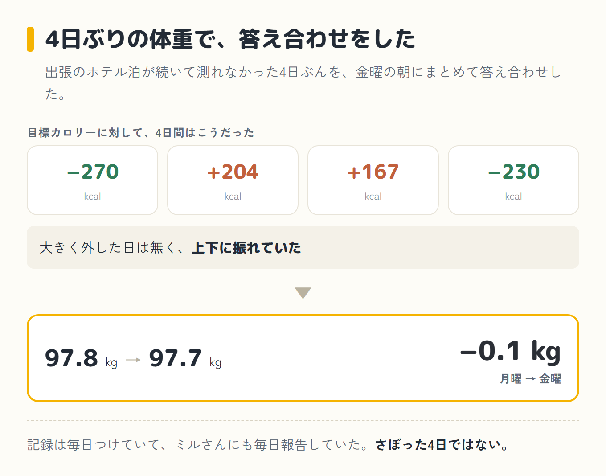
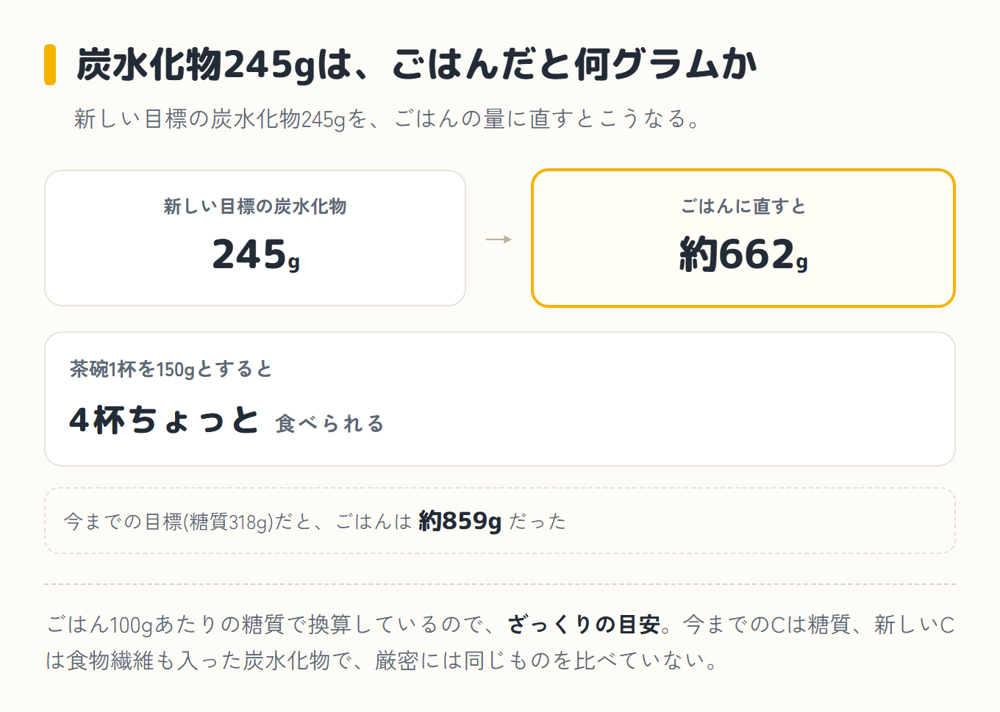
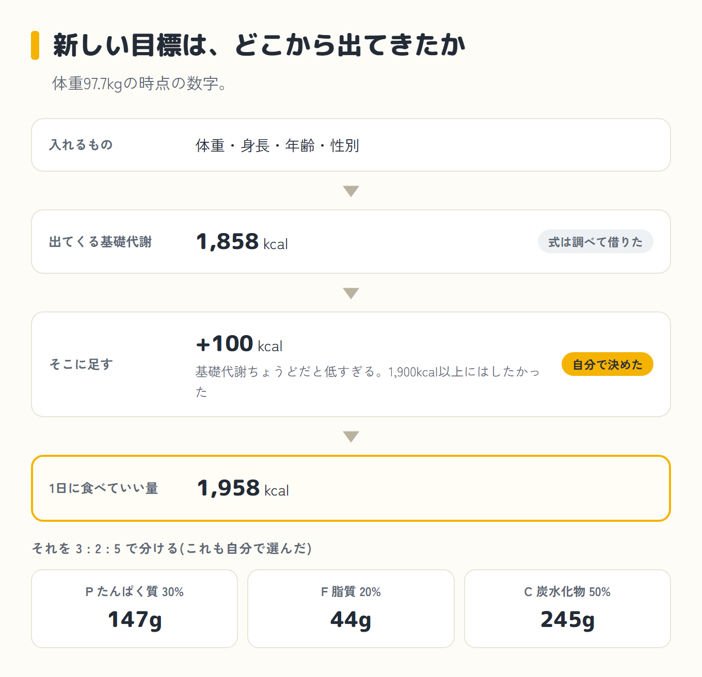
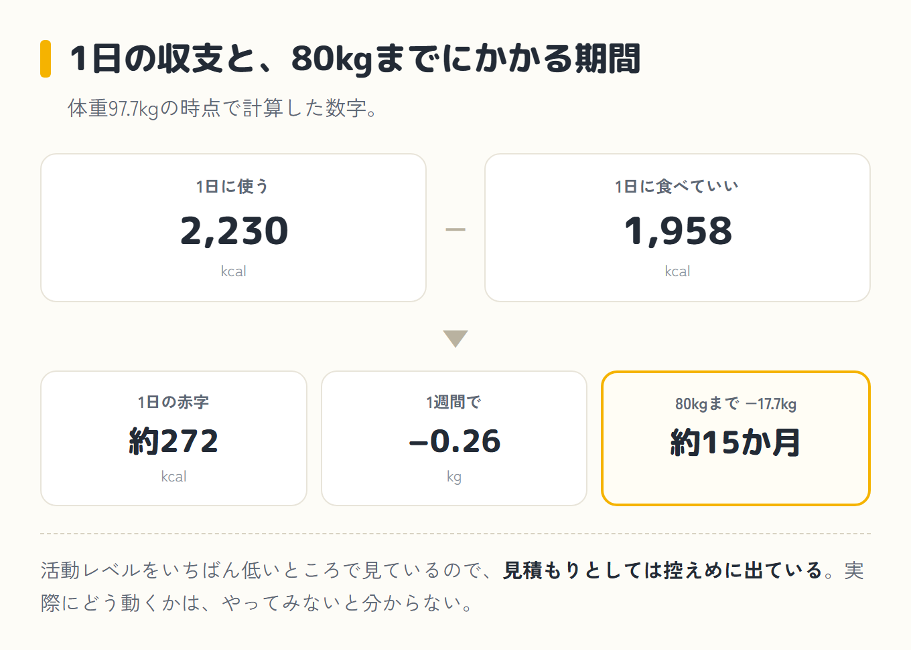
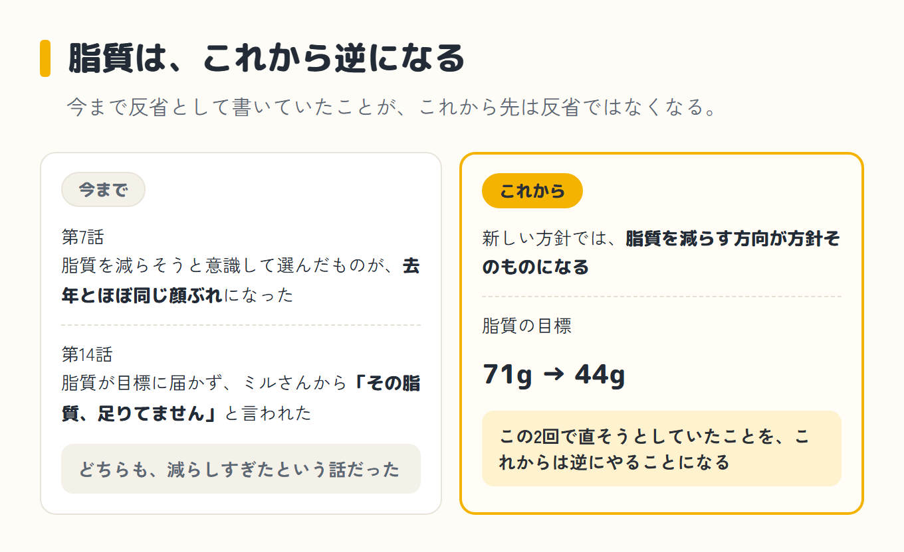

import Balloon from '../../../components/Balloon.astro';

ダイエット21日目、金曜の朝。4日ぶりに体重計に乗った。97.7kg。月曜が97.8kgだったので、4日で−0.1kgだった。

この数字を見て、その日のうちに方針を変えると決めた。20日続けてきたやり方を、21日目でやめることにした。

<Balloon who="boss">8月7日の朝の体重が97.7で、そこでやっぱりこの方法では減らないなっていうことで、方針転換を決めました</Balloon>

## 4日間のカロリーと、体重の結果

[第14話](/blog/diet/diet-day20/)の最後に、この4日間のカロリーを並べてある。目標に対して−270、+204、+167、−230。大きく外した日は無く、上下に振れていた。出張のホテル泊が続いて体重を測れていなかったので、この4日ぶんをまとめて金曜の朝に答え合わせすることになっていた。

結果が−0.1kgだった。

記録は毎日つけていたし、ミルさん(僕がパソコンとスマホのAIに、昔飼っていた猫の名前をつけたコーチ)にも毎日報告していた。さぼった4日ではない。それで0.1キロなので、日々の細かい外し方の問題ではなく、やり方そのものが自分に合っていないと考えた。

## 今までやっていたこと

今年やっていたのは、足りないものを足していく方式だった。ご飯を抜かない。多い項目を削るのではなく、足りない項目を埋めて全体のバランスを整える。目標のカロリーは、参考にしているトレーナーさんの計算式に体重を入れて出した数字から、自分の判断で100kcal引いたものだった。体重を入れ直すたびに目標も動くので、回ごとに数字が少しずつ違っていた。

この方式自体は気に入っていた。ご飯を食べていいので、続けるのは苦しくない。ただ、20日やって減らなかった。上下には動いていて、この20日でいちばん軽かったのが96.6、いちばん重かったのが98.3。そこから97.7に戻ってきた。

去年は、110.7kgから15キロ落としている([去年の記録はこちら](/blog/110kilo-diet-ai/))。やり方は真逆で、脂質をとことん減らす方向だった。そっちに戻すことにした。

## 新しい目標の中身

その日のうちに、これからの目標をこう決めた。同じ97.7kgで、今までの式と新しい式を並べるとこうなる。

| | 今までの式(97.7kg) | 新しい式(97.7kg) |
|---|---|---|
| カロリー | 2,545 kcal | **1,958 kcal** |
| P(たんぱく質) | 159 g | **147 g** |
| F(脂質) | 71 g | **44 g** |
| C(ご飯など) | 糖質で 318 g | **炭水化物で 245 g** |

カロリーで−587kcal。脂質は71gから44gへ−27g減った。

Cの−73gだけは、少し事情が違うと教えてもらった。今までの式のCは糖質で、新しい式のCは食物繊維も入った炭水化物なので、厳密には同じものを比べていないそうだ。減ることは減るけれど、−73gはきっちりした比べ方ではない。

その245gをごはんに直すと、約662gだそうだ。ごはん100gあたりの糖質で換算しているので、これも同じ理由でざっくりの目安になる。茶碗1杯を150gとすると、4杯ちょっと食べられる。今までの318gだと約859gだった。

念のため書いておくと、第14話に出てくる2,547kcalは、月曜に測った97.8kgを入れて出した数字で、あの日はあれで合っている。ここで2,545kcalになっているのは、金曜の97.7kgを今までの式に入れたらいくつか、という数字だ。体重をそろえないと、式の差が出せない。

新しい目標の出どころは、自分の基礎代謝にした。体重・身長・年齢・性別を入れると基礎代謝が出る計算式があると調べて分かったので、それを借りた。97.7kgの時点で1,858kcalになる。

そこに100kcal足して、1,958kcalを1日に食べていい量にした。基礎代謝ちょうどだとちょっと低すぎるよな、と思ったからだ。だいたい1,900kcal以上にはしたくて、100足せば1,958kcalになる。ここは自分で決めた。

PFCの3:2:5(たんぱく質30%・脂質20%・炭水化物50%)も、自分で選んだ。よく見かける目安の中では、この配分がいちばん食事を組みやすい。

## 消費カロリーと、80kgまでの期間

一日に使うカロリーのほうは、基礎代謝に活動レベルの倍率を掛けて出す。その活動レベルは自分で選ぶ形になっていて、僕はいちばん下の「低い」にした。仕事でほとんど座っているし、運動もしていない。それで消費が2,230kcalになる。

食べていい量が1,958kcalなので、1日あたり約272kcalの赤字になる。週にすると−0.26kg相当。目標体重は80kgに決めているので、97.7kgからだと−17.7kg。単純に割ると約15か月かかる。

これは活動レベルをいちばん低いところで見ているので、見積もりとしては控えめに出ている。実際にどう動くかは、やってみないと分からない。

ミルさんに教えてある中身も、あわせて、摂取カロリーが消費カロリーより下になる状態を保つやり方に入れ替えた。「食べて痩せる」の説明が残ったままだと、明日から言うことがちぐはぐになる。

## 脂質を減らすことについて

[第7話](/blog/diet/diet-day13/)と第14話で反省として書いたことが、これから先は反省ではなくなる。

第7話は、脂質を減らそうと意識して選んだものが、焼き鮭、刺身、ゆで卵、砂肝、レバーで、去年とほぼ同じ顔ぶれになった日だった。第14話は、脂質が目標に届かず、ミルさんから「その脂質、足りてません」と言われた日だった。どちらも、脂質を減らしすぎたという話だった。

新しい方針では、脂質を減らす方向が方針そのものになる。この2回で直そうとしていたことを、これからは逆にやることになる。

## 目標が変わるのは、この日から

新しい目標で見ると、今まで「達成」だった日が「超過」の側に回る。数えなおせば、そういう日がいくつも出てくる。

ただ、記録そのものは1グラムも動いていない。第1話から第14話までに書いた数字は、その日の目標で見た当時の事実なので、全部そのままにしてある。新しい目標はこの記事から先の話で、前と後ろは混ぜない。

## この日に食べたもの

朝と昼は、3時間かけての車移動だった。車の中でフランスパンを食べた。夜は友達の家で、ガレージでのバーベキューだった。お店の焼肉ではない。焼きながら食べて、お酒も飲んだ。

何をどれだけ食べたのかは把握できていない。記録もつけていない。カロリーもPFCも、この日は数字が無い。

方針を変えると決めた日の夜が、この予定だった。第14話の最後にも、4日ぶりの答え合わせの日の夜に焼肉の予定を入れているのは段取りが悪い、と自分で書いている。

## 体重は、まだ測れていない

翌日の土曜の朝はまだ友達の家にいたので、その朝は測れなかった。バーベキューの翌朝の体重は分からない。この記事を書いている時点でも測れていない。次に乗れるのは、早くても日曜の朝になる。

前回: [第14話](/blog/diet/diet-day20/)
