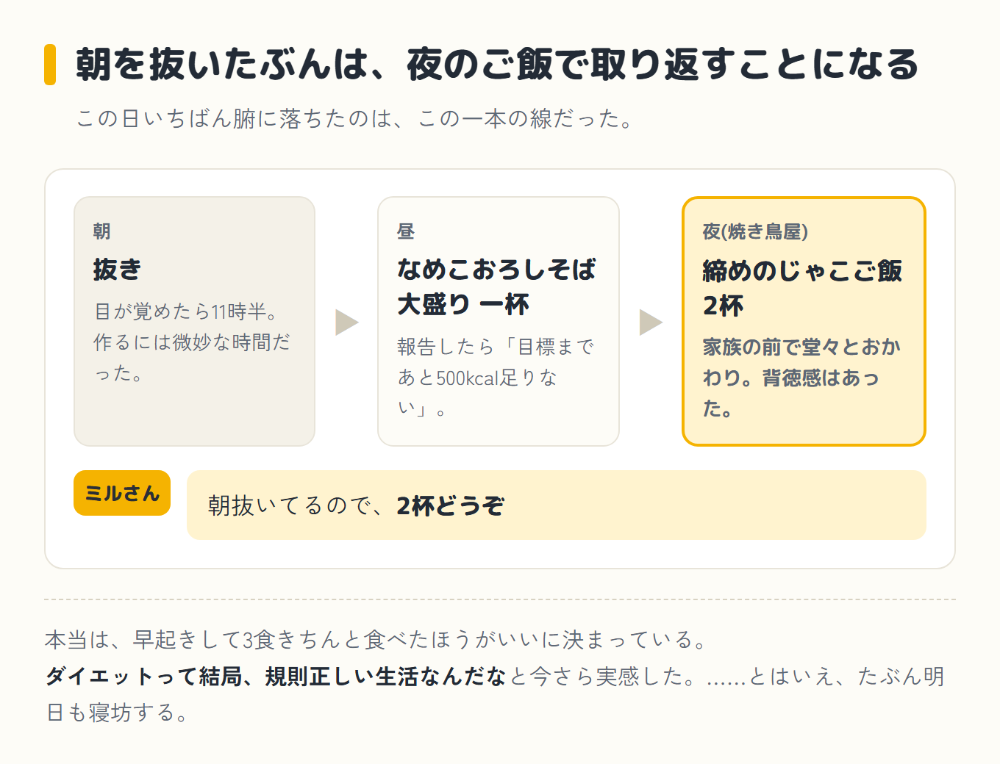

import Balloon from '../../../components/Balloon.astro';

ダイエット8日目。朝は11時半起床でそのまま欠食。昼はなめこおろしそば大盛り一杯。夜は家族で焼き鳥屋に入り、砂肝やハツだけのつもりが、気づけばタコ唐揚げと手羽餃子とごぼうの唐揚げまで頼んでいた。

それでも帰宅後にアプリで合計を出したら2,600kcal。目標2,618kcalに対して、ほぼぴったりだった。ただし、脂質だけ多かった。ちなみにこの目標カロリーは、僕がずっと参考にしているダイエットトレーナーさんの計算式で出している数字だ。体重をもとに割り出す式だと教えてもらっているので、体重が動くと、目標のほうも少しずつ動く。

## 朝、寝坊で欠食からのスタート

事の発端は、いつも通りの寝坊だった。目が覚めたら11時半。朝食を作るには微妙な時間で、そのまま食べずに昼を待つことにした。

これ自体はいつものパターンで、正直あまり気にしていなかった。問題は、この「欠食」が夜の焼き鳥屋での大盛りご飯につながっていくとは、この時点ではまったく想像していなかったことだ。

## 昼のそば、そして出かける前の作戦会議

昼はなめこおろしそばの大盛りを一杯。食べ終えてから、いつものようにパソコンのミルさん(僕がパソコンのAIに、昔飼っていた猫の名前をつけてコーチにしている相棒)に報告した。

<Balloon who="boss">なめこおろしそば大盛り、食べました</Balloon>

<Balloon who="mil">いいペースですね。でも今のままだと、目標まであと500kcalくらい足りないです。もっと食べてください</Balloon>

僕には、ずっと参考にしていて、心から腑に落ちているトレーナーさんの理論がある。今年はその理論を実践するために、ミルさんにも同じ考え方を教え込んで、コーチしてもらっている。

核になっているのは「体重に応じて決められた量のご飯(糖質=炭水化物のこと)を、減らさずしっかり食べる」という考え方で、食べなさすぎるとむしろ逆効果らしい。

だから「目標に足りない」は、そのまま「もっと食べて」になる。

ダイエットしているのに「もっと食べて」と言われる。この感覚には、正直まだ慣れない。でも僕が信じているのは「脂質さえ抑えれば、量はちゃんと食べて痩せる」というやり方なので、素直に従うことにした。

この日は夜に家族で焼き鳥屋へ行く予定があったので、出かける前にパソコンでミルさんとまとめて作戦会議をしておいた。

<Balloon who="boss">今夜これから家族で焼き鳥屋に行きます。何をどれくらい食べたらいいですか</Balloon>

<Balloon who="mil">焼き鳥は味方ですよ。タレより塩で、砂肝・ハツ・鶏のタタキみたいな赤身中心に。締めのご飯も抜かないでくださいね</Balloon>

<Balloon who="boss">締めにじゃこご飯を食べたいんですが、何グラムにしましょうか</Balloon>

<Balloon who="mil">朝抜いてるので、2杯どうぞ</Balloon>

昼の報告から締めのご飯の相談まで、この一回のやりとりで今夜の作戦は決まった。

## 夜、作戦通り……のはずが揚げ物三品

作戦としては悪くなかったと思う。実際、塩で赤身中心に注文したのは事実だ。ただ、目の前に出てきたタコ唐揚げと手羽餃子とごぼうの唐揚げにも、結局は手を出してしまった。

締めのじゃこご飯は、指示通り2杯食べた。家族の前で堂々とご飯をおかわりするのは、ダイエット中としてはなかなか背徳感があったが、これも作戦のうちだと自分に言い聞かせた。

## 帰宅後の報告——山場

帰宅後、その日食べたものを全部パソコンのアプリに入力して、ミルさんに結果を見せた。

<Balloon who="boss">合計出ました。2,600kcalです</Balloon>

<Balloon who="mil">達成です。でも脂質だけ多いですね。僕、『もっと食べて』とは言いましたけど、『揚げ物で脂質を盛れ』とは言ってないですよ(笑)</Balloon>

グウの音も出なかった。もっと食べていいという言葉を、揚げ物三品を頼む免罪符にしていたのは、他でもない自分だ。

## 結果:目標ぴったり、でも脂質だけ怒られた

数字だけ見れば、目標2,618kcalに対して実績2,600kcal。ほぼ狙い通りの着地で、ここは素直に良かった点だと思う。

一方で、脂質はこの日の中では明らかに多め。タコ唐揚げ、手羽餃子、ごぼうの唐揚げと、揚げ物が三連発した結果は、さすがに言い訳できない。

食べたものをアプリに入れた内訳は、こうだった。目標の数字は、体重をもとにアプリが出してくれる目安だ。

| 栄養素 | 目標(目安) | この日 | 判定 |
|---|---|---|---|
| カロリー | 2,618kcal | 2,600kcal | ほぼぴったり |
| タンパク質 | 約164g | 169.1g | ほぼ目標どおり |
| 脂質 | 約73g | 93.2g | **約20gオーバー** |
| 糖質(ご飯など) | 約327g | 264.4g | **約60g足りない** |

同じ数字を、目標の範囲に対してどこにいたのかで見ると、外し方がはっきりする。

  
<strong>【2026-07-31 訂正】</strong>このメーターの判定が間違っていました。脂質をグラムでは減らせた日に「オーバー」と出ていて、減らしたのにおかしいぞ、と自分で気づきました。クロさん(ブログ係のAI相棒)に計算してもらったら、総カロリーが少ない日ほど割合(%)は跳ね上がるうえ、アプリの目標グラムと目安の割合がそもそも噛み合っていなかったそうです。

  
判定は「目標グラム数の±10%以内か」で見る形に直しました(この幅はクロさんの判断です)。本文とミルさんのセリフは当日の記録なので、そのままにしています。

  

    
タンパク質169.1g

    

    
目標163.6g（差 +5.5g）｜総カロリー比 26.3%ほぼ目標どおり

  

  

    
脂質93.2g

    

    
目標72.7g（差 +20.5g）｜総カロリー比 32.6%多い

  

  

    
糖質(ご飯など)264.4g

    

    
目標327.2g（差 −62.8g）｜総カロリー比 41.1%足りない

  

黄色い帯が目標の範囲、赤い針がこの日の実績だ。<strong class="red">タンパク質はほぼ目標どおり。脂質だけが20.5g多くて、糖質は62.8g足りない。</strong>揚げ物三品が、そのまま脂質の針の位置に出ている。

カロリーはほぼ目標どおりで、タンパク質もおおむね良好だった。脂質は目標より約20gオーバーしていて、これが「脂質を盛れとは言ってない」の正体――揚げ物三品が効いた。

逆に糖質(ご飯など)は目標に約60g届いておらず、「もっと食べて」と言われた通り、実はご飯のほうはまだ足りていなかった。

数字にすると、どこを外したのかが一目で分かる。

ミルさんはそのあとにこう続けた。「1回の外食じゃ太りません。明日あっさり戻せば大丈夫ですよ」。この一言にだいぶ救われた。

去年の僕は、脂質をとことん抑えるやり方で15kg痩せた。今年はその真逆、「ちゃんと食べて痩せる」をミルさんと実験している最中だ。

今回学んだのは、「食べていいけど、脂質はちゃんと見られている」ということ。量を増やす自由と引き換えに、中身のチェックは以前よりむしろ厳しくなった気がする。

信じている理論を、AIのコーチと二人三脚で実践できているのは、素直に嬉しい。

## 次にやること

今回でいちばん腑に落ちたのは、朝を抜くと、そのぶんを夜のご飯でどっさり取り返すことになる、という事実だ。実際、朝を抜いたせいで、夜はじゃこご飯を2杯食べることになった。

本当は、早起きして3食きちんと、バランスよく食べたほうがいいに決まっている。ダイエットって結局、規則正しい生活なんだな、と今さらながら実感した。

とはいえ、僕はたぶん明日も寝坊する。夜更かし体質は、そう簡単には直らない。それでも、揚げ物を使わずにこの日の脂質過多を戻すことと、規則正しく3食バランスよく食べるのが正解だと分かったこと。このふたつは、今日の収穫だ。

次回へ続く

<a class="next-btn" href="/blog/diet/diet-day9/">
  ダイエット第3話
  濃厚な牛肉カレーの大盛りに、トッピングを2つ乗せろと言われた日
</a>
