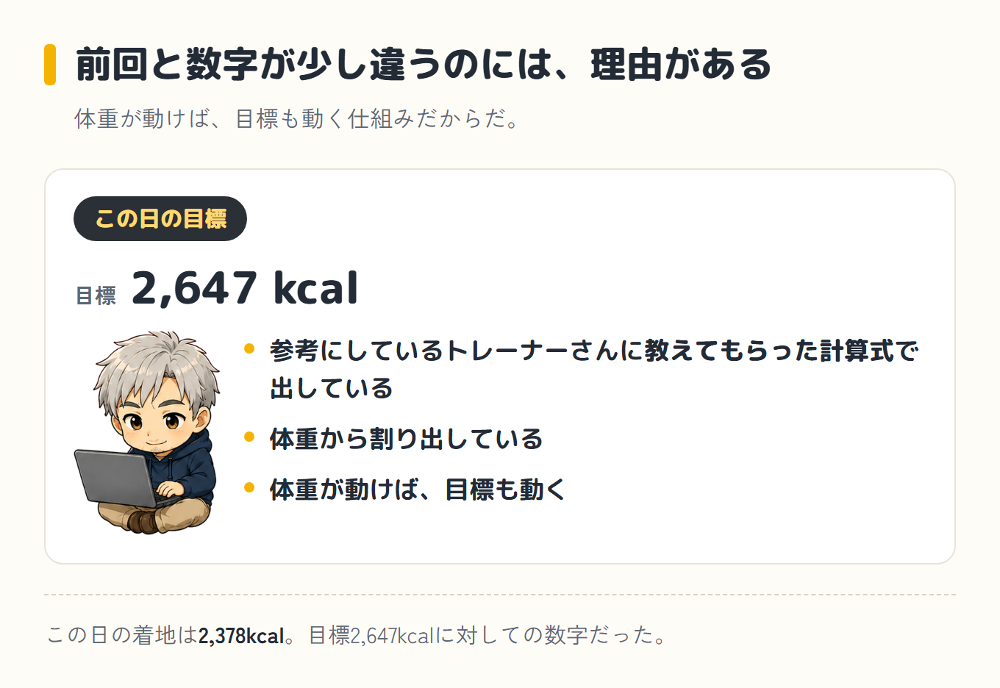
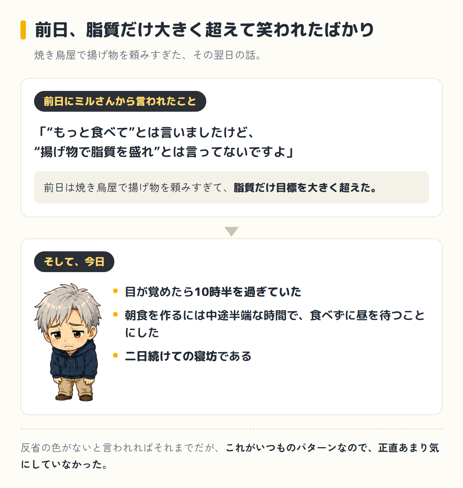
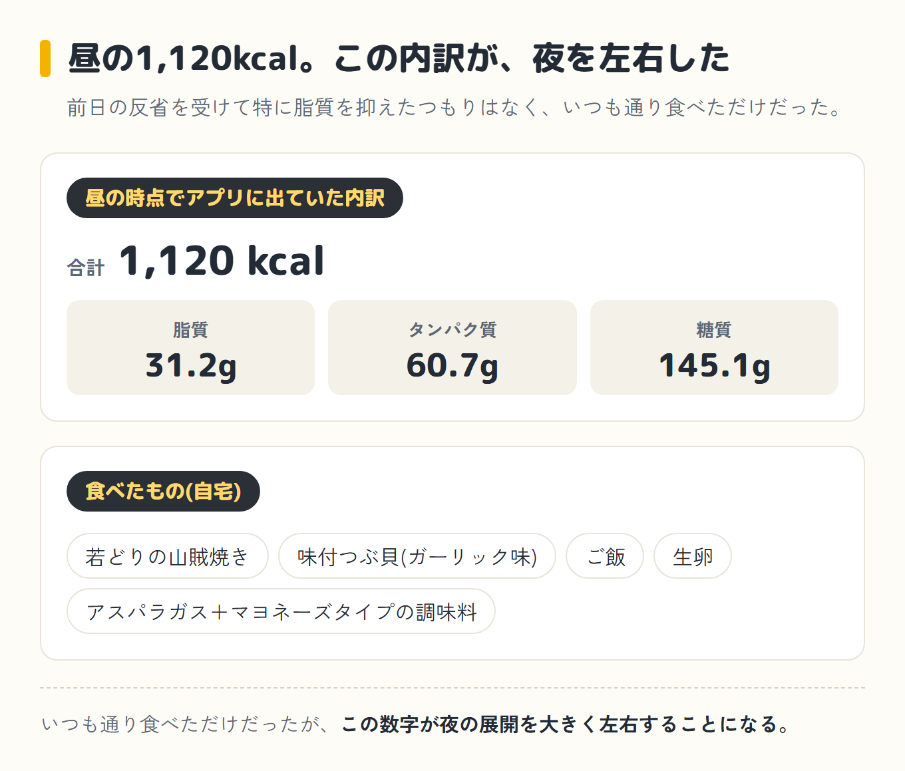
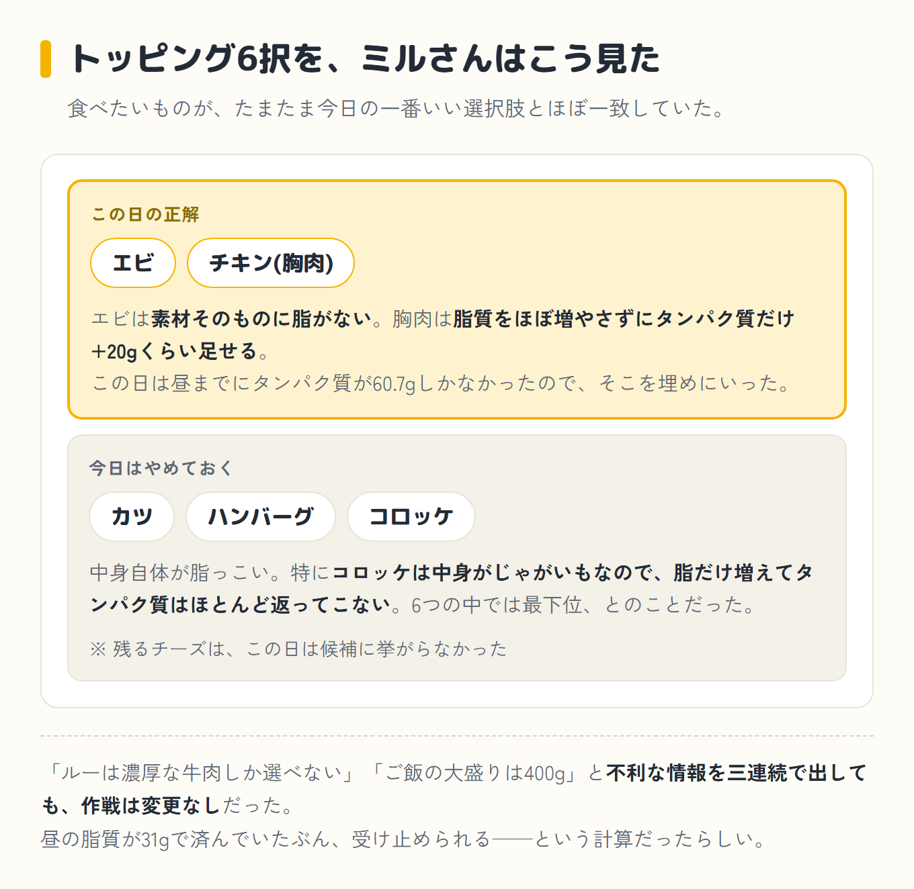
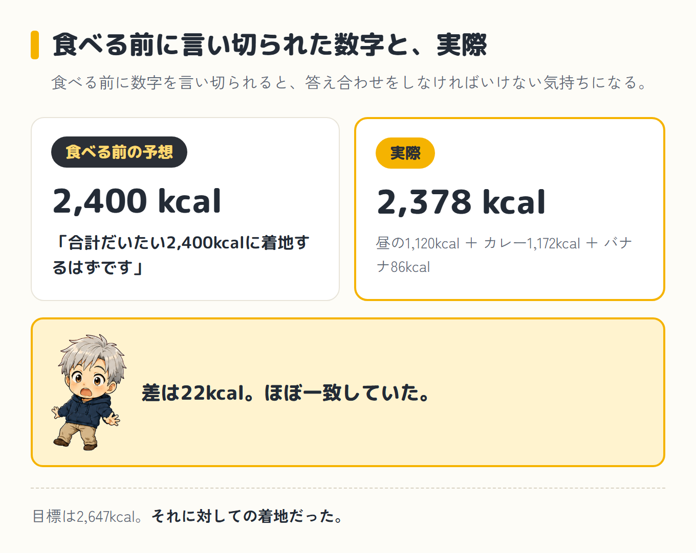
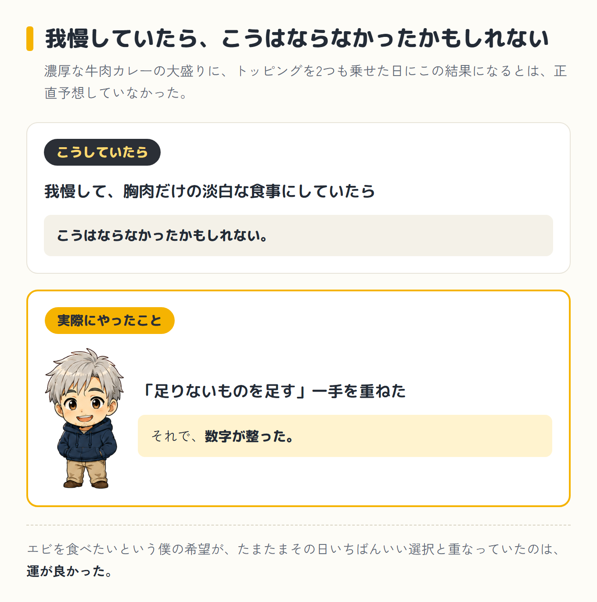
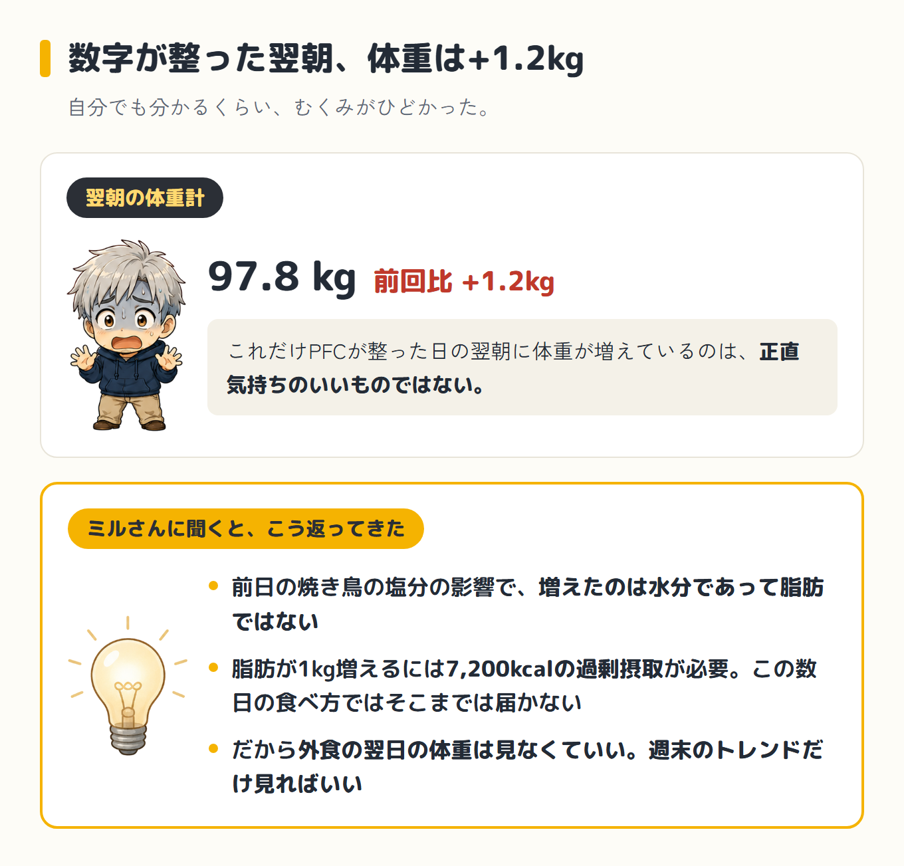
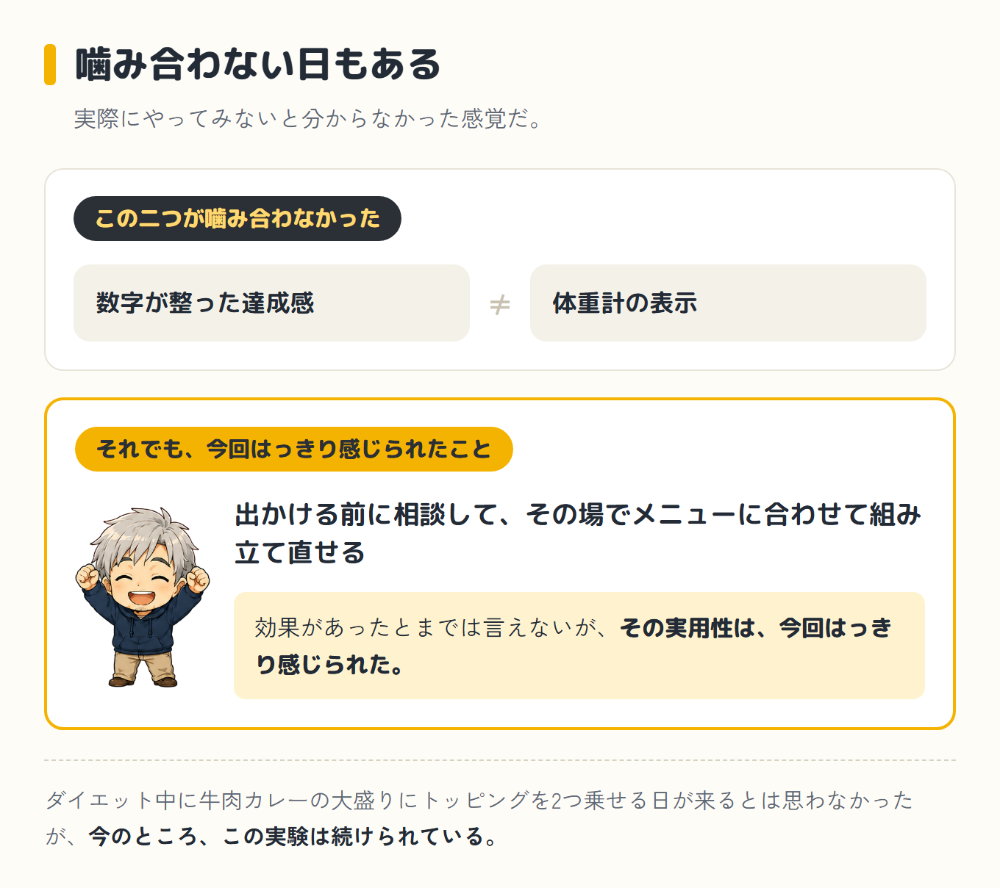

import Balloon from '../../../components/Balloon.astro';

ダイエット9日目。この日も起きたのは10時半過ぎで、朝食は抜き。昼は自宅で若どりの山賊焼き、味付つぶ貝(ガーリック味)、ご飯、生卵、アスパラガスにマヨネーズタイプの調味料をかけて1,120kcal。

夜は家族で地元で人気のカレー屋に行くことになり、出かける前にパソコンのミルさん(僕がパソコンのAIに、昔飼っていた猫の名前をつけてコーチにしている相棒)に相談してから向かった。

結果、夕食は濃厚な牛肉ルーにエビと鶏むね肉、ご飯大盛り400gという組み合わせに着地し、合計2,378kcal(目標2,647kcal)。目標カロリーは、参考にしているトレーナーさんに教えてもらった計算式で、体重から割り出している。前回と数字が少し違うのは、体重が動けば目標も動く仕組みだからだ。

ミルさんが食べる前に出した予想は2,400kcalで、ほぼ一致していた。そして何より、PFCバランスが3つとも目標レンジに収まっていた日だった。

## 前日の反省を抱えたままの昼食

前日は焼き鳥屋で揚げ物を頼みすぎて、脂質だけ目標を大きく超えた。ミルさんに「"もっと食べて"とは言いましたけど、"揚げ物で脂質を盛れ"とは言ってないですよ」と笑われたばかりだ。

そしてその翌日である今日も、目が覚めたら10時半を過ぎていた。朝食を作るには中途半端な時間で、結局そのまま食べずに昼を待つことにした。

二日続けての寝坊である。反省の色がないと言われればそれまでだが、これがいつものパターンなので、正直あまり気にしていなかった。

昼は自宅で、若どりの山賊焼き、味付つぶ貝(ガーリック味)、ご飯、生卵、アスパラガスにマヨネーズタイプの調味料をかけたもの。

合計1,120kcal。この時点でアプリに出ていた内訳は、脂質31.2g、タンパク質60.7g、糖質145.1gだった。

前日の反省を受けて特に脂質を抑えたつもりはなく、いつも通り食べただけだったが、この数字が夜の展開を大きく左右することになる。

## 出かける前の作戦会議

この日は夜に家族で、地元で昔から人気のカレー屋に行く予定が入っていた。出かける前に、パソコンでミルさんに相談しておいた。

<Balloon who="boss">夕食はカレー屋に行きます。どう食べたらいいですか。トッピングは何がいいですか</Balloon>

<Balloon who="mil">カレーはむしろgoodです。今日は糖質がまだ186gも余ってるので、ご飯をしっかり食べられるカレーは相性がいいですよ。気にするのは脂質だけです。ライスは遠慮なく大盛りでどうぞ</Balloon>

前日の脂質オーバーを踏まえた慎重な提案かと思いきや、開口一番「カレーは相性がいい」だった。ここで、店のメニューの実態を伝えることにした。

## トッピングの実態を伝えるたびに、作戦が組み変わる

<Balloon who="boss">トッピングはカツ・ハンバーグ・チキン(胸肉)・エビ・コロッケ・チーズの6つしかないです。僕としてはエビが食べたいです</Balloon>

<Balloon who="mil">エビでいきましょう。食べたいものが、たまたま今日の一番いい選択肢とほぼ一致してます</Balloon>

理由も添えられた。カツ・ハンバーグ・コロッケは中身自体が脂っこい。特にコロッケは中身がじゃがいもなので、脂だけ増えてタンパク質はほとんど返ってこない。6つの中では実は最下位という説明だった。素材に脂がないエビは、その点で分がいいらしい。

続けて、もう一言足された。

<Balloon who="mil">あと、チキン(胸肉)も足してください。今日はタンパク質が60.7gしかなくて足りないので。胸肉なら脂質はほぼ増やさずに、タンパク質だけ+20gくらい足せます</Balloon>

エビだけで満足していたところに、まさかの追加指示だった。ここで、店の細かい実態も伝えておいた。

<Balloon who="boss">エビは茹でたエビがルーに入ってるだけです</Balloon>

<Balloon who="boss">ルーはあっさりめが選べません。濃厚な牛肉ルーしかないです</Balloon>

<Balloon who="boss">ご飯の大盛りは400gらしいです</Balloon>

三連続で不利な情報を出したつもりだったが、ミルさんは動じなかった。

<Balloon who="mil">牛肉ルーで脂質は少し上がりますけど、昼の脂質が31gで済んでるので受け止められます。作戦変更なしです。ご飯400gもそのままで大丈夫です。帰ってからバナナだけ食べてください</Balloon>

そして食べる前に、こう予想値まで出してきた。

<Balloon who="mil">合計だいたい2,400kcalに着地するはずです</Balloon>

食べる前に数字を言い切られると、答え合わせをしなければいけない気持ちになる。

## 食べた結果と、当たった予想

実際に注文したのは、濃厚な牛肉ルーに茹でエビと鶏むね肉、ご飯400g。食べ終えてアプリに入れると1,172kcal。帰宅後、指示どおりバナナを1本(86kcal)。

昼の1,120kcalと合わせて、この日の合計は2,378kcal。目標2,647kcalに対しての着地だった。ミルさんの事前予想は2,400kcal。実際との差は22kcalで、ほぼ一致していた。

| いつ | 食べたもの | カロリー |
|---|---|---|
| 朝 | 抜き(起きたのが10時半過ぎ) | 0 kcal |
| 昼 | 若どりの山賊焼き / 味付つぶ貝(ガーリック) / ご飯 / 生卵 / アスパラガス＋マヨネーズタイプ | 1,120 kcal |
| 夜 | 濃厚な牛肉ルーのカレー ＋ 茹でエビ ＋ 鶏むね肉 / ご飯400g | 1,172 kcal |
| 帰宅後 | バナナ 1本(ミルさんの指示) | 86 kcal |
| **合計** | **目標2,647kcalに対して269kcal下** | **2,378 kcal** |

## 3つとも収まったと喜んだが、グラムで見ると糖質だけだった

数字だけ見ても悪くない着地だったが、それ以上に目を引いたのがPFCバランスだった。

  
<strong>【2026-07-31 訂正】</strong>このメーターの判定が間違っていました。脂質をグラムでは減らせた日に「オーバー」と出ていて、減らしたのにおかしいぞ、と自分で気づきました。クロさん(ブログ係のAI相棒)に計算してもらったら、総カロリーが少ない日ほど割合(%)は跳ね上がるうえ、アプリの目標グラムと目安の割合がそもそも噛み合っていなかったそうです。

  
判定は「目標グラム数の±10%以内か」で見る形に直しました(この幅はクロさんの判断です)。本文とミルさんのセリフは当日の記録なので、そのままにしています。

  

    
タンパク質115.7g

    

    
目標165.4g（差 −49.7g）｜総カロリー比 19.5%足りない

  

  

    
脂質55.2g

    

    
目標73.5g（差 −18.3g）｜総カロリー比 20.9%足りない

  

  

    
糖質(ご飯など)346.2g

    

    
目標330.9g（差 +15.3g）｜総カロリー比 58.2%ほぼ目標どおり

  

黄色い帯が目標の範囲、黒い針がこの日の実績だ。<strong class="red">帯に収まっていたのは、糖質だけだった。</strong>当時は割合(%)で見て「3つとも収まった」と喜んでいたのだが、あとからブログ係のAI相棒・クロさんにグラムで数え直してもらったら、タンパク質は49.7g、脂質は18.3g足りていなかった。喜んだ事実は事実なので、そのまま残しておく。

濃厚な牛肉カレーの大盛りに、トッピングを2つも乗せた日にこの結果になるとは、正直予想していなかった。

我慢して胸肉だけの淡白な食事にしていたら、こうはならなかったかもしれない。エビを食べたいという僕の希望が、たまたまその日いちばんいい選択と重なっていたのは運が良かったにしても、そこにチキンという「足りないものを足す」一手を重ねたことで、数字が整った。

出かける前に、メニューの実態を伝えるたびにアドバイスが組み替わっていく感覚は、本やネットの情報を事前に読んでおくのとはまったく違うものだった。

## それでも体重は+1.2kg、そしてわかったこと

数字がここまで整った翌朝、体重は97.8kg。[前回](/blog/diet/diet-day8/)比+1.2kgだった。自分でも分かるくらい、むくみがひどかった。

これだけPFCが整った日の翌朝に体重が増えているのは、正直気持ちのいいものではない。ミルさんに聞くと、前日の焼き鳥の塩分の影響で、増えたのは水分であって脂肪ではないという話だった。

脂肪が1kg増えるには7,200kcalの過剰摂取が必要で、この数日の食べ方ではそこまでは届かない。だから、外食の翌日の体重は見なくていい、週末のトレンドだけ見ればいい、とのことだった。

数字が整った達成感と、体重計の表示。この二つが噛み合わない日もあるというのは、実際にやってみないと分からなかった感覚だ。

効果があったとまでは言えないが、出かける前に相談して、その場でメニューに合わせて組み立て直せることの実用性は、今回はっきり感じられた。

ダイエット中に牛肉カレーの大盛りにトッピングを2つ乗せる日が来るとは思わなかったが、今のところ、この実験は続けられている。

次回へ続く

<a class="next-btn" href="/blog/diet/diet-day10/">
  ダイエット第4話
  ほっけ定食に決めていたのに、800円の差でぬかにしんを頼んでいた日
</a>
