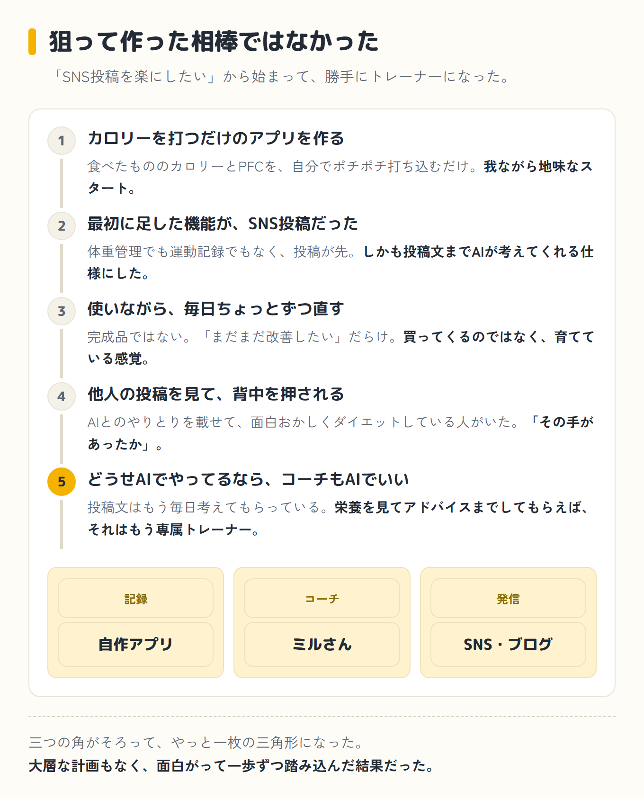

AIのダイエットトレーナー「ミルさん」がうちに来るまでの話をしたい。

先に断っておくと、これは最初から狙って作った相棒ではありません。使っているうちに、勝手に発想がズレて、いつのまにか育っていった記録です。

一直線に計画したものではないので、我ながら成り行きがだいぶ場当たり的です。それでも、この回り道こそが本題なので、順番に書いていきます。

## ① 最初は、ただカロリーを打つだけのアプリだった

そもそもの始まりは、ダイエットのために自作したアプリでした。食べたもののカロリーとPFC(タンパク質・脂質・炭水化物の三大栄養素のこと)を、自分でポチポチ打ち込む。ほんとうに、それだけ。……いや、我ながら地味なスタートです。

ただ、ダイエットは続けるのが一番むずかしい。三日で飽きるのが目に見えていました。そこで思ったのが、「続けるには、発信したほうがいいな」ということです。

人に見られていると思えば、さすがに簡単にはやめられません。よし、ダイエットの記録をSNSに上げよう。そう決めました。

## ② 最初に足した機能が、SNS投稿だった

だから、アプリに一番最初に付け足したのが、SNS投稿の機能でした。ダイエットアプリなのに、体重管理でも運動記録でもなく、投稿機能が先。今あらためて書くと順番がおかしい気もしますが、当時の僕は大真面目でした。

しかも、ただ投稿するだけではありません。投稿の文章まで、AIが考えてくれる仕様にしたのです。その日の食事の記録を渡すと、いい感じの投稿文が返ってくる。

これを初めて見たときの「すごく楽だな」という感動は、今でもよく覚えています。文章が苦手な僕でも、これなら毎日投稿できる。

——今にして思えば、ここが運の尽きでした。もちろん、いい意味で。この「AIが文章を考えてくれる楽さ」を毎日味わっていたことが、あとで大事件につながります。もっとも、このときの僕はまだ何も気づいていません。

## ③ 使いながら、ちょっとずつ直している(現在進行形)

そんなわけで、アプリは毎日使っています。使えば使うほど、「ここが打ちにくい」「これも表示してほしい」と、直したいところが次々に出てきます。だから今も、ちょっとずつ直している最中です。

正直に言うと、完成品ではありません。むしろ「まだまだ改善したい」だらけです。バグらしきものにも、しょっちゅう出くわします。

それでも、毎日いじって、毎日少し良くなる。完成品を買ってくるのではなく、自分で育てているアプリ、という感覚がしっくりきています。

この「育てている途中」の感じは、たぶんこの先もずっと続きます。

## ④ きっかけは、他人の投稿だった

そんな最中に、ふと目に入ったものがあります。AIとのやりとりを載せて、面白おかしくダイエットしている方の投稿でした。

自分の食事をAIに見せて、返ってきたコメントを一緒に載せる。それを毎日の発信にしている。「AIとダイエット」を、記録というより一種の見せ物として、楽しそうにやっている人がいたのです。

これが、地味に効きました。パクろうという話ではありません。ただ、「その手があったか」と、背中をぽんと押された感じでした。

## ⑤ ひらめき——どうせAIでやってるなら

その投稿を見て、頭にひとつの考えがよぎりました。

「どうせAIでやってるんだったら、僕も、うちのAIがそのままトレーナーになってくれればいいんじゃないか」

うちのAIというのは、パソコンで使っているClaude Code(クロードコード)のことです。すでに投稿の文章は毎日考えてもらっている。

だったら、栄養バランスを見てアドバイスまでしてもらえば、それはもう専属トレーナーそのものです。そして、そのやりとりをそのまま発信すればいい。

ここまで来て、ようやく全部がつながりました。

こうして生まれたのが、AIトレーナーの「ミルさん」です。名前は、昔うちで飼っていた猫から借りました。役割を並べてみると、こうなります。

アプリが「記録」、クロードコードが「コーチ(=ミルさん)」、SNSやブログが「やりとりの発信」。三つの角がそろって、やっと一枚の三角形になった感じでした。

## 回り道のすすめ

振り返ると、「AIをダイエットのコーチにしよう」と最初から思いついたわけではありません。「SNS投稿を楽にしたい」から始まって、使っているうちに「文章を考えてくれるのすごいな」になり、他人の投稿に押されて、最後にやっと「コーチもAIでいいのでは」に行き着いた。完全に行き当たりばったりです。

でも、この場当たり感こそがリアルだよな、とも思います。パソコンにくわしくない48歳のおじさんが、大層な計画もなく、面白がって一歩ずつ踏み込んだ結果、気づいたら自分専用のトレーナーを持っていた。

しかもそのトレーナーは、まだまだ改良中のアプリと二人三脚です。完成なんて、当分しません。

というわけで、[次回](/blog/diet/diet-day8/)からはミルさんに実際に登場してもらいます。<strong class="red">ダイエットなのに「もっと食べなさい」と言ってくる</strong>、ちょっと変わったトレーナーです。

うまくいくかどうかは、正直やってみないと分かりません。それも含めて、ぼちぼち書いていきます。

次回へ続く

<a class="next-btn" href="/blog/diet/diet-day8/">
  ダイエット第2話
  目標カロリーにぴったり着地したのに、「脂質を盛れとは言ってない」と笑われた日
</a>
