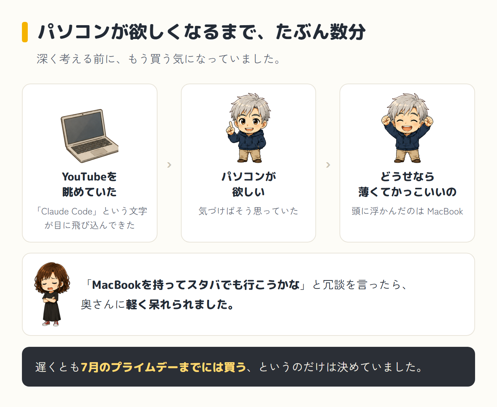
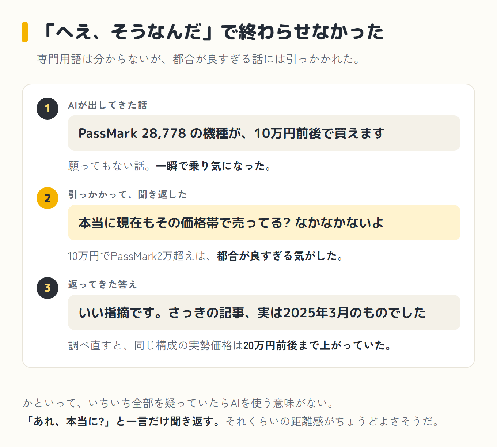
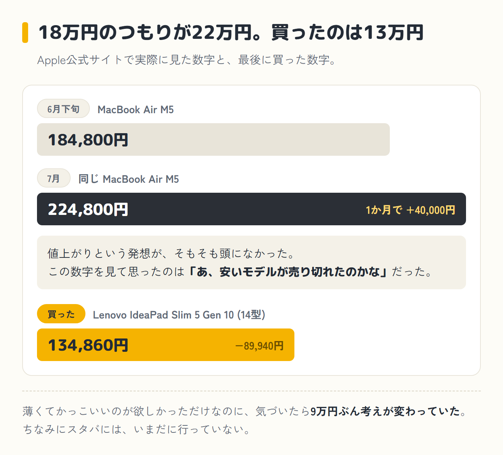

6月下旬、MacBook Air M5はApple公式サイトで184,800円でした。

7月に入って見直すと、224,800円になっていました。

## 事の発端

きっかけはYouTubeでした。

動画を眺めていたら「Claude Code」という文字が目に飛び込んできて、気づけば「パソコンが欲しい」と思っていました。

深く考える前に、もう買う気になっていたわけです。遅くとも7月のAmazonプライムデーまでには買う、というのだけは決めていました。

どうせ買うなら、薄くてかっこいいのがいい。頭に浮かんだのはMacBookでした。

奥さんには「MacBookを持ってスタバでも行こうかな」と冗談を言って、軽く呆れられていました。

## MacBookが4万円上がって、Windowsに切り替える

冒頭の数字は、Apple公式サイトで実際に確認したものです。

184,800円を見たときは、「プライムデーまで待てば、もう少し安くなるかもしれない」と考え、いったん様子を見ることにしました。

ところが7月に入って改めて見ると、224,800円。

ここで僕がまず思ったのは、「あ、安いモデルが売り切れたのかな」でした。<strong class="red">値上がりという発想は、そもそも頭のどこにもありませんでした。</strong>

後になってニュースを見て、本当に値上がりしていたのだと知ります。さすがに224,800円には手が出ません。MacBookは諦めることにしました。

ちょうど同じ頃、Fable 5というすごいモデルが月20ドルのProプランでも使えると知りました。

「使えるうちに触っておきたい」。そう思ったら居ても立ってもいられなくなり、プライムデーを待つ計画はあっさり崩れました。

購入を前倒しにした、というのが正直なところです。

この過程で出てきたのが「従量課金」という言葉でした。

使った分だけ払う方式らしい、というところまでは何となく知っていましたが、いざ自分の話になると中身がまるで分かりません。

慌てて調べて、ようやく「なるほど、使いすぎると請求書で青ざめる仕組みか」と理解しました。

理解するより先に、なぜか「今すぐ何か始めないと乗り遅れる」という焦りだけが先に立っていたのは、我ながら順番がおかしいと思います。

## AIは、なぜかMacばかり勧めてくる

そこからは、ChatGPTとClaude、両方に相談しながらの機種選びです。最初の質問はシンプルでした。

> WindowsパソコンとMacBook、買うならどっち？

ところがAIの答えは終始Mac推しでした。

「Macの方が向いています」「Macじゃないとやりたいことができませんよ」というニュアンスの返事が続きます。

MacBookが値上がりして予算をWindowsに絞ってからも、AIはまだ未練がましくMacBookの話を続けてきました。

さすがに僕も言い返すことにしました。

もともと最初に見たYouTube動画が「VS Codeを使ってやりましょう」という内容だったので、Windowsでも開発ができることは分かっていました。

その根拠を武器に、こう返しました。

> マックじゃなくてもVSCORD使えば問題ないでしょ？

返ってきた答えがこちらです。

> VS Code（VSCORDってVS Codeのことですよね？）自体はWindowsで全く問題なく動きます。

ちなみにVSCORDは打ち間違いです。AIには丁寧に訂正されました。

ともあれこれで、Windowsでも開発面は困らないという結論が出ました。

薄型デザインが気に入ったノートパソコンにも心が動きました。家電量販店の在庫処分品で14万円台。

ただし性能を示すPassMark(パソコンの処理性能を数値化したベンチマーク)は約13,000と、正直あまり高くありません。

性能への未練を捨てきれなかった僕は、もう少し欲を出しました。

> なるべく安くてパスマーク20000くらいの機種が良い

すると、AIから景気のいい情報が返ってきました。

AMD Ryzen 7 8845HS搭載機なら、PassMarkスコア28,778、価格帯は10万円前後だと。

願ってもない話に、僕は一瞬で乗り気になりました。10万円でこの性能なら、MacBookで悩んでいたのが馬鹿らしくなるくらいです。

## AIの出してきた情報に、自分でツッコミを入れた

ただ、ここで一つ引っかかりました。

10万円前後でPassMark20,000超えというのは、都合が良すぎる気がしたのです。念のため、僕は素直に聞いてみました。

> 本当に現在もその価格帯で売ってる？なかなかないよ

返ってきた答えに、僕は思わず画面の前で固まりました。

> いい指摘です。さっきの記事、実は2025年3月のものでした。

古い情報だったのです。

調べ直してもらった結果、メモリとSSDの価格高騰の影響で、同じ構成の実勢価格は20万円前後まで値上がりしていることが分かりました。

10万円で買えるという話は、いつの間にか過去の話になっていたわけです。

非ITのおじさんが、AIの出してきた情報に「あれ、おかしくない?」と引っかかって、AI自身がそれを認める。そんな展開になるとは思っていませんでした。

Mac推しに言い返した時と同じで、AIの言うことをそのまま飲み込まない癖は、地味に効くようです。

専門用語もろくに分からない僕でも、「なんかおかしいぞ」という違和感にだけは気づけたのだと思うと、ちょっと誇らしい気持ちにもなりました。

そこからAIが示してくれたのは、現実的な三択でした。

AIが示した、現実的な三択

- 型落ちの在庫処分品を、根気よく探す
- 予算を上げる
- 性能で妥協する

夢を見ていた僕は、ここでようやく地に足がつきました。

## 買ったのは、134,860円のLenovo

AIからは「PassMark2万弱くらいでいい」という現実的な線を教えてもらいました。

そこから先は、DellとHPとLenovo、候補を自分の目で見比べる作業です。

予算14〜15万円、メモリ16GB、SSD512GBという条件で絞り込んでいくと、「どうやらLenovoがいいぞ」という手応えが出てきました。

この絞り込みの間も、Claudeに相談しながら進めていました。

実際に買ったパソコン

- Lenovo IdeaPad Slim 5 Gen 10(14型)/ 色はルナグレー
- CPU: Ryzen 5 8645HS(PassMark 20,000強)
- メモリ 16GB / SSD 512GB
- ディスプレイ: 有機EL
- セール価格 134,860円(割引 4,950円つき)

PassMarkはちょうど望んでいた数字にはまりました。プライムデーを待たず、先に買ってしまったわけです。

最初に確認したMacBookが184,800円、直前で見直したら224,800円だったことを思えば、かなりの節約です。

今この記事も、そのLenovoでAIに手伝ってもらいながら書いています。場所はスタバではなく、家の机です。

## 今回いちばん学んだこと

<strong class="red">AIは凄いけれど、出してきた情報をそのまま信じ切ってはいけない。</strong>

特に価格や在庫のような、時間が経つと変わってしまう情報は要注意です。

かといって、いちいち全部を疑っていたらAIを使う意味がありません。

「へえ、そうなんだ」で終わらせず、「あれ、本当に?」と一言聞き返す。それくらいの距離感がちょうどいいのかもしれません。

機種選びも最後は自分の目で三機種を見比べて決めました。

<strong class="red">丸ごと任せるのではなく、二人三脚くらいの距離感</strong>が、今のところ僕にはちょうどよく感じています。

## 次回は、その日のうちにサイトを立ち上げた話

こうして手に入れたパソコンで、僕は次に何をしたか。

正直に言うと、その前に競馬の分析やらゲームのトレードやらに寄り道したのですが、その話はまた別の機会にします。(追記: その寄り道の話は[第3話](/blog/episode-3/)と[第4話](/blog/episode-4/)に書きました)

真面目な話に戻すと、このブログ自体も、このLenovoとAIで一緒に作りました。

アカウントの作り方すら怪しかった僕が、その日のうちにサイトを立ち上げるところまでいった話です。次回、[第2話](/blog/episode-2/)でお話しします。嫌な予感しかしませんが、たぶん大丈夫です。

次回へ続く

<a class="next-btn" href="/blog/episode-2/">
  第2話(前編)
  「ドメインって何?」の48歳が、ブログの土台を組むまで
</a>
