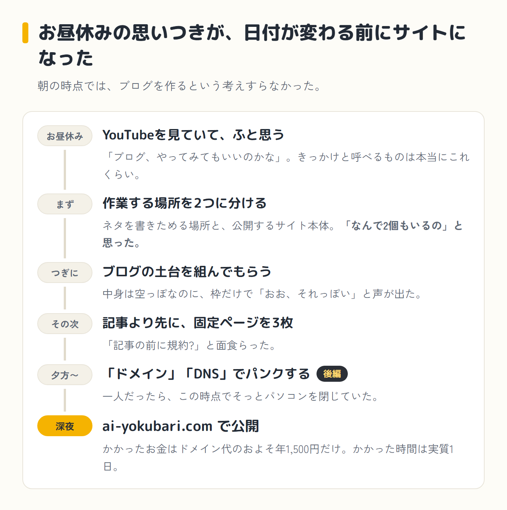
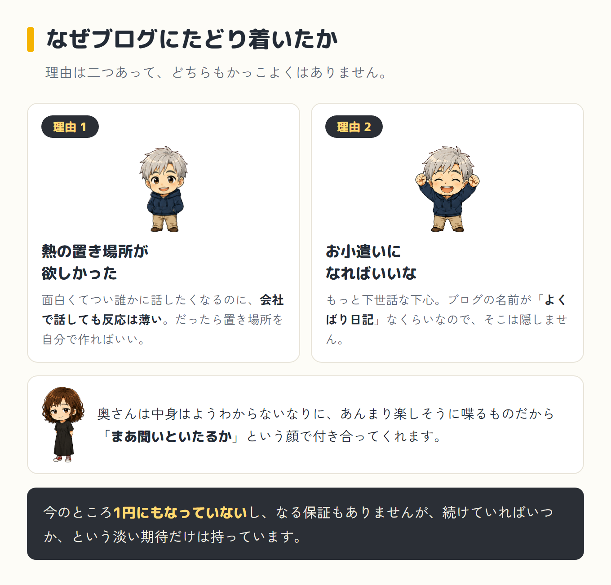
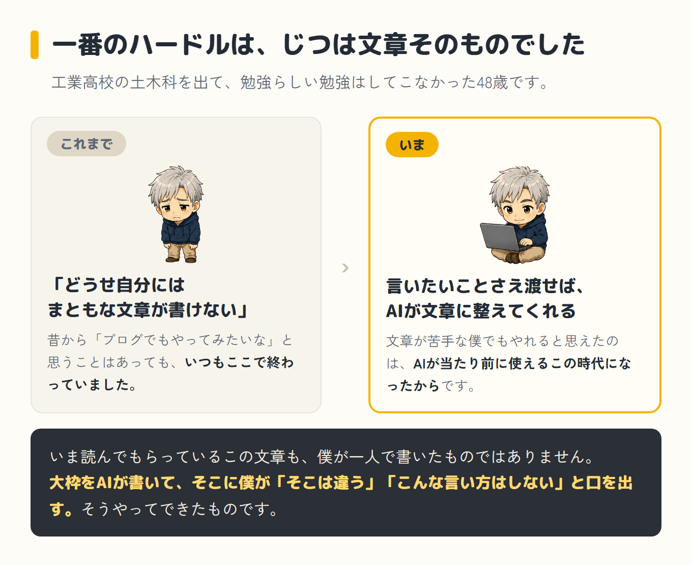
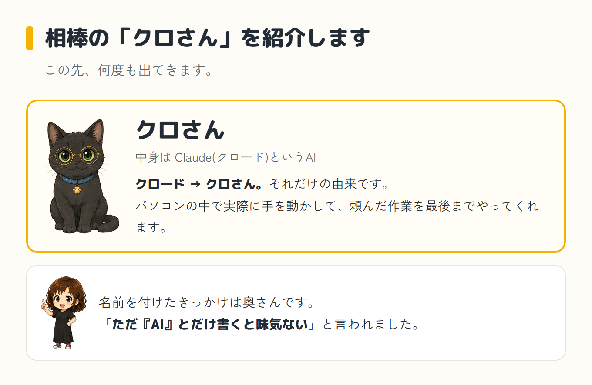
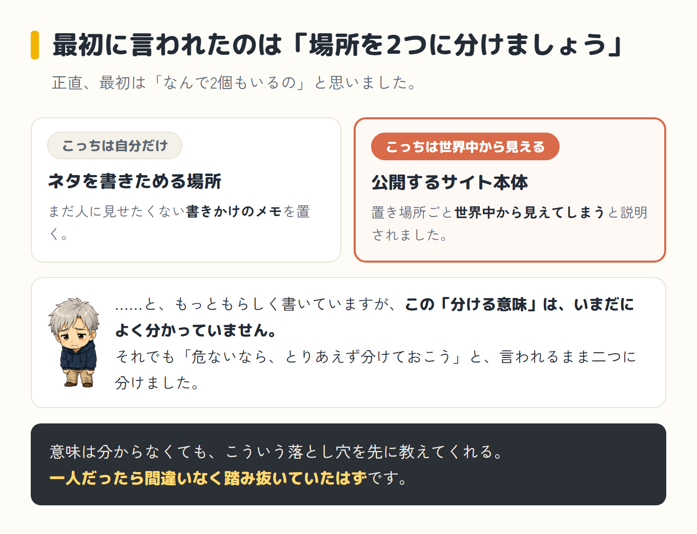
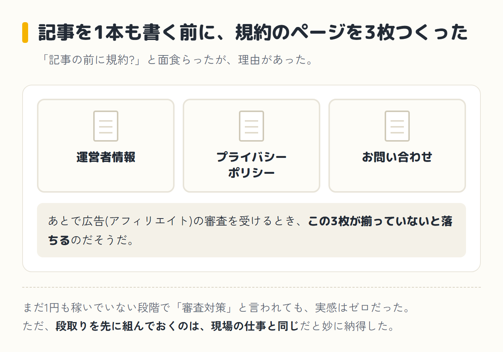

その日の朝、目が覚めたときには、夜に自分のブログを公開することになるとは、まったく思っていませんでした。

始まりは、お昼休みです。いつものようにYouTubeを眺めていて、ふと「ブログ、やってみてもいいのかな」と思っただけでした。

きっかけと呼べるものは、本当にそれくらいです。その思いつきが、日付が変わる前には `ai-yokubari.com` という自分のドメインのサイトになっていました。

朝の時点では、ブログの名前どころか、作るという考えすらなかったのに、です。

## 事の発端

[前回](/blog/episode-1/)、18万円のMacBookをやめてLenovoを買った話を書きました。ではパソコンが届いて真っ先にブログを作ったのかというと、そうではありません。

実際に最初に手をつけたのは、競馬の分析と、FC26(サッカーゲーム)のトレードのためのシステム作りでした。ブログは、そのあたりをさんざんいじり倒した後、ようやく始めたものです。

この寄り道の話は、また別の機会にちゃんと書きます。(追記: [第3話](/blog/episode-3/)がゲームのトレード、[第4話](/blog/episode-4/)が競馬です)

では、なぜ最終的にブログにたどり着いたのか。理由は二つあって、どちらもかっこよくはありません。

一つは、熱の置き場所が欲しかったこと。Claude Codeを触っているうちに面白くて、つい誰かに話したくなります。ただ、会社で話しても反応は薄い。

奥さんは、話の中身はようわからないなりに、僕があんまり楽しそうに喋るものだから「まあ聞いといたるか」という顔で付き合ってくれます。

ありがたいのですが、それでもやっぱり、この面白さが分かる人に話したい。だったら、その置き場所を自分で作ればいい。そう思っただけです。

もう一つは、もっと下世話な話で、これが少しでもお小遣いにつながればいいな、という下心です。ブログの名前が「よくばり日記」なくらいなので、そこは隠しません。

今のところ1円にもなっていないし、なる保証もありませんが、続けていればいつか、という淡い期待だけは持っています。

## 一番のハードルは、じつは文章そのものでした

それに、僕にとってブログの一番のハードルは、じつは文章そのものでした。工業高校の土木科を出て、勉強らしい勉強はしてこなかったし、仕事でも、きちんとした文章を書く機会はほとんどないまま来ました。

だから昔から「ブログでもやってみたいな」と思うことはあっても、「どうせ自分にはまともな文章が書けないから」で、いつも終わっていた気がします。

それが、今回は違いました。頭の中にある「言いたいこと」さえ渡せば、AIがそれなりの文章に整えてくれる。文章が苦手な僕でもブログをやれると思えたのは、AIが当たり前に使える、この時代になったからです。

逆に言えば、少し前だったら、たぶんまた諦めていました。

正直に言うと、今こうして読んでもらっているこの文章も、僕が一人で書いたものではありません。大枠をAIが書いて、そこに僕が「そこは違う」「こんな言い方はしない」と口を出して、少しずつ自分の言葉に近づけていく。

そうやってできたものです。この"AIとどうやって文章を作っているのか"という舞台裏は、それだけで一本になりそうなので、また別の回でちゃんと書きます。

もう一つの問題は、僕にブログを作る知識がまったくなかったことです。そこはもう、AIに全部相談しながら進めました。

## 相棒の「クロさん」を紹介します

ここで先に、ひとつだけ紹介させてください。この先、AIの相棒が何度も出てきます。ただ「AI」とだけ書くと味気ない、と奥さんに言われたので、我が家ではこのAIを「クロさん」と呼ぶことにしました。

中身はClaude(クロード)というAIなので、そこから「クロさん」です。以下、そう呼びます。

## フォルダを2つに分けるところから

最初にクロさんから言われたのが、「作業する場所を2つに分けましょう」でした。ネタを書きためる場所と、実際に公開するサイト本体を、別のフォルダにするというのです。

正直、最初は「なんで2個もいるの」と思いました。理由もちゃんと説明してもらいました。公開するブログは、置き場所ごと世界中から見えてしまう。だから、まだ人に見せたくない書きかけのネタは、別の場所に分けておくほうが安全なのだ、と。

……と、もっともらしく書いていますが、正直なところ、この「フォルダを分ける意味」は、いまだに自分でもよく分かっていません。

それでも「危ないなら、とりあえず分けておこう」と、言われるまま二つに分けました。意味は分からなくても、こういう落とし穴を先に教えてくれる。

<strong class="red">一人だったら間違いなく踏み抜いていたはず</strong>で、思えばこの時点で、もうクロさん任せの二人三脚が始まっていたのだと思います。

そこから、ブログの土台を組んでもらいました。自分のパソコンの画面に、初めて「ブログらしきもの」が表示されたときは、地味に感動しました。中身はまだ空っぽなのに、枠だけでも「おお、それっぽい」と声が出ました。

## 記事より先に、規約のページ?

次にクロさんが用意したのが、記事ではなく固定ページ3枚でした。運営者情報、プライバシーポリシー、お問い合わせ。

「記事の前に規約?」と面食らいましたが、これも理由がありました。あとで広告(アフィリエイト)の審査を受けるとき、この3ページが揃っていないと落ちるのだそうです。

まだ1円も稼いでいない段階で「審査対策」と言われても実感はゼロでしたが、後で効くなら先にやっておくに越したことはありません。

段取りを先に組んでおくのは、現場の仕事と同じだなと妙に納得しました。

## 前編はここまで

土台ができて、固定ページも揃いました。われながら、ここまでは順調です。

問題は、この後でした。「ドメイン」「DNS」という聞いたこともない言葉が立て続けに出てきて、頭が一瞬止まります。

後編へ続く

<a class="next-btn" href="/blog/episode-2-kouhen/">
  第2話(後編)
  「ドメイン」「DNS」の三連発でパンクしながら、その日のうちに公開した話
</a>