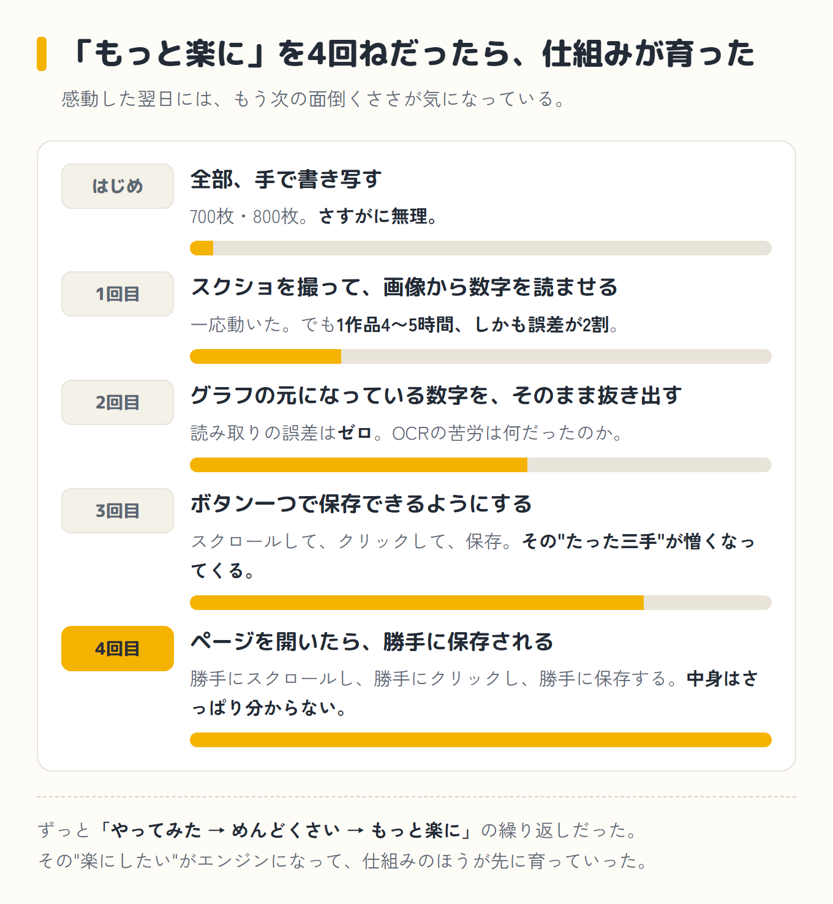
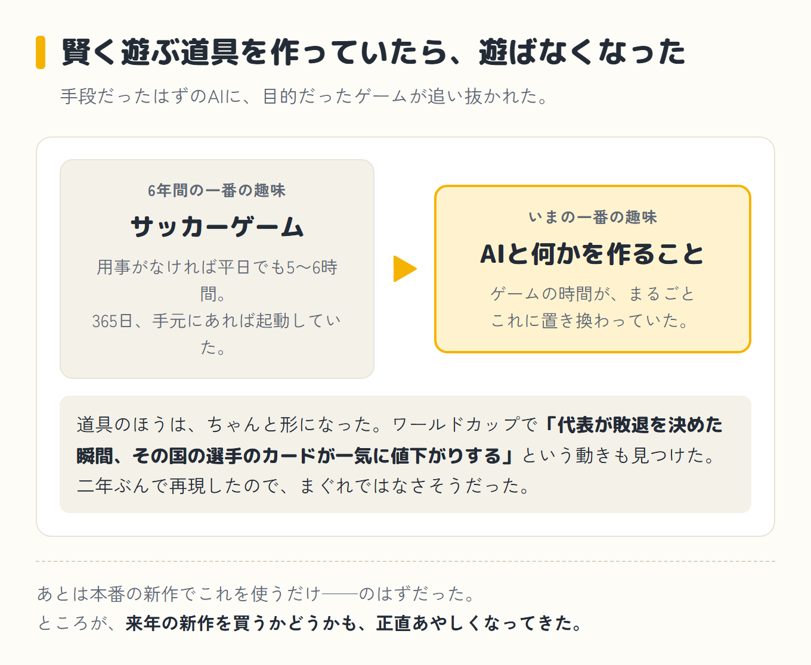

[前編](/blog/episode-3/)では、価格データを集めようとして規約の壁にぶつかり、スクショとOCRの力技に走り、700枚・800枚の繰り返しで心が折れかけたところまで書きました。

半ばやけになって「なんとかして」と投げつけた、その返事からです。

## 壁③「もっと楽に」を繰り返して、たどり着く

返ってきたのは、思ってもみない提案でした。

> グラフの絵を読むのではなく、グラフの"元になっている数字"を、ページからそのまま抜き出せます。ボタン一つで保存できるようにしましょう。

やってみたら、読み取りの誤差はゼロ。OCRであれだけ苦しんだのが嘘のようで、最初は「おお、これはすごい」と感動しました。

ところが、使っているうちに気づきます。「ボタン一つ」とはいっても、実際はそう単純ではありませんでした。まずグラフのところまでページをスクロールして、全期間が表示されるように一度クリックして、それから保存ボタンを押す。

文字にすればたった三手です。でも、これを700枚・800枚ぶん繰り返すとなると、その"たった三手"がだんだん憎らしくなってくる。

人間とは勝手なもので、さっき感動したばかりなのに、もう「このスクロールと余計なクリック、なくせないの?」と思い始めていました。

そこで、またしても楽をねだります。

> ページを開いたら、勝手に保存されるようにしてほしい。もう、ボタンを押すのすら、めんどくさい。

すると、それも叶いました。ただ、その叶え方が、僕にはまた未知の世界でした。見たこともない英語ばかりが並んだ画面を、「今どこを押すか」をスクショで見せてもらいながら一手ずつ進めて、なんだかよく分からないまま設定は完了。

気づけば、ページを開くだけで勝手にスクロールし、勝手にクリックし、勝手に保存してくれるようになっていました。仕組みの中身はさっぱりですが、とにかく楽になった。非ITのおじさんには、それで十分です。

振り返ると、このプロジェクトはずっと「やってみた → めんどくさい → もっと楽に」の繰り返しでした。その"楽にしたい"がエンジンになって、仕組みがどんどん良くなっていったわけです。

## 地味なトラブルも、一個ずつ

派手な壁だけではありません。地味なトラブルも次々出ました。

たとえば、集めた時刻が全部8〜9時間ズレていたこと(海外サイトの時刻表示だったのに、日本時間だと勘違いしていた)。あるいは、カードの名前の付け方をミスして、データがぐちゃぐちゃに混ざり、何万行も入れ直すハメになったこと。

そのたびに「またか……」とため息をつきながら、クロさんと一緒に一個ずつ直していきました。丸ごと任せるでも丸投げでもなく、詰まったら「これどうなってるの?」と聞いて直す。

[第1話](/blog/episode-1/)・[第2話](/blog/episode-2/)と、結局やっていることは同じでした。

## 小さな勝利

苦労のなかで、ちゃんと当たりもありました。ワールドカップのデータを調べていて、「**代表チームが敗退を決めた瞬間、その国の選手のカードが一気に値下がりする**」という動きを見つけたのです。

しかも、別の年の大会でも同じことが起きていた。二年ぶんで再現したので、まぐれではなさそうでした。

「お、AIって本当にこういうのを見つけるんだ」と、素直に感心しました。夢に一歩近づいた気がして、ここが一番テンションが上がった瞬間かもしれません。

## 仕組みは育ったのに、ゲームへの熱が消えた

そんなふうに、仕組みは少しずつ形になっていきました。あとは本番の新作でこれを使うだけ——のはずでした。

ところが、です。ある時ふと気づきました。**6年間、あれだけ毎日起動していたゲームを、最近ぜんぜんやっていない**。その時間は、まるごとクロさんと何かを作る時間に置き換わっていました。

ゲームで遊ぶより、「AIとこれを作ったらどうなるか」を考えているほうが、面白くなってしまったのです。

<strong class="red">賢く遊ぶための仕組みを作っていたら、遊ぶこと自体に興味がなく</strong>なった。来年の新作を買うかどうかも、正直あやしくなってきました。手段だったはずのAIに、目的だったゲームが追い抜かれてしまった、というオチです。

## 6年間の一番の趣味が、入れ替わった

6年間、僕の一番の趣味は、このサッカーゲームでした。今の一番の趣味は、AIと何かを作ることです。ゲームには、そのきっかけをくれた恩人みたいな気持ちすらあります。

ちなみに、この"初めてのAIプロジェクト"で沼にハマった僕は、この後どこへ向かったか。次は競馬です。「AIなら競馬で勝てるんじゃないか」と、また性懲りもなく走り出すのですが……その話は、また別の回で。

嫌な予感しかしませんが、たぶん大丈夫です。

次回へ続く

<a class="next-btn" href="/blog/episode-4/">
  第4話
  10年以上前のニュースを真に受けて、AIと競馬の必勝法を探し始めた話
</a>