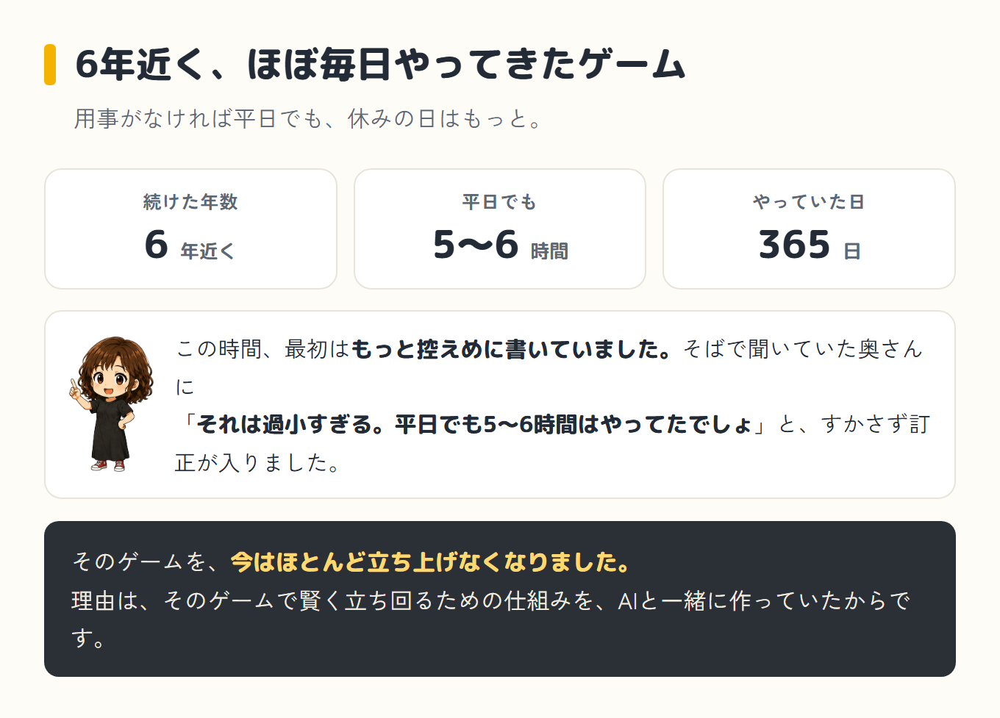
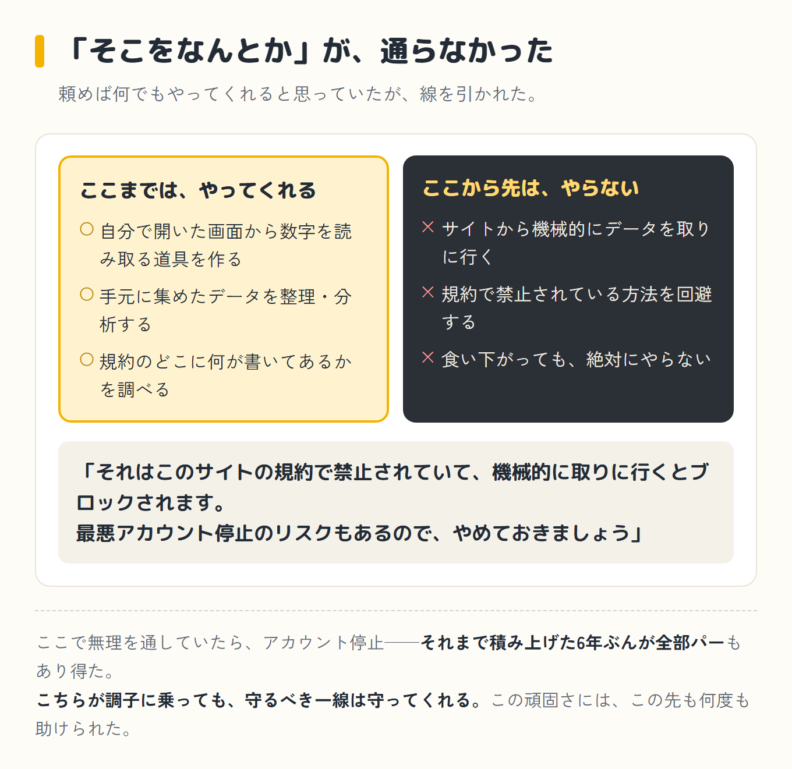
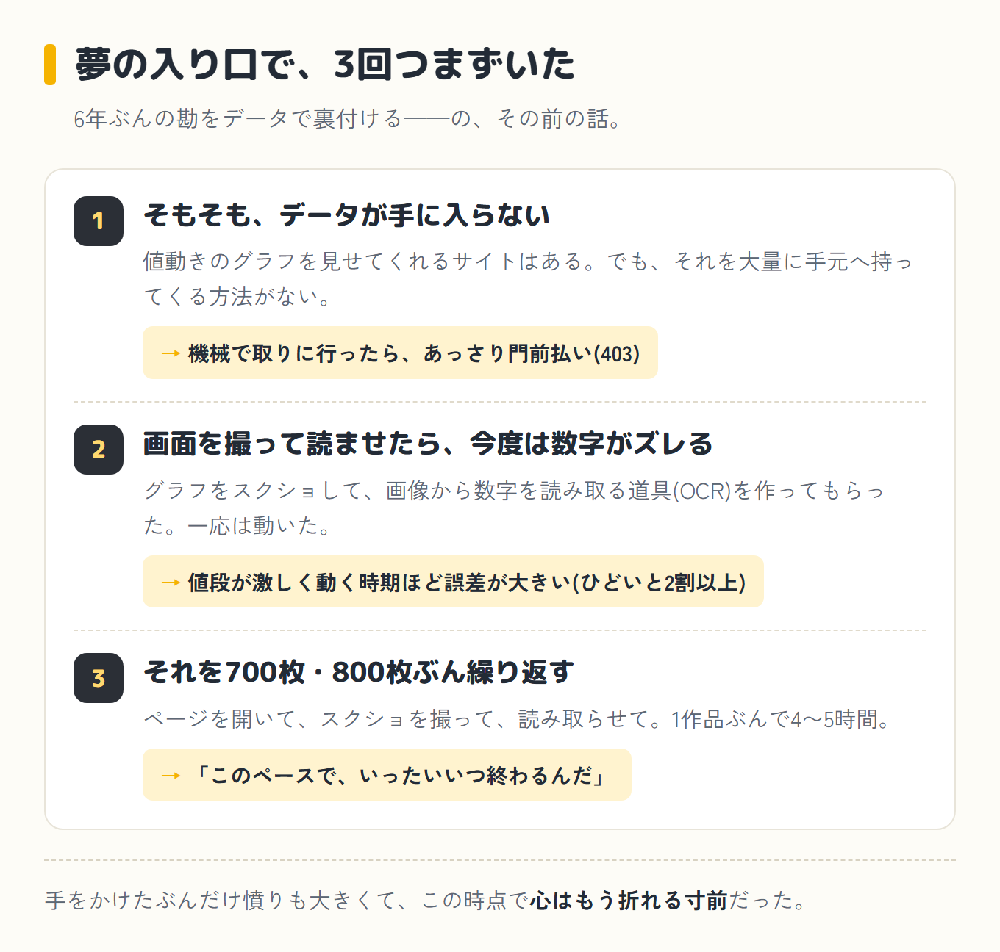

僕はあるサッカーゲームを、6年近く、ほぼ毎日やってきました。用事がなければ平日でも5〜6時間、休みの日はもっと。365日、手元にあれば起動する。それくらいの相棒でした。

（じつはこの時間、最初はもっと控えめに書いていました。すると、そばで聞いていた奥さんに「それは過小すぎる。平日でも5〜6時間はやってたでしょ」と、すかさず訂正が入りました。自分の記憶より、隣の証言のほうが正確だったようです。）

そのゲームを、今はほとんど立ち上げなくなりました。理由は、そのゲームで賢く立ち回るための仕組みを、AIと一緒に作っていたからです。順番がおかしい気もしますが、本当にそうなったのだから仕方ありません。

## 事の発端

これは実は、僕がAIと組んで、いちばん最初にやったプロジェクトです。競馬より前、このブログより前。記念すべき一発目が、これでした。

相棒は、このブログでいつも「クロさん」と呼んでいるAIです。正体は「Claude Code(クロードコード)」。チャットで返事をするだけのAIではなく、パソコンの中で実際にプログラムを書いて動かしてくれる、いわば"手も動く"タイプのAIです。

今回のように「仕組みそのものを作る」話では、この違いがけっこう効いてきます。

## そもそも、トレードって何をするのか

このゲームには、プレイヤー同士が選手のカードを売り買いする市場があります。運営が値段を決めて売るのではなく、世界中のプレイヤーがオークション形式で出品し、落札し合う。

人気や活躍しだいで需要と供給が変わり、値段が上下する——株の売買によく似た仕組みです。ここで安く買って高く売れば、ゲーム内のコインが増えていきます。

じつはこの"トレード"、ただのおまけ機能ではありません。ゲームの中ではかなり重要な要素の一つで、売り買いのコツだけを専門に発信するYouTuberがいたり、月額のメンバーシップにお金を払って「今どのカードが狙い目か」という情報を受け取る人が大勢いたりします。

それくらい、ひとつの"市場"として成り立っている世界です。

僕も6年やっているので、なんとなく「このカードは上がりそう」くらいの相場観はありました。そこでこう考えたわけです。

> 6年ぶんの勘を、AIとデータで裏付けたら、もっと賢く増やせるんじゃないか。

ちゃんと言うと、過去のデータで「勝てる型」を検証して、ルールどおりに売り買いする——そんな運用の仕組みを作ろうとしました。しかも本番は来年の新作から、今作は練習期間、という壮大な二段構えです。夢だけは一丁前でした。

念のため先に書いておくと、これはゲーム内のコインの話で、現金の儲け話ではありません。しかも後で書くとおり、実際の売買までは一度も行き着いていません。

## 壁①「まず、データが手に入らない」

始めてすぐ、最初の壁にぶつかりました。検証するには、過去の価格データが要ります。

幸い、選手カードの値動きを、過去ぶんまでグラフで見せてくれるサイトがあります。どのカードがいつ、いくらだったか。この界隈では定番の、いわば"株価チャート"のようなサイトです。

データそのものは、そこにある。問題は、それを大量に、自分の分析用に手元へ持ってくる方法でした。何百枚ぶんも手で書き写すのは、さすがに無理です。

でも、このときの僕は正直、余裕だと思っていました。クロさんはプログラムを書けるAIなんだから、こういうのは全部、勝手に自動で集めてきてくれるものだと思い込んでいたのです。だから、ずいぶん軽い気持ちで頼みました。

> 価格を自動で集めてきてほしいんだけど。

## AIが「それはやめましょう」と止めてきた

返ってきたのは、ノリノリの実装案……ではなく、ブレーキでした。

> それはこのサイトの規約で禁止されていて、機械的に取りに行くとブロックされます。最悪アカウント停止のリスクもあるので、やめておきましょう。

実際、試しに機械で取りに行くと、あっさり門前払い(403エラー)。夢の入り口で、いきなりつまずきました。「え、まずデータを集めるところで詰まるの?」というのが正直な感想です。

感心したのは、クロさんがただ「ダメ」と言うだけではなかったことです。そのサイトやゲームの規約をちゃんと調べたうえで、「ここまではやっていい、ここから先は違反になる」と、できること・できないことを線引きして説明してくれました。

そして、その"できないほう"は、僕が「そこをなんとか」と食い下がっても、絶対にやってくれません。

「AIなんだから、頼めば何でもやってくれる」と思っていた僕には、これは少し意外でした。でも、もしここで無理を通していたら、アカウント停止——それまで積み上げたものが全部パー——もあり得た話です。

<strong class="red">こちらが調子に乗っても、守るべき一線は守ってくれる。</strong>この頑固さには、この先も何度も助けられました。

## 壁②「じゃあ画面を撮って読ませよう」→ これがまた、めんどくさい

自動がダメなら、人間が画面を見て集めるしかありません。とはいえ、選手一人ひとりの「その日いくらだったか」を全部手で書き写すのは、さすがに無理があります。

そこで、我ながらいいことを思いつきました。値動きはグラフで表示されているのだから、その画面をスクショで撮っておけばいい。

あとは、グラフ上のいくつかの点について「ここは何円」と分かりさえすれば、線をたどって残りのだいたいの金額も割り出せるはずだ——と。

このひらめきを、クロさんに形にしてもらいました。撮ったスクショから数字を読み取る、画像認識の技術(OCR)を使ったツールです。

一応は動きました。でも、やってみると——これがめんどくさい。

> カード1枚ごとに何枚もスクショ撮るの、正直しんどいな。1作品ぶん集めるのに4〜5時間かかるんだけど、もうちょっと楽にならない?

しかも、読み取った数字が、肝心なところでズレる。値段が激しく動いている時期——つまり一番見たい場面ほど、誤差が大きい(ひどいと2割以上)。手間をかけたのに精度が甘い、という一番がっかりするパターンでした。

## 700枚・800枚を、一枚ずつ手作業で

ここで、正直かなり荒れました。考えてみてください。1作品ぶんのデータを揃えようと思ったら、選手カードは700枚も800枚もあるんです。

その一枚一枚を、ページを開いて、スクショを撮って、読み取らせて……を延々と繰り返す。しかも、その読み取りすら甘い。「こんなの、やってられるか」。

「このペースでいったい、いつ終わるんだ。いや、たぶん一生終わらない」。手をかけたぶんだけ憤りも大きくて、この時点で心はもう折れる寸前でした。

半ばやけになって、僕はクロさんにこう投げました。

> もう、こんなのやってられない。このペースだと、いつ終わるか分からない。なんとかして。

今振り返ると、ずいぶん雑なお願いです。「何を」「どう変えてほしい」も言っていない、ほとんど泣き言でした。でも、その雑な丸投げをちゃんと拾ってくれたのが、クロさん(Claude Code)だったのです。

後編へ続く

<a class="next-btn" href="/blog/episode-3-kouhen/">
  第3話(後編)
  「もっと楽に」を繰り返した結果、そのゲーム自体をやめた話
</a>