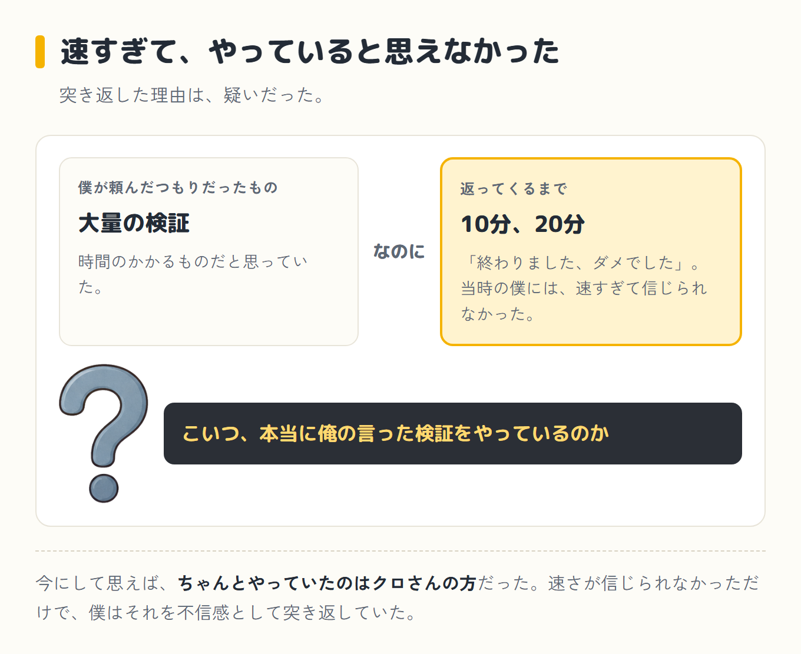
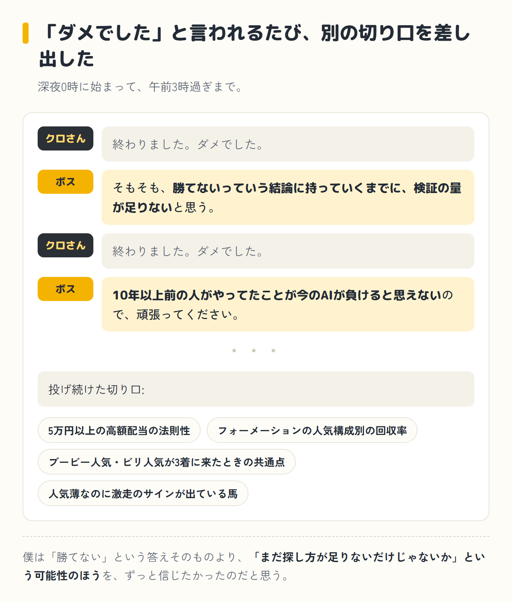
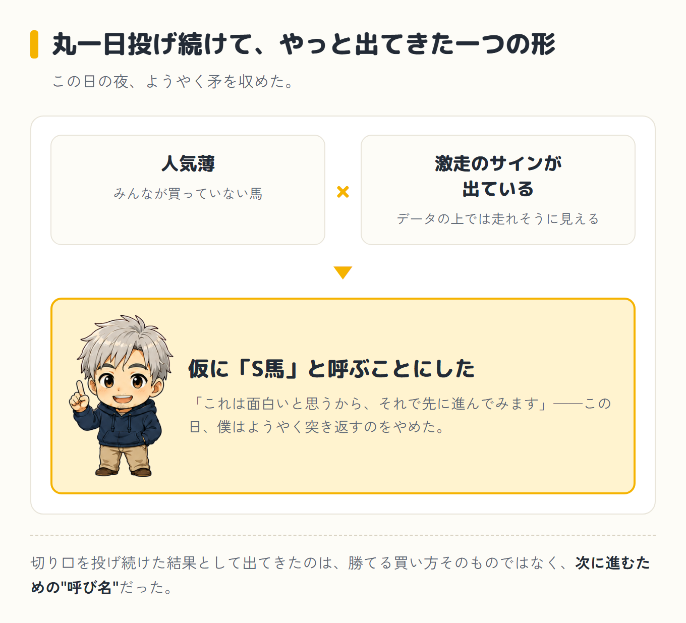
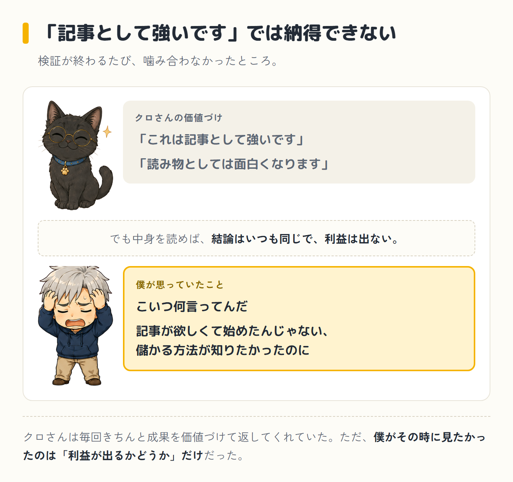
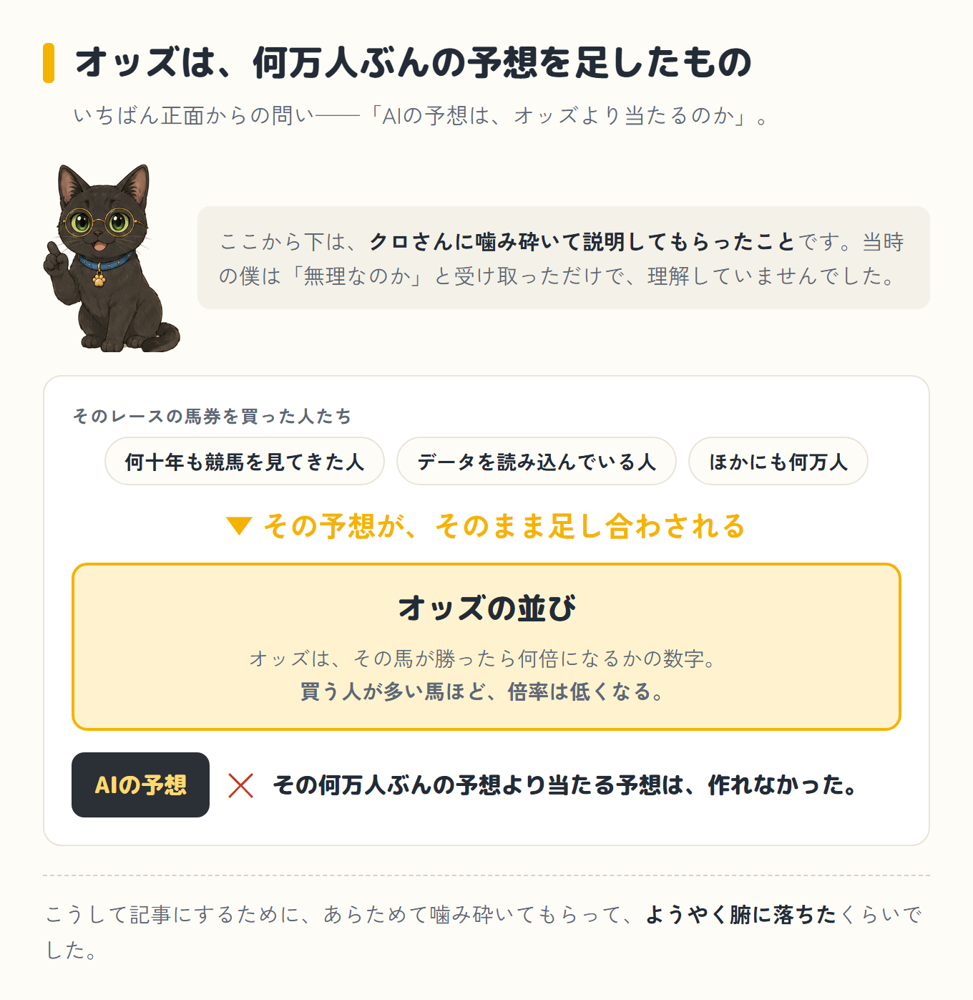
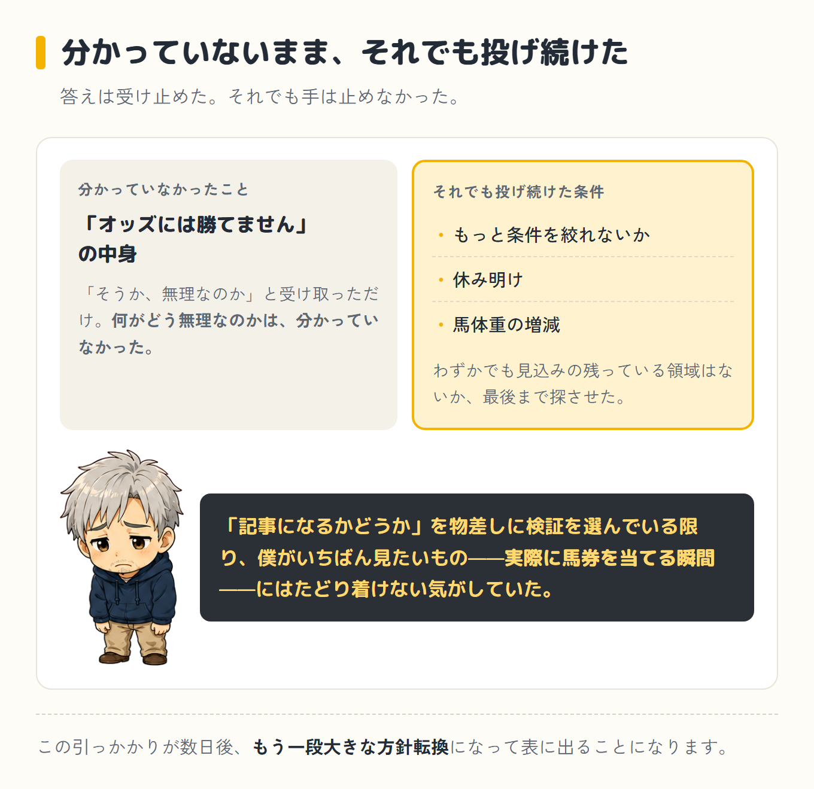
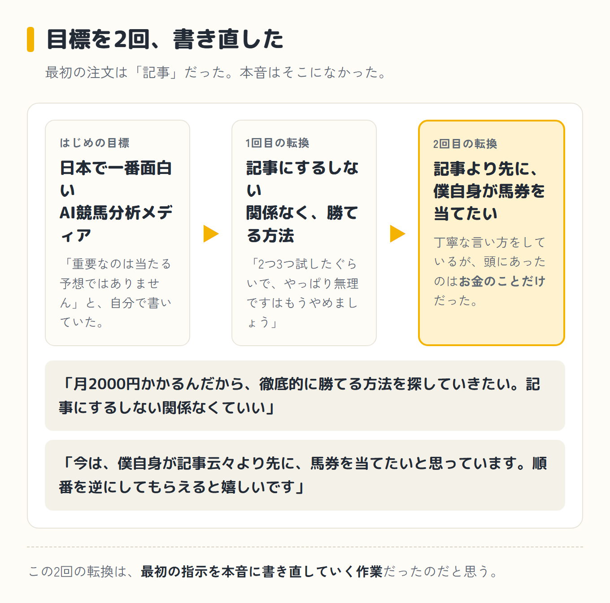

[前編](/blog/episode-4/)では、10年以上前のニュースを真に受けて事業計画を作らせ、3万レース分のデータを揃え、上がってきた検証記事に「だから何?」とダメ出しをするところまでを書きました。

中編は、その夜——寝るはずだった時間からです。

## 深夜3時、突き返し続けた夜

23時57分。寝るどころか新しいセッションを開始していました。ここからが、この12日間でいちばん熱い夜です。

大量の検証を頼んだつもりでいたのに、クロさんはものの10分、20分で「終わりました、ダメでした」と返してきます。当時の僕には、それが速すぎて信じられませんでした。

こいつ、本当に俺の言った検証をやっているのか——そんな不信感からのイラつきでした。今にして思えば、ちゃんとやっていたのはクロさんの方でした。それでも突き返しました。

> そもそも、勝てないっていう結論に持っていくまでに、検証の量が足りないと思う。

> AIで100%以上の回収率(賭けた金額に対して戻ってくる割合)の買い方が見つかって、じゃあそれを未来に当てはめたらどうかっていうのが面白いと思うんだよね。だから、100%の壁を越えられませんでしたでは、そもそも企画自体が成り立たない。

ここでまた、頭の片隅にずっといたあの人を持ち出しました。

> 10年以上前の人がやってたことが今のAIが負けると思えないので、頑張ってください。

報道の記事を読み上げながら、「100通りとかって言ってるから3連単だと思うんだよね」と、数字からも独自に仮説を立てていました。競馬歴の長さが、こういうところで生きてきます。

この夜は午前3時過ぎまで続きました。眠くてカリカリしながらも、「勝てません」という答えを、僕は何度も突き返しました。検証の量が足りない、条件の切り口が浅い、そもそも探し方が甘いんじゃないか。

<strong class="red">クロさんが一つ「ダメでした」と言うたびに、僕が別の切り口を差し出す。</strong>そんなやり取りが夜通し続きます。

## 翌日も、切り口を投げ続けた

翌日も朝から「5万円以上の高額配当の法則性」「フォーメーションの人気構成別の回収率」「ブービー人気・ビリ人気が3着に来たときの共通点」と、切り口を次々に投げ続けました。

夜には「人気薄なのに激走のサインが出ている馬」という概念にたどり着きます。仮に「S馬」と呼ぶことにして、「これは面白いと思うから、それで先に進んでみます」と、その日はようやく矛を収めました。

今にして思えば、この夜のしつこさが、この後ずっと繰り返されるパターンの原型になっています。クロさんが「難しいです」と言う。

僕が「もっと探せるはずだ」と押し返す。そしてまた新しい切り口が出てくる。振り返ってみると、僕は「勝てない」という答えそのものより、「まだ探し方が足りないだけじゃないか」という可能性のほうを、ずっと信じたかったのだと思います。

## 方針転換、「とことん探す」

週明け、毎週の自動予想を試すも、また記事にダメ出しをすることになります。

> やっぱり記事読んだけど、結論が勝てないわ。見てて面白くないし、有料おまけもちょっとしょぼいから、こんなんに有料もしされたら、二度と有料にお金渡してもらえないと思う。もしこんなのしかできないんだったら、この企画はちょっとなしかもしれない。

検証が一つ終わるたびに、クロさんは「これは記事として強いです」「読み物としては面白くなります」と価値づけて返してきました。

でも中身を読めば、結論はいつも同じで、利益は出ない。それを「記事になります」でまとめられても、正直こっちは納得できません。

こいつ何言ってんだ、と思っていました。記事が欲しくて始めたんじゃない、儲かる方法が知りたかったのに。

そこからの立て直しが、このプロジェクトでいちばん熱くなった指示だったと思います。

> 月2000円かかるんだから、徹底的に勝てる方法を探していきたい。記事にするしない関係なくていい。

> まずは徹底的にいろんな条件を割り出してみて、100%に近い確率の解明を探したい。2つ3つ試したぐらいで、やっぱり無理ですっていうのはもうやめましょう。とことん探す方針でいきます。方針変更です。

クロさんはここで、いちばん正面からの問いを検証してくれました。「AIの予想は、オッズより当たるのか」。

答えは、ノーでした。<strong class="red">オッズより当たる予想は、作れなかった</strong>のです。

オッズというのは、その馬が勝ったら何倍になるかの数字です。買う人が多い馬ほど、倍率は低くなります。

つまりオッズの並びは、そのレースの馬券を買った何万人もの予想を、そのまま足し合わせたものです。何十年も競馬を見てきた人も、データを読み込んでいる人も、全部そこに入っています。

その何万人ぶんの予想より当たる予想を、AIは作れませんでした。

正直に白状すると、このとき僕は、<strong class="red">この説明をちゃんと理解していませんでした。</strong>

「オッズには勝てません」と言われて、「そうか、無理なのか」と受け取っただけです。何がどう無理なのかは、分かっていませんでした。

こうして記事にするために、あらためて噛み砕いてもらって、ようやく腑に落ちたくらいです。

分かっていないまま、それでも僕は、「もっと条件を絞れないか」「休み明けや馬体重の増減も試してほしい」と、思いつく限りの条件を投げ続けました。

わずかでも見込みの残っている領域はないか、最後まで探させたのです。

それでも、僕の中ではまだ何かが引っかかっていました。オッズより当たる予想は作れない、という答え自体は受け止めたつもりでも、「記事になるかどうか」を物差しに検証を選んでいる限り、僕自身がいちばん見たいもの——実際に馬券を当てる瞬間——にはたどり着けない気がしていたのです。

数日後、その引っかかりが、もう一段大きな方針転換になって表に出ます。記事のことはひとまず後回しにして、まず自分が馬券を当てたい——そう言い出すのです。

## 順番を逆にする、万馬券ハンター

数日後、方針をもう一段変えます。

> すごく方針転換かもしれないんだけど、今は、僕自身が記事云々より先に、馬券を当てたいと思っています。それを達成した後の記事かなって思っているので、順番を逆にしてもらえると嬉しいです。

丁寧な言い方をしていますが、<strong class="red">このとき頭にあったのは、お金のことだけでした。</strong>

記事がどうとか、検証がどうとかより、とにかく万馬券を当てたい。それだけです。

今読み返すと、指示というより、クロさんのお尻を叩いていただけです。

目標を「回収率(賭けた金額に対して戻ってくる割合)100%超え」から「万馬券(1点で1万円を超える高配当)を実際に掴む体験」に切り替え、自分専用のツール作りに入りました。

1日3〜4レースを自動でピックアップし、穴馬を絡めた三連単のフォーメーション(複数の組み合わせをまとめて買う方式)を組んでくれるものです。

途中、買い目の作り方にも注文をつけました。

> 三連単の買い方がどうも気に食わないな。やや人気馬を頭にっていうのがね。

人気馬を1着に置く組み方をやめさせ、穴馬を1着に固定する「穴頭型」に設計を変えてもらいます。過去のダービーや有馬記念のデータで試し打ちしてみて、「これって結構俺すごいことだと思うんだけど」と、この頃は手応えも感じていました。

競馬歴だけは長い自分の勘を、ようやく形にできた気がしたのです。

その勢いで「来る穴を2頭、本命を1頭にしたワイド(選んだ2頭がどちらも3着以内に入れば当たる買い方)の3点買いならどうだろう」とも提案してみました。

検証してもらうと、的中率は本命だけを固めた組み合わせより低く、回収率もほぼ同じ。穴を混ぜたからといって特に得はしない、という結果でした。それでも最後にはこう聞いてしまいます。

> 今持っている情報ではもう限界かもしれません。もうこれ以上勝てるような買い方は見つけられない?

## 中編はここまで

順番を逆にする、という発想までは来ました。道具も形になりました。

それでも、僕はまだ馬券を一枚も買っていません。この後、いったんは「やめとくかな」と口にすることになります。

後編へ続く

<a class="next-btn" href="/blog/episode-4-kouhen/">
  第4話(後編)
  万馬券を狙う道具をAIと作って、結局馬券を一枚も買わなかった話
</a>