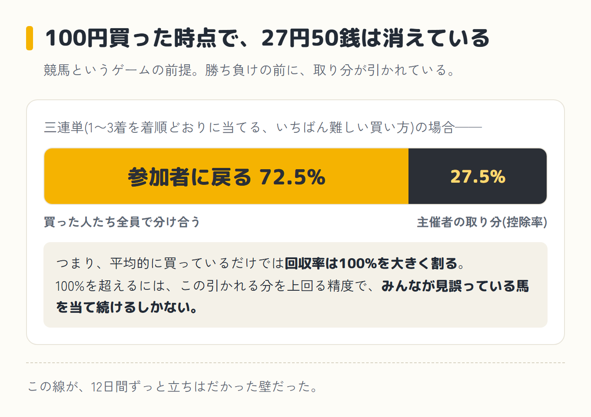
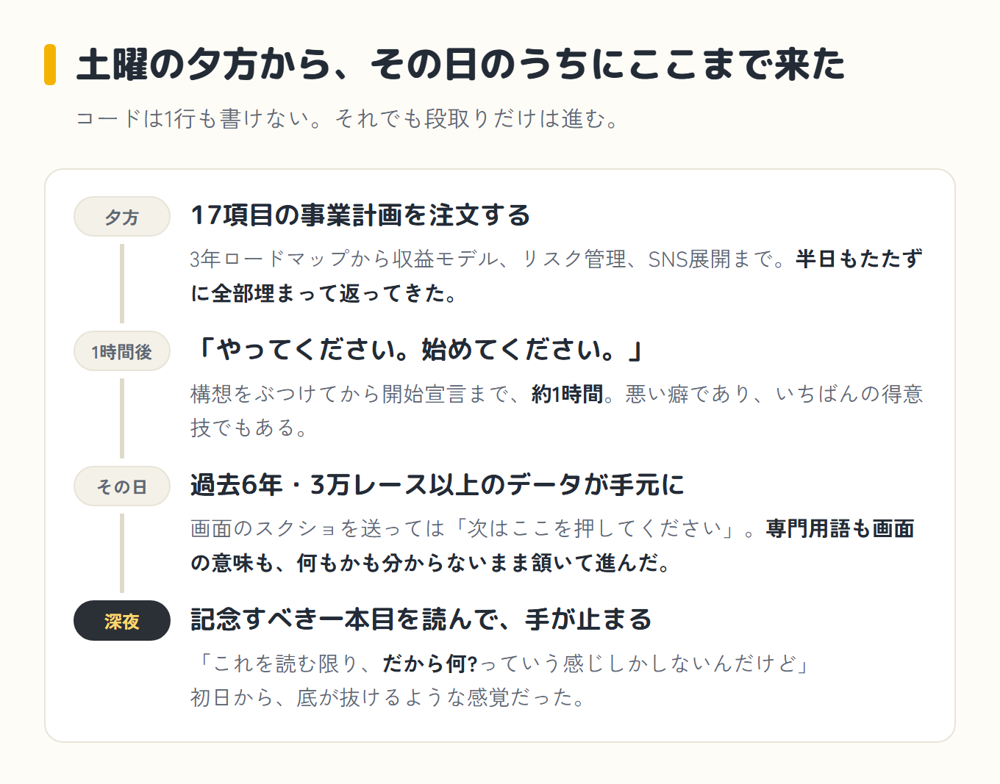

2026年7月11日、僕はAIと競馬の必勝法を探し始めました。この挑戦は結局12日間続き、セッション数は10、出した指示はざっと160回。

深夜3時まで検証させた日もあります。この12日間を、前編・中編・後編の3回に分けてお届けします。前編は、10年以上前のニュースを真に受けて、AIに事業計画を作らせ、データを揃えるところまでです。

[前回](/blog/episode-3/)はゲームそのものをやめたのに、AIと何かを作る楽しさのほうからは結局抜け出せず、次に手を出したのがこれでした。我ながら、あまり学習していません。

## 事の発端

競馬は中学生の頃からずっと好きです。その頭の片隅に、何年も前から引っかかっているニュースがありました。10年以上前、機械的な条件を組んで三連単(1〜3着を着順どおりに当てる、いちばん的中が難しい買い方)を大量に買い続け、それで利益を上げていたと報道された人がいます。

外れ馬券の税金の扱いをめぐって国と争った、あの事件です。当時それを読んで、「そんなやり方があるのか」とずっと記憶に残っていました。

あれから10年以上が経ちました。今度はAIがあります。あの人がやっていたことを、今のAIならもっとうまくやれるんじゃないか——競馬好きの頭の中で、そんな思い込みがじわじわ膨らんでいきました。

今振り返れば、この挑戦の本当の出発点は、この一本のニュースだったのだと思います。

## 17項目の事業計画が、半日で返ってきた

その思い込みを引っさげて、このブログでいつも「クロさん」と呼んでいるAIに声をかけました。正体は「Claude Code(クロードコード)」。チャットで会話するだけでなく、パソコンの中で実際にプログラムを書いて動いてくれる相棒です。

ある土曜の夕方、コードは1行も書けない僕が、いきなりクロさんにこう頼みました。

> あなたは世界トップクラスのAIプロダクトマネージャー、起業家、データサイエンティスト、Pythonエンジニア、SNSマーケターです。目的は「日本で一番面白いAI競馬分析メディア」を作ることです。重要なのは当たる予想ではありません。AIを使って競馬の常識をデータで検証することです。

続けて、3年ロードマップからAI時代の勝ち筋まで、17項目の事業計画を要求。壮大にもほどがあります。半日も経たないうちに、収益モデルからリスク管理、SNS展開まで、きっちり17項目を埋めた計画書が返ってきました。

学校の作文すら苦手だった僕が、こんな立派な事業計画書をあっという間に手にしている。それだけで十分テンションが上がる出来事でした。

その検証結果を、X・note(記事を有料で売れるサービス)、いずれは自前のWebサービスへと育てていくつもりでした。頭の隅にあったのは、Xで見かけたある発信者の投稿です。

noteで売られている競馬予想を実際に買って、そのとおりに馬券を買ってみる、という企画をやっている人がいました。予想が有料でやり取りされる世界が本当にあるんだ、と知ったのはこのときです。

じゃあAIが検証して書いた記事も、同じように売れるんじゃないか。マネタイズの案として早々に出したのが「その週いちばん自信のある1レースの分析だけ有料にする」というものでした。

今にして思えば、ずいぶん甘い見込みでした。

## お金の話と、夫婦プロジェクトの夢

しかも、収益が出るようになったら妻にも運営を手伝ってもらう夫婦プロジェクトにするつもりでいました。ただ、乗り気で誘っていたのはこちらだけで、奥さんの温度感は「協力できるならするよ」くらい。

クロさんと質疑を重ねるうちに、そのあたりの現実がだんだん見えてきて、運営体制は控えめに再設計しました。予算については、

> 最初の数ヶ月はマイナスでもいいけど、それ以降はトントンぐらいにはしたい。

と伝え、最終的に「あまりお金をかけず、JRA-VAN(競馬のデータを提供する正規サービス)ぐらいの課金で最初はやっていきたい」に着地。そして、

> やってください。始めてください。

構想をぶつけてから開始宣言まで、約1時間でした。<strong class="red">興味を持ったらすぐ行動する。</strong>僕の悪い癖であり、いちばんの得意技でもあります。

## 先に、競馬というゲームの前提を

ここで少し脱線して、競馬というゲームの前提を説明しておきます。馬券は買った時点で、主催者の取り分がまず引かれます。これが控除率(胴元の取り分)です。

三連単の場合、買った金額のうち参加者全体に戻ってくるのは72.5%。券種によって率は変わり、単勝のような当てやすいものはもう少し戻りが良くなります。

競馬をやる人なら感覚として知っている話ですが、改めて数字にすると、平均的に買っているだけでは回収率は100%を大きく割る計算です。

100%を超えるには、この引かれる分を上回るだけの精度で、みんなが見誤っている馬を当て続けるしかありません。

## 初日から「だから何?」

宣言してすぐ、JRA-VANに加入。過去6年分のレースデータをパソコンに取り込むためのソフトのセットアップを、クロさんと二人三脚で進めました。

> 更新処理を押したら、この画面で止まったよ。

「スタートキットは持っていますか?」と聞かれれば、

> 持ってないでいいよね。

これが精一杯の返事です。専門用語も画面の意味も、何もかもよく分からないまま、とりあえず頷いて進めていました。一つひとつ画面のスクリーンショットを送り、クロさんが「次はここを押してください」と返してくる。

そんなやり取りを繰り返して、その日のうちにデータベースが完成しました。過去6年分・3万レース以上のデータが、たった1日で自分のパソコンの中に収まっている。

中身は正直まだよく分かっていませんでしたが、それだけでちょっとした達成感がありました。

早速、最初の検証テーマを頼みました。「大外枠は不利って本当か」。クロさんは検証を走らせ、記事まで書き上げてくれました。前の晩からデータベースを作り上げた勢いのまま、「日本で一番面白いAI競馬分析メディア」の記念すべき一本目がどんな記事になるのか、期待して読み始めました。

読んでみて、正直に言いました。

> これを読む限り、だから何?っていう感じしかしないんだけど。これを読んだから馬券が当たりやすくなるとか、得するとかっていうのはあるんだろうか。僕にはそれは感じられませんでした。

<strong class="red">夢の一本目が、これか。</strong>17項目の事業計画まで作らせておいて、出てきたのはこの内容か。手が止まりました。「AIってこんなものなのか」という、初日から底が抜けるような感覚でした。

初日からダメ出し全開です。「こういう条件の時は一番人気を外した方がいい、みたいな検証はできないのか」と、読者目線で切り口を出し続けました。

クロさんはさっそく次の検証に取りかかり、「ハンデ戦の1番人気は危ない」「道悪の1番人気は信用するな」といった、競馬でよく聞く格言を7つ集めて実際のデータで採点しました。

結果は7つ中5つが本当に成立していました。数字としては立派です。それでも僕の感想は、また同じでした。そんなことが分かったからなんだ、と。

競馬をやっている人間が肌で感じていることに、データのお墨付きが付いただけです。それで馬券が当たるようになるわけではありません。

そして夜も更けた頃、自分でも意外な問いが口をついて出ます。

> そもそも競馬を題材にするっていうこと自体が間違ってるのかなって思ってきた。週5時間では全然ダメですか?パソコン自体はもっと動けると思うんですけども、AIエージェント自体はもっともっと動けるのかなと思うんですけど。

日付が変わる直前、「続きは新しいセッションでやりたいので、引き継ぎ書と指示書を作成してください」と頼んで、その日はいったん終了。のはずでした。

## 前編はここまで

一本目の記事も、7つの格言の検証も、僕には響きませんでした。データのお墨付きが付いただけで、馬券が当たるようになるわけではありません。

そしてこの夜、僕は寝ませんでした。ここから、この12日間でいちばん熱い夜が始まります。

中編へ続く

<a class="next-btn" href="/blog/episode-4-chuhen/">
  第4話(中編)
  深夜3時まで「勝てません」を突き返して、万馬券を狙う道具を作った話
</a>