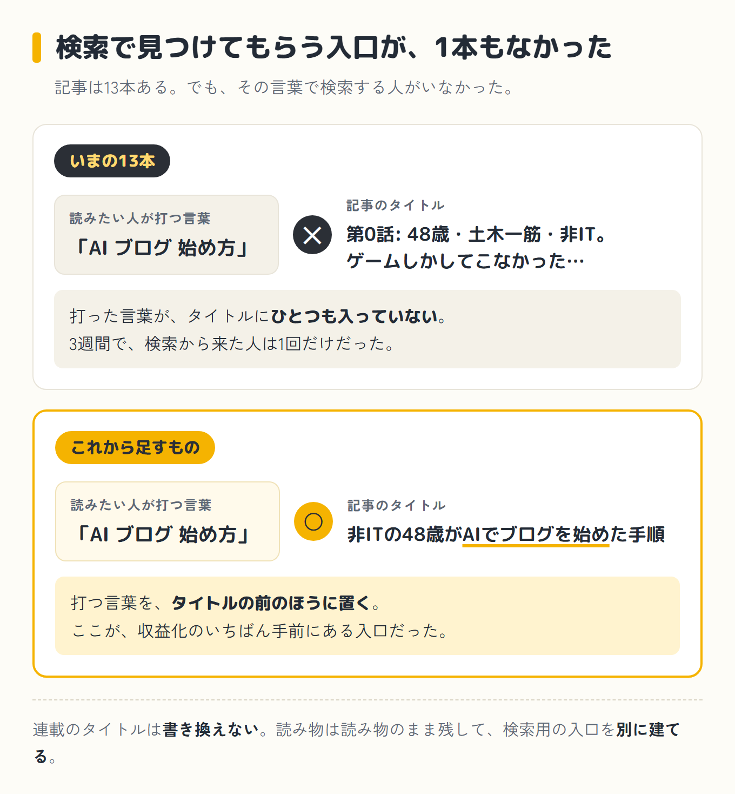
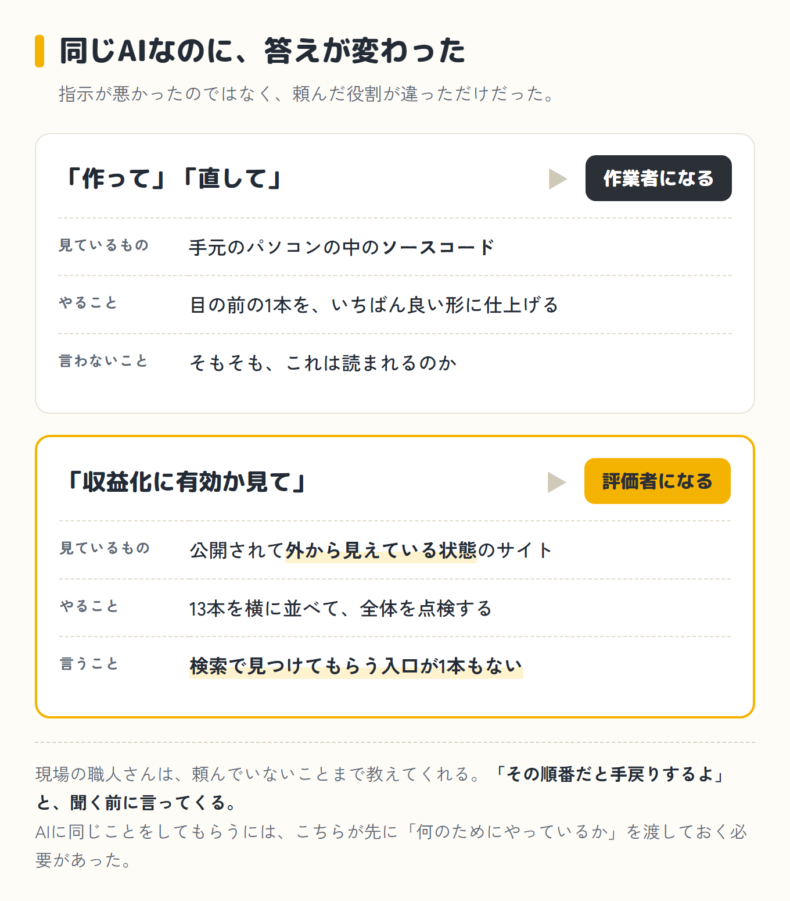

## きっかけは、まったく別の相談だった

最近、収益化への意識が明らかに強くなっています。

ブログを始めたころは、熱の置き場所が欲しかっただけでした。書けなかった自分が書けることが、ただ面白かった。

それが13記事を書くうちに、頭の中がだんだん金の話になってきました。アクセス数を見る回数が増えて、収益化の方法ばかり調べるようになっています。

ブログの名前が「よくばり日記」なので、そこは否定しません。

ただ、それ自体は悪くないと思っています。趣味で終わらせたくないからです。

だから、もっと効率よくやれないかと思って、AIをもう一つ増やそうか、と考えていました。

いま僕が使っているのはClaude Code、このブログで「クロさん」と呼んでいるものです。

同じようなものに、OpenAI(ChatGPTを作っている会社)が出している<strong class="red">Codex</strong>があります。クロさんと同じで、パソコンの中で実際に手を動かしてくれるタイプです。

それを補助に入れたら作業が速くなるんじゃないか。

そう思って、仕事用に使っている別のフォルダのClaude Codeに相談を投げました。

同じClaude Codeでも、フォルダが違えば別々に動きます。仕事用のほうは、このブログのことを何ひとつ知りません。第0話も、競馬の12日間も、ダイエットの記録も、一切見ていない完全な初対面です。

話の流れで、「ちなみにこれが僕のブログです」とURLを渡しました。軽い気持ちでした。

## 返ってきた診断

まず、褒められました。

Astroという仕組みで作られていること、アクセス解析が入っていること、記事ごとの説明文が丁寧に手書きされていること。目次が自動で出ること、プライバシーポリシーもお問い合わせも揃っていること。

「非ITの48歳が3週間で作ったサイトとしては、正直かなり優秀です」と。

いい気分になりました。ここまでは。

次の行がこれです。

> 最大の問題:検索で見つけてもらう入口が1本もない

そして、僕が書いた13記事のタイトルが、全部まとめて並べられました。

```
第0話: 48歳・土木一筋・非IT。ゲームしかしてこなかったおじさんが…
第1話: 18万円のMacBookをやめて、13万円のLenovoでAI生活を始…
第2話(前編): 「ドメインって何?」の48歳が、ブログの土台を組むまで
第3話(前編): ゲームでコインを増やす仕組みを作ろうとしたら…
第4話(前編): 10年以上前のニュースを真に受けて、AIと競馬の必勝法を…
(以下略)
```

> 読み物としての引きは強く、文章も上手い。ただし、この言葉で検索する人はいない。



……。

正直なところ、そのときの僕は「ああ、そうなんだ」でした。

反省したわけではありません。<strong class="red">検索する人がいるとかいないとか、そこまで考えたことがなかった</strong>のです。

記事がどうやって人に見つけてもらえるのか、その仕組み自体が分かっていませんでした。書けば誰かが読むもの、くらいに思っていたのだと思います。

「10年以上前のニュース 真に受けて 競馬」で検索する人は、この世に一人もいません。それを言われて初めて、検索という入口があることを考えました。

アドセンスもアフィリエイトも、検索から人が来ないと1円にもならないのだそうです。つまり僕は収益化を目指しているつもりで、13記事すべてを検索されない形で書いていたことになります。

ついでに、技術的な穴も実測で並べられました。

- `robots.txt`(検索エンジンに「このサイトの地図はここです」と教えるファイル)が404、つまり存在しない状態でした
- 記事一覧のサムネイル画像は0枚。本文に画像が入っている記事も、13本中3本だけでした(第2話後編にドメイン設定の実画面が2枚、ダイエットの記事にキャラクターの顔)
- 構造化データが無い
- パンくずリストが無い

正直に書きます。<strong class="red">この4つのうち、意味が分かったものは1つもありませんでした。</strong>

パンくずリストって何だ、というところからです。

分かったのは「ダメだったんだな」ということだけでした。

あとで教えてもらった説明を、僕の言葉で書いておきます。同じところで止まる人がいるかもしれないので。

- **構造化データ** —— 記事の中身を、検索エンジンが読める形で別に書いておくもの。「これは記事で、書いたのは誰で、いつ公開した」と機械に申告しておく
- **パンくずリスト** —— ページの上にある「トップ > ブログ > この記事」という並び。読者が今どこにいるか分かるし、検索エンジンにもサイトの形が伝わる

Search Consoleで確認すると、3週間で検索からのクリックは1回でした(7月25日)。ゼロではありません。でも<strong class="red">3週間で1人</strong>です。

しかもこの1回、たぶん僕です。自分のブログがちゃんと検索に出るか気になって、自分で検索して開いた覚えがあります。

そして、その`robots.txt`は、指摘を受けたその日のうちに直りました。作業は5分でした。<strong class="red">5分で直るものを、3週間放置していた</strong>ことになります。

## なぜクロさんは、これを言わなかったのか

ショックの次に来たのは、この疑問でした。

このブログは、記事もデザインもクロさんと一緒に作ってきました。何十回も相談して、何十回も直してもらっています。なのに、なぜ一度も「そのタイトルでは検索されません」と言われなかったのか。

僕の指示が下手だったのか。そう聞いてみたら、返ってきた答えがこれでした。

> あなたの指示が悪いからではありません。置かれた立場が違うだけです。



理由は4つあると言われました。

### ① 頼まれた役割が違った

僕がクロさんに言ってきたのは、ずっと「作って」「直して」です。

だから作業者として動きます、と説明されました。作業者は目の前の仕事を最善にしますが、そもそもこの企画は儲かるのか、とは言い出さないのだそうです。

仕事用のほうには、僕は「収益化に有効か見てくれ」と頼みました。だから評価者として答えた、とのことでした。

役割が違えば出す答えも変わる、と言われて、そこでようやく飲み込めました。

ここで、職人さんのことを思い出しました。<strong class="red">現場の職人さんは、頼んでいないことまで教えてくれます。</strong>

「その納まりだと後で困るよ」「その順番だと手戻りするよ」と、聞いてもいないのに言ってくる。長年やっている職人さんほど、そうです。

クロさんは、それを言いませんでした。そこが違いました。

### ② 見ていたものが違った

クロさんが見ているのは、僕のパソコンの中にあるソースコードなんだそうです。

仕事用のほうが見たのは、インターネットに公開されて、検索エンジンから見えている状態のサイトでした。僕のブログのアドレスを開きにいって、`robots.txt`が無いことを確かめ、ページの中身を数えて「画像は0枚」と出してきました。

これは僕がやったことではありません。向こうが勝手に見にいって、数字で出してきたのです。

同じサイトなのに、片方には見えて、片方には見えない。そういうことがあるんだと、このとき初めて知りました。

### ③ タイトルを一覧で並べる機会が、一度もなかった

これが一番腑に落ちました。

「1記事ずつ書く」を13回繰り返すと、タイトルを横に並べて眺める瞬間が一度も来ない、と言われました。

1本ずつ見れば、どれも悪くないタイトルです。並べて初めて「全部エッセイだ」と分かる。僕もクロさんも、13回とも1本ずつしか見ていませんでした。

### ④ 目的が伝わっていなかった

たぶん、これが根っこです。

クロさんは「ブログを作る」が目的だと理解していた、とのことでした。<strong class="red">「アドセンスとアフィリエイトで稼ぐ」が最上位のゴールだと、僕は一度もはっきり伝えていなかった。</strong>

アフィリエイトのほうは、前から知っていました。それで稼ぎたいとも思っていました。

ただ、<strong class="red">「アドセンス」という言葉を知ったのは、つい一昨日です。</strong>収益化の話をさんざんしておいて、片方は名前すら知らなかったわけです。

頭の中にあっただけで、口に出したことは一度もありませんでした。

伝わっていれば、タイトルを付けるたびに検索を意識したはずだ、と言われました。

## 前編はここまで

目的を一度も伝えていなかったこと、アドセンスという言葉すら知らなかったこと。分かったのは、ここまでです。

ただ、分かっただけでは同じことを繰り返します。

後編は、そこで思いついた「もう一人呼ぶ」という話からです。

<p class="tsuzuku">後編へ続く</p>

<a class="next-btn" href="/blog/episode-5-kouhen/">
  <span class="next-btn-label">第5話(後編)</span>
  <span class="next-btn-title">AIに「褒めるな」と言う監査役を、自分で作った話</span>
</a>
