Claude Code(クロードコード)は、頼んだ作業をパソコンの中で実際に手を動かしてやってくれるAIです。僕はこれに「クロさん」という名前を付けて、ブログの相棒にしています(AIの相棒・クロさん)。

この記事は、そのClaude CodeをWindowsのパソコンに入れて、最初の仕事を1つ頼み終えるまでの手順です。書いているのは48歳、土木一筋30年、IT・プログラミング経験ゼロの会社員です。2026年7月5日にYouTubeの動画を見ながらこの手順をやって、以来1か月、毎日使っています。

先に正直に書いておきます。僕はこの作業のどこにも詰まりませんでした。「非ITの自分にできるだろうか」と不安な人にこそ、その事実を伝えたくてこの記事を書いています。そもそも何ができるようになるのか、実例を先に見たい人は[非エンジニアができること7選](/blog/claude-code-dekirukoto/)をどうぞ。

**この記事でできるようになること**

- VSCodeというソフトを入れて、画面を日本語にする
- Claude Codeを入れて、自分のアカウントとつなぐ
- 最初の仕事(ファイルを1つ作ってもらう)を頼んで、完了まで見届ける

**要るもの**

- Windowsのパソコン(この記事の画面は全部Windowsです)
- Claudeの有料プランのアカウント(料金の話はこの記事ではしません。自分がいくら払っているかは、別の記事で正直に書くつもりです)

なお、Claude Codeの入り口はVSCodeのほかにもいくつかあると公式のドキュメントに書いてありましたが、この記事は僕が実際にやったVSCode版だけを書きます。画面は説明用に2026年8月3日に撮り直したものです。この手のソフトは見た目がよく変わるので、細かい部分が違っても慌てないでください。

## 1. VSCodeを入れる

VSCodeは、Microsoftが無料で出しているソフトです。僕は道具箱だと思って使っています。この道具箱に、あとからClaude Codeという道具(拡張機能)を入れます。

1. ブラウザで「VS Code」と検索して、公式サイト(code.visualstudio.com)を開きます。
2. ページ右上の「Download」を押します。

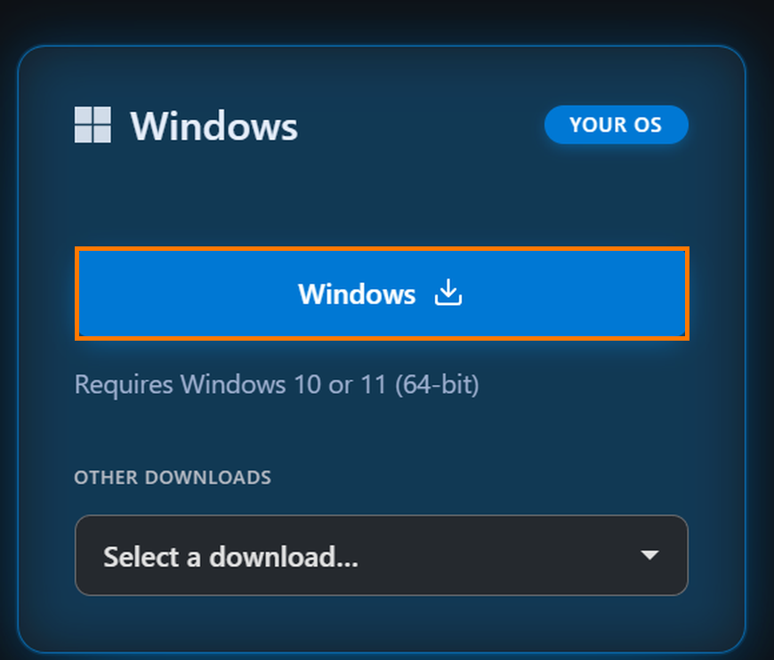

3. 大きな青い「Windows」ボタンを押します。ここは迷いません。押すボタンは実質この1つで、自分のパソコンに合うものが青く光っています(「YOUR OS」=あなたのパソコン用、という印付きです)。
4. ダウンロードされたファイルをダブルクリックします。
5. インストールの画面は、規約に同意して「次へ」で進めるだけです。途中の設定は変えなくて大丈夫でした。

**ここまでできていれば**、VSCodeが起動して、メニューが英語の画面が開いています。

## 2. 画面を日本語にする

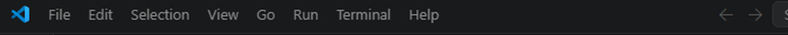

開いた直後はこういう全部英語の画面です。引き返したくなりますが、ここからすぐ日本語になります。

1. 左端の縦のバーにある、四角いブロックを組み合わせたようなアイコン(拡張機能の一覧)を押します。上から5番目です。
2. 一番上の検索欄に「japan」と打ちます。

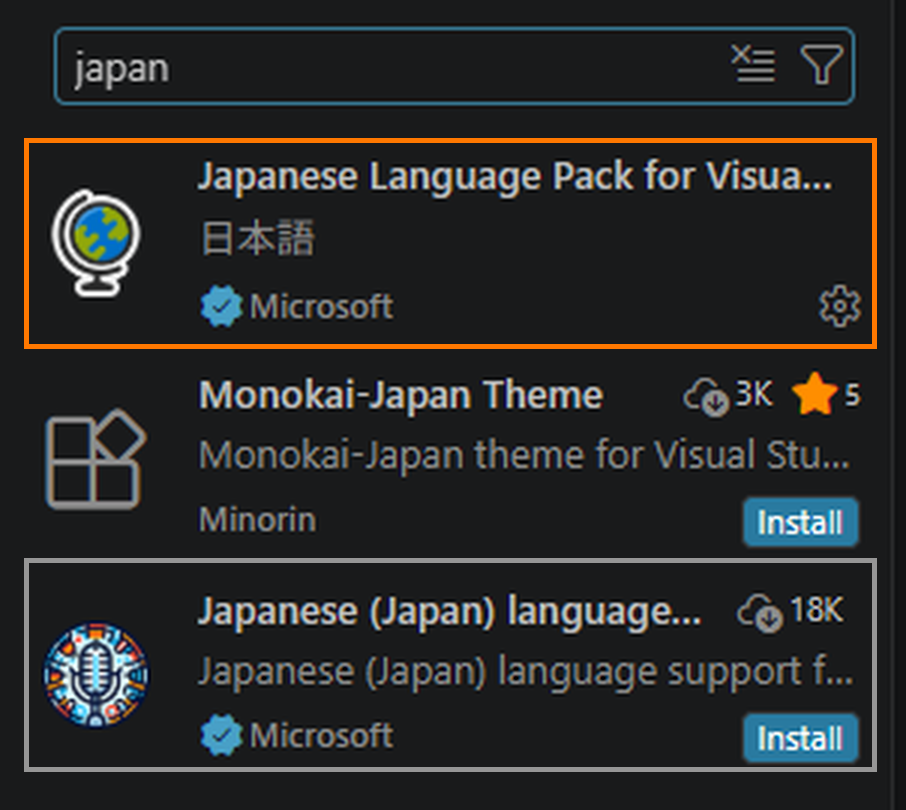

3. 似たような名前がずらりと並びます。ここで選ぶ条件は2つです。名前が「**Japanese Language Pack for Visual Studio Code**」(説明のところに「日本語」と書いてあるもの)で、**かつ**作者が「Microsoft」でチェックマーク付きのもの。この2つがそろったものを選びます(僕の画面は入れたあとの撮り直しなので「Install」ボタンが消えていますが、初めての人にはボタンが出ます)。
4. 少し下にある「Japanese (Japan) language support …」も作者は同じMicrosoftですが、こちらは別物で、入れても画面は日本語になりません。作者名だけで選ばず、必ず名前とセットで確かめてください。
5. 青い「Install」を押します。
6. 右下に、言語を切り替えて再起動するかを聞く小さな案内が出たら、その青いボタンを押します。VSCodeが再起動して、日本語になります。

**案内が出なかった場合**は、こうします。

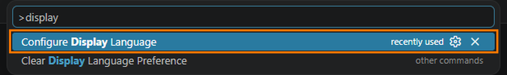

1. キーボードで「Ctrl+Shift+P」を押します。画面の上に入力欄が出ます。
2. 「display」と打ちます。
3. 出てきた「Configure Display Language」を選びます。
4. 「日本語」を選ぶと、再起動して日本語になります。

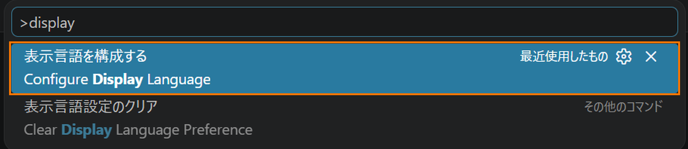

日本語になったあとで同じ操作をすると、この画面になります。英語に戻したいときも同じ手順です。つまり、失敗してもやり直せる操作なので、安心して進めてください。

**ここまでできていれば**、メニューが「ファイル 編集 選択 表示…」と日本語になっています。

## 3. Claude Codeを入れる

1. さっきと同じ拡張機能のアイコンを押します(日本語で「拡張機能」になっています)。
2. 検索欄に「claude」と打ちます。

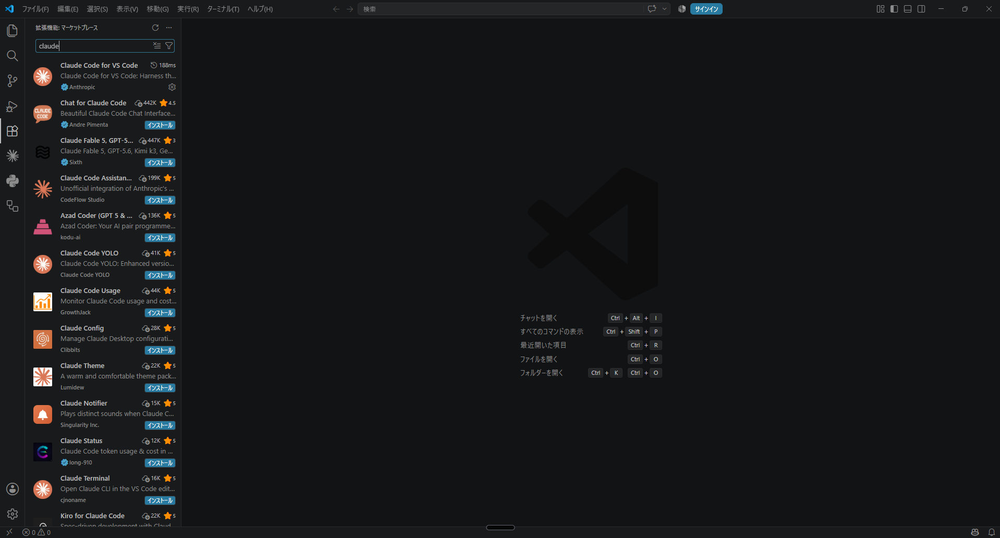

3. ここも紛らわしい名前がずらりと並びます。「Chat for Claude Code」「Claude Code Assistant(Unofficial=非公式、と書いてあります)」「Claude Code YOLO」——どれも今回入れたいものとは別物です。正解は「**Claude Code for VS Code**」で、作者が「**Anthropic**」でチェックマーク付きのもの。AnthropicはClaudeを作っている会社そのもので、この画面でAnthropicと書いてあるのは1つだけなので、こちらは作者名を見れば間違えません。
4. 「インストール」を押します。

## 4. アカウントとつなぐ

ここだけ画像がありません。僕はもうログインを済ませてしまっていて、同じ画面をもう一度出せませんでした。文章だけで書きます。

僕のときは、インストールのあとサインインを求められて、ブラウザが開き、Claudeのアカウントでログインして許可すると、VSCodeに戻ってつながった——という流れでした。有料プランのアカウントでログインすれば完了です。アカウントをまだ持っていない場合は、先にClaudeのサイトで作っておいてください。

## 5. 作業場のフォルダを作って開く

次に、Claude Codeに働いてもらう場所を作ります。「フォルダを開く」というのは、AIに**作業場の鍵**を渡すことです。AIは鍵を渡した部屋の中のものを見て働く——僕はそう理解して使っています。だから最初は、大事なものが入っていない練習用の空フォルダを1つ作るのが安心です。

1. デスクトップの何もないところを右クリックして、「新規作成」→「フォルダー」を選びます。名前は何でも大丈夫です。僕は「AIの練習」にしました。
2. VSCodeに戻って、左上の「ファイル」→「フォルダーを開く」を押します。

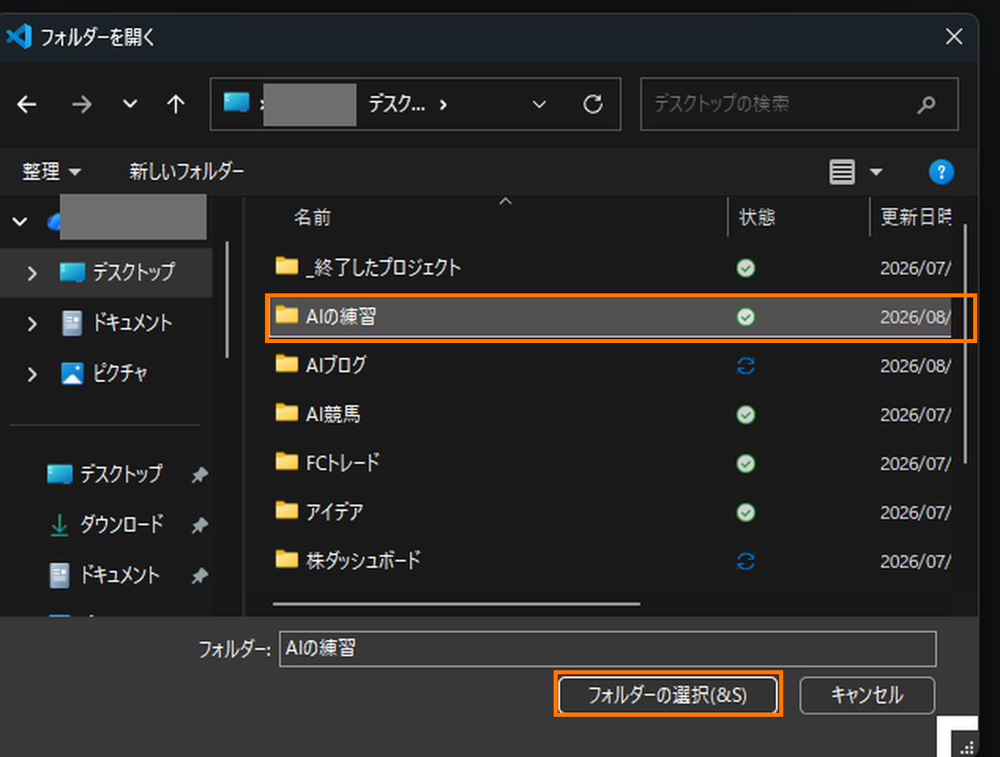

3. いま作ったフォルダを選んで、「フォルダーの選択」を押します。

## 6. 「制限モードになっています」と出ます。壊れていません

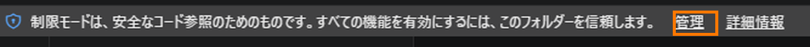

フォルダを開いた直後の画面がこれです。上に「制限モードは、安全なコード参照のためのものです。すべての機能を有効にするには、このフォルダーを信頼します。」という細いバーが出ています。

そして、ここが今日いちばん大事なところです。**左のバーに、Claude Codeのアイコンがありません。**

さっき入れたのに、無いんです。「インストールに失敗したのか」と焦るところですが、失敗していません。まだ信頼していないフォルダの中では、拡張機能がまとめて一時停止されているだけです。信頼すればちゃんと出てきます。

1. 上のバーの「管理」を押します。

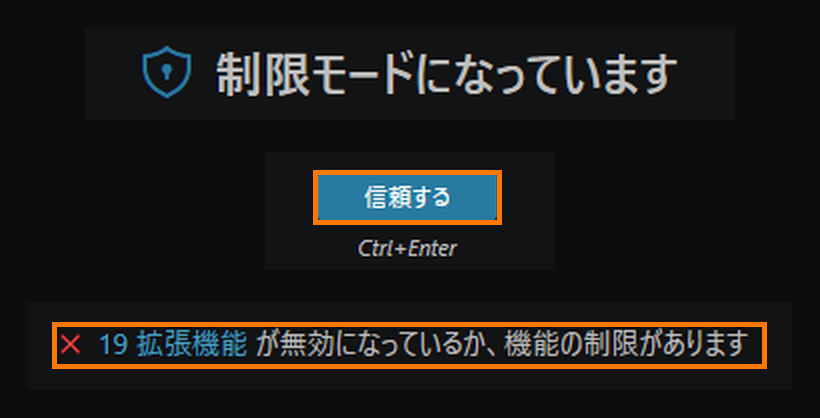

2. 「制限モードになっています」という画面が出ます。右の列には「19 拡張機能 が無効になっているか、機能の制限があります」とあります(19という数は僕の環境のもので、入れている拡張機能の数によって変わります)。
3. 青い「信頼する」を押します。

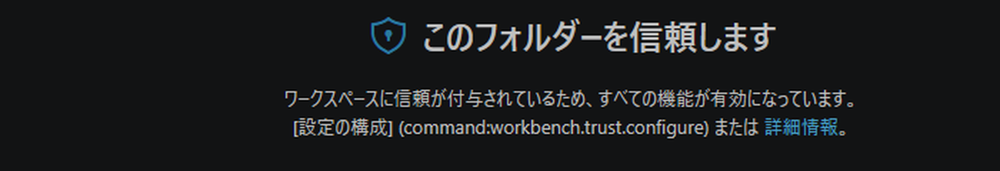

4. 見出しが「このフォルダーを信頼します」に変われば完了です。右上の×でこの画面を閉じます。

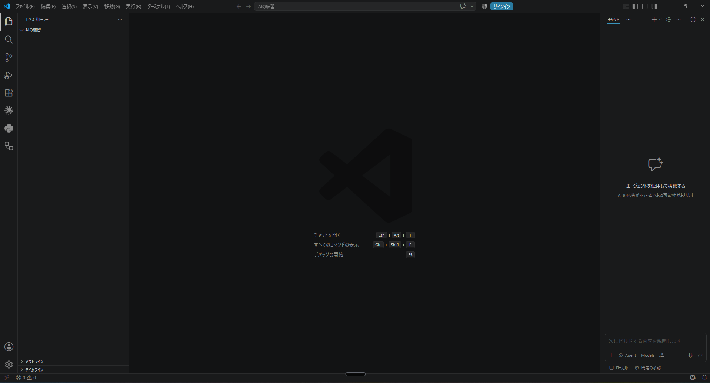

**ここまでできていれば**、左のバーに、線が放射状に伸びた印——Claude Codeのアイコン——が現れています。ひとつ前の画面と見比べると、増えているのが分かります。

## 7. 最初の仕事を頼む

1. その放射状のアイコンを押すと、Claude Codeの画面が開きます。

ひとつ紛らわしい点があります。僕の画面では右端にも「チャット」という欄が出ていますが、あれはVSCodeに最初から付いている別のAI機能です。今回使うのはそちらではありません。

2. 下の入力欄に、頼みごとをふつうの日本語で打ちます。僕はこう打ちました。

> このフォルダにメモ用のテキストファイルを1つ作って

3. Enterで送ると、AIがフォルダの中を確かめてから、ファイルを作ろうとします。そこで手が止まって、こういう画面が出ます。

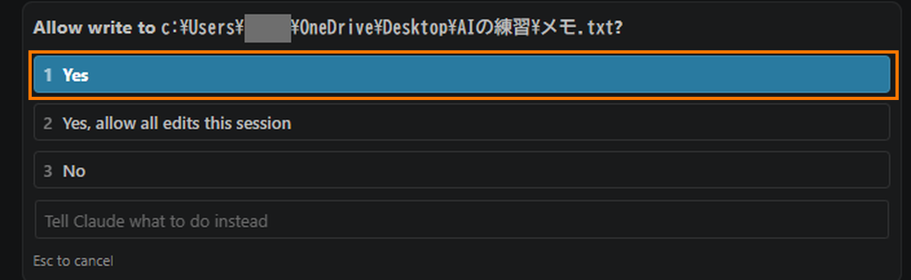

4. これが「**これ触りますけどいいですか**」の一言確認です。表示は英語ですが、3択の意味はこうです。

- **1 Yes** …… 今回だけ許可します
- **2 Yes, allow all edits this session** …… この会話の間は、書き込みをいちいち聞かずに進めてください、という意味です
- **3 No** …… やめてもらいます

最初のうちは「1」を選んで、1回ずつ確かめながら進めるのが安心です。

5. 「1 Yes」を選びます。

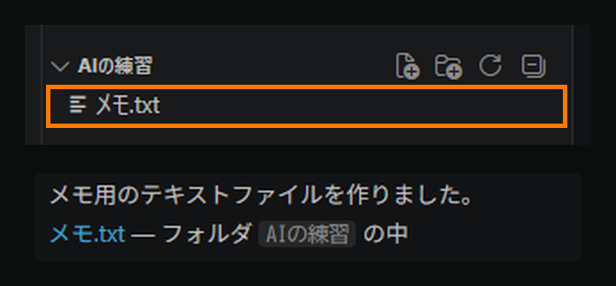

これで完了です。左の一覧に「メモ.txt」が増えて、「メモ用のテキストファイルを作りました」と報告が返ってきます。中身はタイトルと作成日、区切り線だけの空っぽのメモです。

小さな一歩ですが、これが「AIに頼んで、パソコンの中で実際に作業してもらう」の最初の1回です。ここまで、プログラミングの言葉は1つも打っていません。

## 次にやること

今日作った練習フォルダで、もう1つだけ頼んでみてください。たとえば「さっきのメモに、今日やったことを3行で書き足して」。また3択の確認が出たら、今度は2番の意味を思い出しながら選んでみてください。

ちなみに僕は、会話を「1件の用事につき1枚のメモ用紙」のように使っていて、用事が変わったら新しい会話にしています。この使い分けと、許可の設定、モデルの選び方は、次の記事(操作の基本)で書きます。

