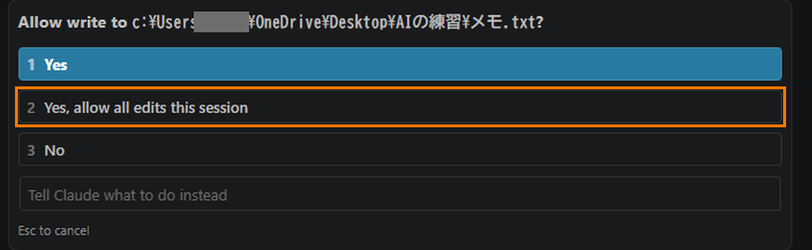
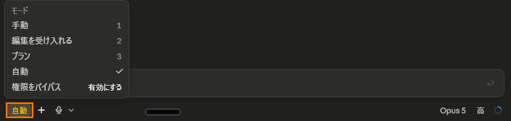
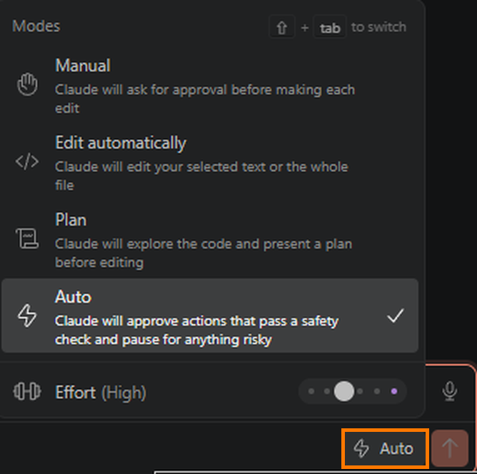
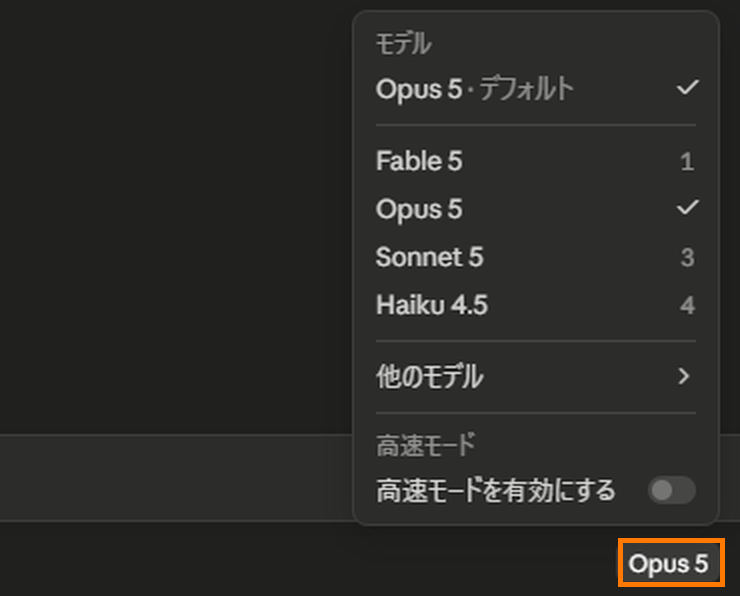
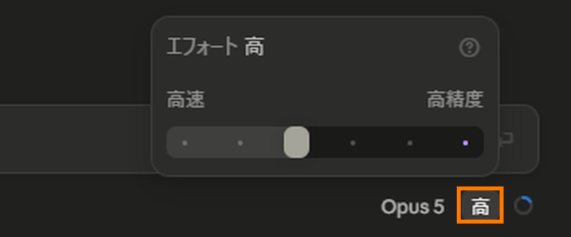
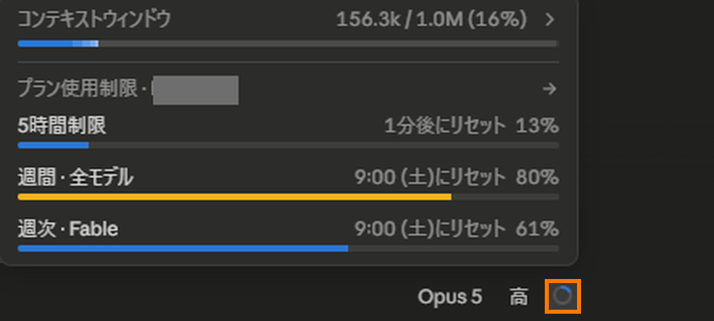

import Balloon from '../../../components/Balloon.astro';
import Callout from '../../../components/Callout.astro';

Claude Code(クロードコード)は、パソコンの中をさわる前に、毎回「いいですか」と聞いてきます。使い始めるとすぐ、この確認がめんどくさくなってきます。僕もそうでした。

この記事は、その許可をどう設定するか、モデル(AIの頭)をどう選ぶか、会話をどう分けるか——毎日の操作の基本をまとめたマニュアルです。書いているのは48歳、土木一筋30年、IT経験ゼロの会社員で、教えてくれたのはAIの相棒・クロさん(中身はClaude)です。内容は2026年8月5日に、公式ドキュメントと突き合わせて確かめました。この手の情報は数週間で変わるので、日付とセットで読んでください。

まだClaude Codeを入れていない人は、先に[第1回(入れて、動かすまで)](/blog/nyuumon/claude-code-hajimekata/)からどうぞ。

## 1. この記事でわかること

<Callout type="wakaru">

- 「いいですか」の3択の本当の意味
- 許可のモード3つと、「自動モード」との違い
- モデル(Sonnet 5・Opus 5・Fable 5)の使い分け
- 会話がいっぱいになったときの分け方

</Callout>

## 2. 「していいですか」の3つの返事

第1回の最後は、この3択で終わりました。

- **1 Yes** …… 今回だけ許可します
- **2 Yes, allow all edits this session** …… この会話のあいだ、書き込みは聞かずに進めてください
- **3 No** …… やめてもらいます

僕はこの意味をちゃんと知らないまま、「とりあえずイエスでいいだろう」と1番を押し続けていました。同じ人は多いと思います。それで困りはしませんが、1つだけ知らないと損をすることがあります。

<Balloon who="kuro">

2番だけ、性質が違います。1番と3番はその場の「返事」ですが、2番は「この会話のあいだの設定を変える」ボタンです。押した瞬間から、ファイルまわりの操作については確認が出なくなります。どこまで通るのかは、次の節で説明します。

</Balloon>

## 3. 許可の構えは、3つ覚えれば足ります

許可のかけ方には名前が付いていて、公式では「許可モード」と呼びます([Choose a permission mode](https://code.claude.com/docs/en/permission-modes))。種類はいくつかありますが、覚えるのは3つで足りると教わりました。

| 構え | 画面に出る名前 | 何が起きるか |
|---|---|---|
| **手動** | 手動 / Manual | さわる前に毎回聞いてくる。最初の設定はこれ |
| **編集を受け入れる** | 編集を受け入れる / Edit automatically | ファイルの書き換えと、ファイルまわりの操作(作る・移す・写す・**消す**)を聞かなくなる。作業フォルダの中に限る。それ以外は今までどおり聞いてくる |
| **プラン** | プラン / Plan | 計画を立てるだけで、ファイルにはさわらない |

<Callout type="chui">

「編集を受け入れる」で聞かれなくなるのは、書き換えだけではありません。公式には、フォルダを作る・移す・写す・**消す**といったよく使う操作も、作業フォルダの中なら聞かずに通ると書いてあります([Choose a permission mode](https://code.claude.com/docs/en/permission-modes))。つまり削除も確認なしで走ります。脅かしたいわけではなく、それを知ったうえで2番を押してください、という話です。

</Callout>

さっきの「2番」を押すのは、この会話のあいだだけ「編集を受け入れる」に切り替えるのと同じことだそうです。

切り替える場所は、使っている画面ごとに違います。僕は第1回で入れたVSCode版に加えて、デスクトップアプリ版も使っています(アプリそのものの話は、あとの回でやる予定です)。どちらも**入力欄の下**にありますが、左右が違います。

- **デスクトップアプリ** …… 入力欄の下の、いちばん**左**。いま選んでいるモードの名前がそのまま出ています

- **VSCode** …… 入力欄の下の、いちばん**右**。送信ボタンのすぐ隣です

<Callout type="chui" title="メニューには、あと2つ出てきます">

デスクトップアプリの写真(上の1枚目)を見ると、実物のメニューには「自動」と「権限をバイパス」も並んでいます。

- **自動** …… 次の節でまるごと説明します
- **権限をバイパス** …… 確認も安全の検査も全部なくして、そのまま実行する設定だそうです。**僕は使ったことがありません**。公式は「コンテナやVMのような、隔離された環境でだけ使ってください」「プロンプトインジェクションにも、意図しない操作にも、いっさい守りがありません」と警告しています([Choose a permission mode](https://code.claude.com/docs/en/permission-modes))。はじめは選べないようになっていて、設定でわざわざ許可しないと使えないそうです。写真で「有効にする」と出ているのは、僕がその許可をしていないからです

VSCodeの写真(2枚目)に「権限をバイパス」が無いのは、まだ許可していないと一覧に出てこないためです。

</Callout>

<Callout type="chui">

ネットの記事によくある「Shift+Tabで切り替え」は**ターミナル版の操作**です。公式は「ターミナル版のショートカット、たとえばモードを切り替える`Shift+Tab`は、デスクトップアプリでは効かない」とはっきり書いています([Desktop application](https://code.claude.com/docs/en/desktop))。

VSCodeのメニューには「⇧ + tab」と出ています(上の写真の右上)。効かないのはデスクトップアプリのほうです。そのかわりデスクトップアプリには`Ctrl+Shift+M`があります。メニューが開いているあいだは、`1`〜`9`の数字キーでも選べます(写真の項目に付いている数字がそれです)。

</Callout>

デスクトップアプリは、選んだモードをフォルダごとに覚えます。プラン(計画)だけは例外で、その場かぎりです。

僕の実物を1つ。僕がクロさんと毎日作業しているフォルダは、はじめの構えを「手動」にしてあります。そのうえで、例外を1つだけ足してあります。「記事の一覧を出す、いつもの操作だけは聞かなくていい」——これです。

モードを丸ごとゆるめなくても、こうやって、めんどくさいものだけを名指しで通せます。決めたのは僕ですが、設定に書き込んだのはクロさんです。僕はターミナルをさわらないので、頼んで書いてもらいました。

## 4. 「自動モード」は何が違うのか

ここで疑問が出ると思います。僕もクロさんに聞きました。「自動モードと、さっきの2番の『もう聞かなくていい』は、何が違うの?」

<Balloon who="kuro">

反対のことをやっている、と思ってください。2番(編集を受け入れる)は、通す範囲が「作業フォルダの中のファイル操作だけ」と狭いかわりに、見張りはいません。自動モードは、全部の操作を通すかわりに、別のAIが1件ずつ「頼まれた範囲の仕事か」を検査していて、はみ出したものを止めます。

</Balloon>

| | 通す範囲 | 見張り |
|---|---|---|
| **2番(編集を受け入れる)** | 作業フォルダの中のファイル操作だけ(書き換えのほか、削除も含む)。外部への送信や、それ以外の操作は聞かれる | いない |
| **自動モード** | 全部 | いる。別のAIが1件ずつ検査 |

止める例として公式が挙げているのは、ネットから拾ってきたものをそのまま実行する、過去の記録を巻き戻して消す、パスワードなどの鍵を外に送る、といった操作です。

僕も実際に止められたことがあります。ThreadsやInstagramへの投稿をクロさんに代行してもらったとき、「外に公開する操作」として見張りに弾かれました。パソコンの外へ出ていく操作には、それくらい厳しめです。3節に書いた「はじめの構えは手動」の設定は、このときに入れたものです。投稿を通すには、聞いてくるモードに戻して、自分で「許可」を押すしかなかったからです。

<Callout type="chui" title="2つ、注意を書いておきます">

- **「自動モードは特定の有料プランが必要」と書いてある記事がネットに残っていますが、2026年7月10日に、すべてのプランで使えるようになりました**([公式ブログの但し書き](https://claude.com/blog/auto-mode))。この道具の記事は、いつ書かれたかを必ず見てください
- 公式は「自動モードは確認を減らすが、**安全を保証するものではない**」とはっきり書いています。見張りがいるから何でも任せていい、ではありません

</Callout>

ただ、正直に言うと、ふだん実際に使っているのは、ほぼ自動モードです。理由は単純で、いちいち聞かれない自動のほうが、めんどくさくなくていいからです。公式もネットの記事も「まずはManualで」と書いていますが、毎日使っている人間が実際に選んでいるのはこっちでした。決めてある構えと、ふだんの使い方は違います。

## 5. モデルの選び方

Claude Codeは、頭(モデル)を選べます。デスクトップアプリでは、画面の右下に出ているモデルの名前を押すか、`Ctrl+Shift+I`で切り替えの窓が開きます。僕がふだん使うのはこの3つです。

公式のたとえがわかりやすいので、そのまま借ります([公式ブログ](https://claude.com/blog/claude-model-and-effort-level-in-claude-code))。

| モデル | 公式のたとえ | 向いている仕事 |
|---|---|---|
| **Sonnet 5** | 何でも屋 | 頼み方がはっきりしている仕事。機械的な修正 |
| **Opus 5** | 熟練者 | あいまいで、さじ加減が要る仕事 |
| **Fable 5** | 専門家 | みんなが行き詰まっている問題で、誰も気づかないものを見つける |

僕はFable 5のことを、「いちばんすごいモードで、だから何でもできる」と思っていました。同じイメージの人は多いと思います。でも公式の原文を読むと、Fable 5は「すごい順のいちばん上」としては説明されていません。上の表の「専門家」には続きがあって、原文は「ほとんど誰も見たことがない問題を、見てきた専門家」です。万能の上位版ではなく、みんなが行き詰まったときに呼ぶ人。何がそんなに違うのか、クロさんに聞きました。

<Balloon who="kuro">

公式が挙げているFable 5の持ち味は、「長い作業を粘り強く続け、動く前に調べ、何度も自分の仕事を検証する」ことです。文章の話は、この一覧のどこにも出てきません。だから、原因の突き止めや腰を据えた調べ物こそ本領です。公式には、Fable 5は「OpusにもSonnetにも、どれだけ深く考えさせても届かない仕事」を終わらせた、とあります。資格試験と同じです。過去問で見たことのある問題は解けますが、解き方を知らない問題は、試験時間が倍あっても解けません。速い・遅いの差ではなく、知っているか知らないかの差です。

</Balloon>

僕の使い分けは、今はこう決めています。記事の文章も、言い回しも、段取りと判断も、ふだんの仕事はOpus 5。Fable 5を呼ぶのは、原因が分からないものの突き止めと、腰を据えた重い調べ物のときだけです。探し物・数えものはSonnet 5です。公式も、Fable 5は「要る仕事のために取っておけ」と書いています([公式ブログ](https://claude.com/blog/claude-model-and-effort-level-in-claude-code))。

切り替えの物差しも、公式ブログに書いてありました。ただし公式は、その前に釘を刺しています。**うまくいかないとき、最初に手を伸ばすべきはつまみではなく、渡した中身のほう**。頼み方があいまいではないか、直すべきはたいていCLAUDE.mdの側だ、と。

そのうえでの2択が、これです。「Claudeは知らなかったのか、それとも手を抜いたのか?」——知らなかったのなら、モデルを上げる。ファイルを飛ばした・見直さなかった、つまり手を抜いたのなら、モデルはそのままで、考える深さを上げる(深さの話は7節でやります)。渡した中身を見直してもまだ足りないとき、僕はこれで分けています。

## 6. なぜFable 5は容量が減るのか

僕は始めて1週間ちょっとの頃、何でもかんでもFable 5でやって、すぐ容量が足りなくなって止まる、を繰り返していました。故障でも使い方のミスでもありませんでした。理由は3つあると教わりました。

<Balloon who="kuro">

1. Fable 5だけ、考える機能をオフにできません。常に深く考えます([Manage costs effectively](https://code.claude.com/docs/en/costs))。
2. 深く考えると、トークン(容量の単位)が増えます。公式には「同じ指示で、深く考えるほうは約7倍のトークンを出す」とあります([公式ブログ](https://claude.com/blog/claude-model-and-effort-level-in-claude-code))。**Fable 5が他のモデルの7倍**という意味ではありません。同じ指示を、深い設定と浅い設定で比べた数字です。
3. 動く前に大量に読みます。読んだ分は全部容量に乗ります([Model configuration](https://code.claude.com/docs/en/model-config))。

粘り強く調べて、深く考えて、何度も見直すから強い。粘り強く調べて、深く考えて、何度も見直すから、容量が消える。別の話ではなく、同じ1つの性質の表と裏です。

</Balloon>

だから「Fable 5は高くつく」ではありません。**小さい仕事に使うと高くつく**、です。難しい仕事なら、やり直しの手数が減って合計はむしろ下がりうる、と[公式ブログ](https://claude.com/blog/claude-model-and-effort-level-in-claude-code)にあります。

## 7. 考える深さ(Effort)

モデルとは別に、「どれくらい深く考えるか」も選べます。公式によると、Opus 5で選べるのは`low`・`medium`・`high`・`xhigh`・`max`の5段階で、最初の設定は`high`(高)です([Model configuration](https://code.claude.com/docs/en/model-config))。デスクトップアプリでは、モデル名の隣に出ている段階の名前を押すか、`Ctrl+Shift+E`で切り替えられます。

写真のつまみは、点が6つあります。公式の一覧には、5段階のあとに`ultracode`という6つ目が並んでいます。これは考える深さの段階ではなく、Claude Code側の設定だそうです。点が1つ多いのは、たぶんこれでしょう。つまみは左から3つ目、`high`の位置にありました。

ただし公式は「たいていは既定のままでよい」と書いているので、無理にさわる必要はありません。罠を1つだけ。**`max`にした場合だけそのセッション限りで元に戻り、それ以外に変えた場合は次回も残ります。**「いつの間にか設定が変わったままだった」が起きやすいところです。

## 8. 会話の分け方——「いっぱい」は2種類ある

まず、混同しやすい2つを分けます。

| | 何がいっぱいか | いっぱいになると |
|---|---|---|
| **A. 会話の容量** | いま開いている会話1本に入る量 | 止まらない。自動で要約されて続く |
| **B. プランの枠** | セッションごと・週ごとに決まっている使用量の上限 | こちらが本当に止まるやつ |

僕が6節で止まりまくっていたのはBのほうです。デスクトップアプリでは、モデルを選ぶ場所の隣にある「使用量の輪っか」で、AとBが1か所で見えます。

ターミナルやVSCodeでは、**コマンド**でも見られます。コマンドというのは、入力欄に`/`(スラッシュ)から打ち込む、決まった形の命令です。頼みごとはふつうの日本語で打ちますが、Claude Codeそのものを操作するときはこっちを使います。全部覚える必要はありません。`/`を1つ打つと、候補の一覧が出てきます。数は50を超えるので、コマンドだけを集めた回も、あとで作る予定です。

入力欄にも、最初からそう書いてあります。さっきのAとBは、それぞれ別のコマンドで見ます。

- **`/context`** …… Aの「会話の容量」。いま何がどれだけ場所を取っているかを、色分けした升目の図で出してくれます([Commands](https://code.claude.com/docs/en/commands))
- **`/usage`** …… Bの「プランの枠」。使った分がどれだけ枠を食っているかが、帯で出るそうです([Manage costs effectively](https://code.claude.com/docs/en/costs))

僕はふだん、デスクトップアプリの輪っかで済ませています。**輪っかは、この2つの合計を1か所にまとめたもの**だと思ってください。内訳まで見たいときがコマンドの出番です。

このあと出てくる`/compact`や`/clear`も、同じように`/`から打ちます。

上がAの「会話の容量」、線から下がBの「プランの枠」です。撮った日の僕は、週の枠を8割使っていました。

そしてAについて、僕が知らなかった仕組みがあります。

<Balloon who="kuro">

クロさんたちは、返事をするたびに、会話の最初から全部を読み直しています。朝から開けっぱなしの会話で一言だけ質問しても、会話全体ぶんの使用量がかかります。公式にそう書いてあります([Manage costs effectively](https://code.claude.com/docs/en/costs))。

</Balloon>

だから会話を分けます。ケチな話ではなく、仕組みの話です。使い分けはこうです。

- **同じ仕事の続き** → `/compact`(会話を要約して容量を空ける命令)。ただし要約するために全部読み直すので、それ自体が重い操作です
- **別の仕事** → まっさらにする。ターミナルでは`/clear`という命令で、これは費用ゼロだと公式に書いてあります。デスクトップアプリでは、新しいセッションを開くのが同じことにあたります(左の「+ New session」か`Ctrl+N`)

<Callout type="chui" title="出回っている話への注意">

「容量が30〜40%埋まるとAIがバカになる」という話をYouTubeなどで見かけます。僕もそれを信じて、35%を目安に区切っていました。**公式ドキュメントを確かめた範囲では、「何%で質が落ちる」という数字はどこにもありません**。かわりに公式が認めているのは、**自動の要約で、会話の序盤の指示が失われることがある**という現象です。頭が悪くなるのではなく、言われたことを忘れる。そして公式の対処は「コンパクトしろ」ではなく、「大事な決まりは会話の履歴に頼らず、CLAUDE.mdというファイルに置け」です。

</Callout>

僕の実物をもう1つ。最近は、会話がいっぱいになってきたら要約させずに、「引き継ぎ書」というファイルを書いてもらって、新しい会話に渡しています。要約は薄くなった記憶ですが、引き継ぎ書は読み直せる紙です。実はこの記事も、前の会話が書いた引き継ぎ書をもとに作られています。

## 9. 困ったら、Claude Code本人に聞く

最後に、いちばん実用的な話です。

<Balloon who="kuro">

Claude Codeの使い方は、Claude Code自身に聞けます。「許可のモードを変えたい。どこを押せばいい?」とふつうの日本語で打ってください。検索で古い記事に当たるより、いま動いている本人に聞くほうが確実です。

</Balloon>

`/init`と打つと、CLAUDE.mdという説明書きのファイルを作る手順を案内してくれる命令もあります。これは次回の主役なので、名前だけ覚えておいてください。

## 10. 次にやること

<Callout type="point" title="次までの宿題は、1つだけ">

**次に別の用事を頼みたくなったら、開きっぱなしの会話に続けて打たないでください**。新しいセッションを開いてみてください。

デスクトップアプリなら左の「+ New session」か`Ctrl+N`、ターミナルなら`/clear`です。**8節で書いたとおり、こちらは費用ゼロです。**

</Callout>

次回(第3回)は、8節で出てきた「AIは会話の序盤の指示を忘れる。大事な決まりはCLAUDE.mdに置け」の、そのCLAUDE.md——クロさんに毎回読ませる紙の話です。僕のブログが毎日同じルールで回っているのは、このファイルのおかげです。

---

**この記事の出典**(2026年8月5日に確認)

- [Choose a permission mode](https://code.claude.com/docs/en/permission-modes)(許可モード)
- [Auto mode](https://claude.com/blog/auto-mode)(自動モード・全プラン開放の但し書き)
- [Model configuration](https://code.claude.com/docs/en/model-config)(モデルの選び方)
- [Manage costs effectively](https://code.claude.com/docs/en/costs)(容量と費用)
- [Choosing a Claude model and effort level in Claude Code](https://claude.com/blog/claude-model-and-effort-level-in-claude-code)(モデルと考える深さ)
- [How Claude Code works](https://code.claude.com/docs/en/how-claude-code-works)(会話の仕組み)
- [Commands](https://code.claude.com/docs/en/commands)(コマンドの一覧)
- [Desktop application](https://code.claude.com/docs/en/desktop)(デスクトップアプリ)
