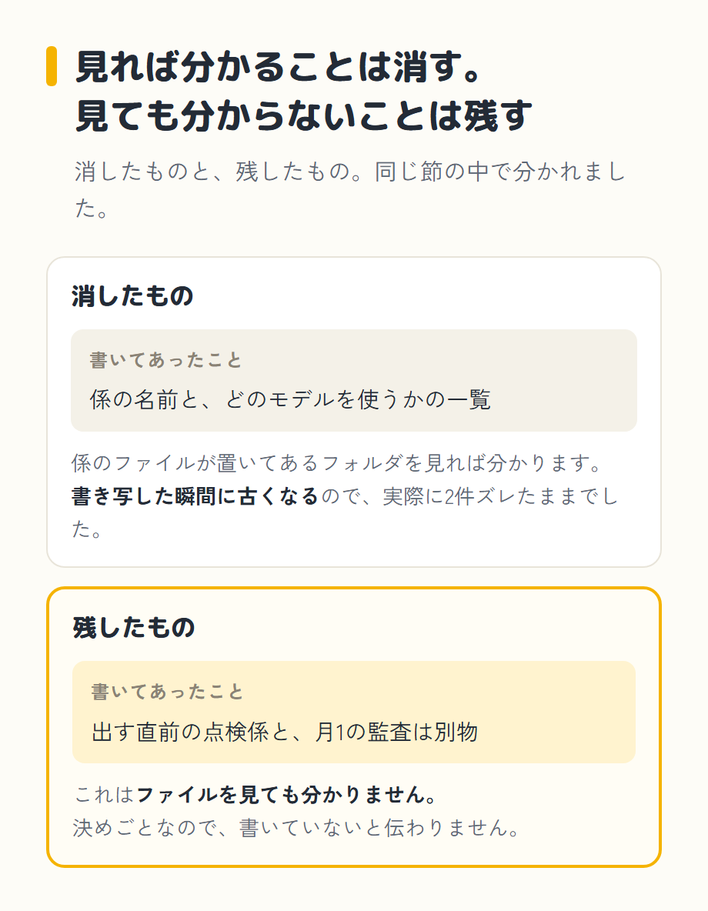
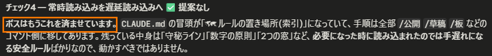

import Balloon from '../../../components/Balloon.astro';
import Callout from '../../../components/Callout.astro';

プロジェクト(1つの仕事のまとまり。僕の場合はブログ用のフォルダ1つです)を始めるときに、まず作っておいたほうがいいファイルがあります。CLAUDE.md(クロード・エムディー)です。

この記事は、そのCLAUDE.mdをどう作るか、何を入れて何を入れないか、なぜそれが毎回効くのか、放っておくとどうなるかをまとめたものです。書いているのは48歳、土木一筋30年、IT経験ゼロの会社員で、教えてくれたのはAIの相棒・クロさん(中身はClaude)です。内容は2026年8月9日に公式ドキュメントと突き合わせて確かめました。公式は英語なので、引用の訳はクロさんに頼んだものです。この手の情報は数週間で変わるので、日付とセットで読んでください。

[第2回(操作の基本)](/blog/nyuumon/claude-code-kyoka/)の終わりに、「大事な決まりは会話の履歴に頼らず、CLAUDE.mdに置け」と書きました。その紙の話です。

先に僕の実物を書いておきます。ブログ用のCLAUDE.mdをクロさんに数えてもらったら、441行ありました。公式の目安は200行だそうです。2.2倍です。この記事は、そこまで太らせた人間が書いています。そして書いている途中で、このファイルをClaude Code自身に診てもらいました。何を言われたかは、あとの節に書きます。

## 1. この記事でわかること

<Callout type="wakaru">

- 最初の1枚の作り方(`/init`)。自分で1行も書かなくても始められること
- 何を入れて、何を入れないか(公式の使い分け)
- なぜ、毎回これが効くのか
- 置き場所は4か所あって、どれかが勝つのではなく全部読まれること
- 放っておくと増えること。増えたら、削るのではなく移すこと
- `/doctor`で自分のCLAUDE.mdを診てもらったら、何を言われたか
- 書いても、守られるとは限らないこと

</Callout>

## 2. まず、`/init`で1枚作ります

作業フォルダを開いて、`/init`と打ちます。フォルダの中身を見て、叩き台を作ってくれます。第2回の最後に「次回の主役なので、名前だけ覚えておいてください」と書いたのが、この命令です。

すでにCLAUDE.mdがある場合は、上書きはせずに、直す案を出す、と公式に書いてありました([How Claude remembers your project](https://code.claude.com/docs/en/memory))。だから、あとから打ち直しても消えません。

正直に書いておきます。僕は自分のCLAUDE.mdを、ほとんど自分で開いていません。「これ、決まりにしておいて」と口で言うだけで、書き足すのはクロさんです。公式にも、Claudeに「これをCLAUDE.mdに足しておいて」と頼めばいい、と書いてありました。**ファイルを自分で編集できないと始められない、という話ではありません**。

## 3. 何を入れて、何を入れないか

作ったあとに迷うのは、そこに何を書くかです。

CLAUDE.mdは毎回・全文読まれます。ということは、毎回その分の場所を取る、ということでもあります。だから、何でも書けば効く、ではありませんでした。

公式には、どれをどこに置くかの表がありました([Extend Claude Code](https://code.claude.com/docs/en/features-overview))。いちばん右は公式には無い列で、たとえはクロさんに付けてもらったものです。

| 置き場所 | いつ読まれるか | 入れるもの | たとえると |
|---|---|---|---|
| **CLAUDE.md** | 毎回・全文 | いつも知っていてほしいこと。決まりごと、そのプロジェクトの形、「絶対に〜するな」 | 席に着いたら、まず目を通す心得 |
| **`.claude/rules/`** | 該当するファイルを触ったときだけ(指定できる) | 置き場所ごと・種類ごとの決まり | その案件のファイルに挟んである注意書き |
| **スキル** | 使うときだけ | ときどき要る参照材料と、手順書 | その作業のときだけ出してくる、やり方の1冊 |
| **フック** | 決まった瞬間に必ず | 毎回、必ず起きてほしいこと | 空欄があると送信ボタンが押せない申請の画面 |

4つ目だけ、読む物ではありません。ほかの3つは読んで効く紙で、これだけは読まなくても効きます。

スキルはあとの回でやる予定です。フックはあとの節でもう一度出てきます。

足すきっかけの目安も書いてありました。Claudeが同じ間違いを2回したら、CLAUDE.mdに足す。毎回、聞かずにやってほしいなら、フックにする。僕はこの表を読む前から、ミスが出たらその場で決まりにする、というやり方でやっていました。

### 書かなくていいものも、自分のファイルから出てきました

あとの節で書きますが、自分のCLAUDE.mdを点検してくれる`/doctor`という命令があります。それを打ったときに言われたことです。

僕のCLAUDE.mdには、専門の係(サブエージェント)の名前と、どのモデルを使うかの一覧を、3行に書き写してありました。言われたのは、この一覧は係のファイルが置いてあるフォルダを見れば分かる、書き写した瞬間に古くなる情報だ、ということでした。

実際に古くなっていました。8月5日にモデルの使い分けを変えたとき、係の実ファイルだけ直して、書き写したほうの一覧を直し忘れていて、2件ズレたままでした。なので一覧はやめて、「そのフォルダを見る。名前とモデルはそこが正本」の1行に置き換えました。

ただし、その節を全部消したわけではありません。「出す直前の点検係と、月1の監査は別物」といった決めごとは残しました。これはファイルを見ても分かりません。線引きは、見れば分かることは消し、見ても分からないことは残す、というものでした。

## 4. 口で伝えたことは消えて、心得だけが残る

ここから、なぜこの1枚が効くのかの話です。

Claude Codeとの会話は、新しく開くたびにまっさらです。前の会話で決めたことは、次の会話には引き継がれません。毎回、別の担当者が席に着くようなものです。前の人に口で伝えたことは、次の人には伝わりません。

でも、心得だけは席に残っています。だれが座っても、仕事を始める前に目を通します。それがCLAUDE.mdです。作業フォルダに置いておくと、会話を始めるたびに、こちらが何か打つ前から全文が読まれます。就業規則のように、棚に置いてあって、何かあったときに引っぱり出す物ではありません。

第2回の8節で、会話がいっぱいになると自動で要約されて、序盤の指示が失われることがある、と書きました。公式の対処が「コンパクトしろ」ではなく「CLAUDE.mdに置け」だった理由も、同じ場所に書いてありました。

<Balloon who="kuro">

プロジェクトのいちばん上に置いたCLAUDE.mdは、要約(`/compact`)のあと、もう一度ファイルから読み直されて会話に入れ直されます。だから要約で消えません。ただし条件があります。フォルダの下のほうに置いたCLAUDE.mdと、あとで出てくる`paths:`付きのルールは、自動では入れ直されません。生き残るのは、いちばん上の1枚です([How Claude remembers your project](https://code.claude.com/docs/en/memory))。

</Balloon>

## 5. 心得は4か所にある。全部つなげて読まれます

置き場所は1つではありませんでした。公式には4種類あると書いてあります。

| どれ | 置き場所 | 効く範囲 |
|---|---|---|
| **組織に配られるもの** | 管理者が決まった場所に置く | その組織の全員。個人の設定では外せない |
| **自分ぜんぶ** | `~/.claude/CLAUDE.md` | 自分が使う全部のフォルダ |
| **プロジェクト** | 作業フォルダの中の`CLAUDE.md` | そのフォルダ。共有もできる |
| **自分だけ・そこだけ** | 同じフォルダの`CLAUDE.local.md` | そのフォルダで、自分だけ |

大事なのは、どれか1つが勝つのではない、というところでした。公式の言い方は「見つかったファイルは、上書きし合うのではなく、全部つなげて文脈に入る」です。

僕の場合。どのフォルダで作業するときも読まれる共通の1枚が、54行あります。中身はかなり個人的なことなので書きませんが、ブログのフォルダで起動すると、この54行と、ブログ用の441行が、両方読まれています。片方が消えたりはしません。

<Balloon who="kuro">

上の階層にさかのぼって、途中にあるものも全部読みます。逆に、下のフォルダに置いたCLAUDE.mdは、起動した時点では読まれません。そのフォルダの中のファイルを触ったときに、はじめて読まれます。

</Balloon>

これも実物があります。僕のブログのフォルダの中に、自作のダイエットアプリのフォルダが入っています。そこにも147行のCLAUDE.mdを置いてあって、アプリを触るときだけ読まれる形です。ブログの記事を書いている日は、この147行は読まれていません。

### 置き場所を知らないと、こうなります

この「触ったときに読まれる」を知らずにいて、うっかりした形が、僕のフォルダから1つ見つかりました。

8月2日にルールの仕分けをしたとき、念のため当時のCLAUDE.mdをまるごとコピーして、バックアップ用のフォルダに取ってありました。まずかったのは、その中でファイル名を「CLAUDE.md」のままにしていたことです。大きさは38,742文字と出ていました。8月2日より前の古いルールが、そっくりそのまま入っています。

`/doctor`に言われて分かったのは、このバックアップのフォルダの中のファイルを触った瞬間に、その古い1枚が正規のメモリとして読み込まれる状態だった、ということでした。読み込まれる量は約9,685トークンと出ています(トークン数は文字数からの推定値だと但し書きが付いていました)。しかも古いほうの冒頭には「毎セッション、まずここを読む」と書いてあります。新しい決まりと古い決まりが混ざる形です。

直し方は簡単でした。`CLAUDE.md.旧2`という名前に変えるだけです。中身は1文字も変えていません。名前が「CLAUDE.md」でなくなれば、もう自動では読まれません。同じ日に直しました。

<Callout type="chui">

バックアップを取るのが悪いのではありません。**取ったコピーの名前を「CLAUDE.md」のままにしておくと、それも本物として読まれる**、というだけの話です。名前を変えるか、作業フォルダの外に出せば済みます。

</Callout>

## 6. 放っておくと、心得は増えます

行数を記録から拾ってもらいました。

| いつ | 行数 |
|---|---|
| 2026年8月5日 | 389行 |
| 2026年8月9日(診てもらう前) | 441行 |
| 同じ日(指摘を2つ直したあと) | 439行 |

4日で52行増えました。1日あたり13行です。減ったほうは2行だけで、その理由は次の節に書きます。

本文の中に日付を書き添えてあるので、そこも数えてもらいました。7月28日から8月9日までで33か所ありました。いちばん多い日は8月5日の7か所です。

増える理由ははっきりしています。僕が「これ決まりにして」と言うからです。同じミスを二度やらないようにする、というやり方を自分で決めたので、守るほど太ります。

<Callout type="chui" title="一度、逃がす作業を済ませたうえで、この数です">

僕は8月2日に、細かい手順を別のファイルへ仕分けしました。CLAUDE.mdの冒頭には、そのとき決めた文が今も残っています——「作業ごとの細かい手順は、その作業を始めたときに読み込まれる場所に移してある。ここに書き戻さない」。そのために作ったコマンドは、いま12個あります。

**それだけ逃がしたうえで、441行です**。

</Callout>

だから、この記事の落としどころは「整理しましょう」ではありません。**整理しても、また増える**。続けているかぎり増えるものなので、増えてから慌てるより、行き先を先に決めておくほうがいい、ということです。これは1か月続けてみて分かったことで、始めた日には分かりませんでした。

## 7. 削るのではなく、別の紙へ移す

僕は前に一度、CLAUDE.mdを少し削ったことがあります。そのあと、ダイエットのほうで使っているAI([ミルさん](/blog/diet/mil-tanjou/))が、記事を書くのが遅くなって、文章も変になりました。それ以来、このファイルを削るのが怖くなっていました。

<Balloon who="kuro">

公式は「削れ」とは書いていません。「移せ」です。原文を訳すと「目安として、CLAUDE.mdは200行以下に保つこと。増えてきたら、参照するための中身はスキルへ移すか、`.claude/rules/`のファイルに分けること」。逃がし先は2つです。

1. **スキルへ移す**。手順書や、一部の場所でしか要らないものは、こちら向きです
2. **`.claude/rules/`に分ける**。`paths:`という指定を付けると、そのファイルを触ったときだけ読まれます

それとは別に、どれを移すかは`/doctor`が教えてくれます。長いCLAUDE.mdを見て、削る案を出してくれます。ただし新しい版でないと出ません。

</Balloon>

捨てるのではなく、別の紙へ移すという話でした。心得から外しても、要るときには出てきます。

正直に書いておくと、そのとき僕が何を削ったのかは、まだ調べていません。だから「短くしたから変になった」のか「消してはいけないものを消した」のかも、まだ分かっていません。公式が言っているのは「長いと文脈を食って、守られにくくなる」で、僕が体験したのは「削ったら変になった」です。この2つは別の話だと教わりました。

### `/doctor`を、実際に打ちました

打ったのは僕です。打つと、直近50セッションぶんの記録、8日間、5つのプロジェクトを見た、と表示が出ました。出てきたのは、チェック0から9まで並んだ健康診断のようなレポートです。まとめと、詳しい表と、直す提案が入っています。

打つ前、クロさんは「うちのフォルダはgitに入れていないので、効かないかもしれません」と言っていました。外れました。441行をちゃんと診て、5節で書いたバックアップの1枚まで見つけています。

数字も出ました。毎回いちばん場所を取っているのは、ブログ用のCLAUDE.mdで約4,358トークン。全部のフォルダで読まれる共通の1枚が約640トークン。コマンド12個の一覧は約209トークンで、「安い。よく出来ています」と言われました。ただしトークン数は文字数からの推定値で、日本語ではずれることがある、と但し書きが付いていたので、だいたいの目安として見ています。

### いちばん知りたかった「441行をどう減らすか」

そこは、提案なしでした。

> ボスはもうこれを済ませています。CLAUDE.mdの冒頭が「ルールの置き場所(索引)」になっていて、手順は全部コマンド側に移してあります。残っている中身は「守秘ライン」「数字の原則」「2つの窓」など、必要になった時に読み込まれたのでは手遅れになる安全ルールばかりなので、動かすべきではありません。

言われたのは、5節のバックアップと、3節の書き写した一覧の2件だけです。両方を直して439行になりました。減ったのは2行です。

公式の200行は、目安として生きています。僕のファイルはその2倍以上あって、そこは変わりません。ただ、目安と自分の実物を突き合わせた結果は、行数を減らす作業にはなりませんでした。中身を見ずに行数だけで減らすと、必要になってから読み込まれたのでは間に合わないものまで、外へ出してしまいます。だから今も439行のままです。

## 8. 書いても、守られるとは限らない

公式に、こういう一文がありました。

> CLAUDE.mdやスキルに書いた「`.env`は絶対に編集するな」のような指示は、お願いであって、保証ではない。

続けて、そのルールが毎回必ず守られないと困るなら、指示ではなくフックにしなさい、と書いてあります。フックは、決まった操作の前や後に必ず走る仕掛けで、条件に合えばその操作を止めます。

僕のCLAUDE.mdには、この公式を読む前から、自分の言葉で同じことが書いてありました。

> 「文章で書いたルール」は抜ける。実績がある。

実際に起きたことです。どの仕事にどのモデルを使うかの決まりを3か所に書いてあったのに、9日間まるごと抜けていました。気づいたのは僕です。文章で書いたルールは、読んでもらえれば効きますが、読み飛ばされたときに何も起きません。

<Balloon who="kuro">

フックは、読む・読まないと関係なく、必ず走ります。指示は「そうしてください」で、フックは「そうなっていなければ、そこで止まる」です。公式も、絶対に守らせたいルールは、書くよりフックにしろと言っています。

</Balloon>

なので今は、絶対に外したくないものだけをフックにしてあります。1つ実物を書くと、記事の草稿を、担当ではないほうが書こうとすると止まる見張りです(`tools/check-fable-draft.py`)。中身を作ったのはクロさんです。

同じ`/doctor`のレポートに、フックが実際に何回走ったかも出ていました。会話を始めるたびに走るものが50回で、まん中の速さは0.5秒ほど。ファイルを書いたあとに走るものがいちばん遅くて、1.8秒でした。時間切れで失敗したものはゼロ件です。

さっきの見張りは、記録では0件でした。動いていないのかと聞いたら、何も言わずに通した回は記録に残らない仕組みだそうです。止めた回がないので、記録も無い、ということでした。

CLAUDE.mdに書けば全部そのとおりになる、と思って書き足していくと、この違いで足をすくわれます。僕は先に足をすくわれてから、公式を読みました。

## 9. 次にやること

<Callout type="point" title="次までの宿題">

1. **自分の作業フォルダで`/init`と打ってみてください**。中身を見て、叩き台を作ってくれます。1行も自分で書かなくても始められます
2. **そのあと、決まりを1つだけ足してみてください**。ファイルを開く必要はありません。「これをCLAUDE.mdに足しておいて」と、ふつうの日本語で頼むだけです
3. **すでにCLAUDE.mdがある人は、`/doctor`も打ってみてください**。僕の場合、見つかったのは「行数」ではなく、バックアップの1枚と、古い書き写しでした(削る案は新しい版でないと出ません)

</Callout>

僕のブログが毎日同じルールで回っているのは、このファイルのおかげです。ただし、回っているように見えて抜けることがある、というのが8節でした。

次回は、パソコンの中のどこにフォルダを作るか、会話をどう分けるかの話です。

---

**この記事の出典**(2026年8月9日に確認)

- [How Claude remembers your project](https://code.claude.com/docs/en/memory)(CLAUDE.mdの置き場所・読まれ方・`/init`・`/doctor`の削る案)
- [Extend Claude Code](https://code.claude.com/docs/en/features-overview)(CLAUDE.md・ルール・スキル・フックの使い分け)
- [第2回 Claude Codeの許可がめんどくさい人へ](/blog/nyuumon/claude-code-kyoka/)(会話の分け方と要約の話)
